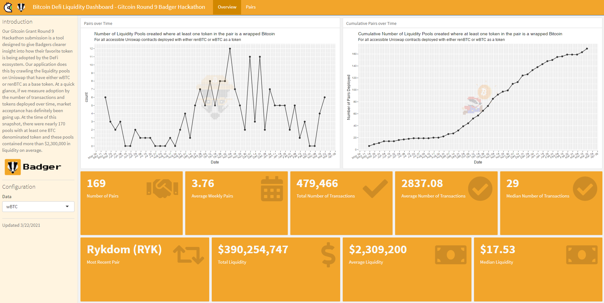

```{r setup, include=FALSE}
knitr::opts_chunk$set(echo = FALSE, warning = FALSE, message = FALSE, fig.align = "center")

library(knitr)
library(kableExtra)
library(tidyverse)
library(lubridate)
library(omnitheme)

wbtc_pairs <- readRDS("data/wbtc_pairs.rds") %>%
    as_tibble() %>%
    mutate(across(where(is.character), readr::parse_guess)) %>%
    mutate(BTC = "wBTC")

renbtc_pairs <- readRDS("data/renbtc_pairs.rds") %>%
    as_tibble() %>%
    mutate(across(where(is.character), readr::parse_guess)) %>%
    mutate(BTC = "renBTC")
```

## Introduction

Our Gitcoin Grant Round 9 Hackathon submission was a tool designed to give Badgers clearer insight into how their favorite token is being adopted by the DeFi ecosystem. Our application does this by crawling the liquidity pools on Uniswap that have either wBTC or renBTC as a base token. In the process, we produced some "unique" visualizations in ggplot2 that we're going to show you how we created!

```{r, out.height=350}

```

---

## Liquidity Pools with wrapped Bitcoin

Below is a plot of the number of liquidity pools where at least one token int he pair is a Wrapped Bitcoin. We're going to spruce this up a bit.

```{r, fig.height=6, fig.width=11}
p1 <- wbtc_pairs %>%
    mutate(date = as_date(Pair_Origin_Timestamp),
           week = round_date(date, unit = "week")) %>%
    group_by(week) %>%
    summarise(count = n()) %>%
    complete(week = full_seq(week, period = 7), fill = list(count = 0)) %>%

    ggplot(aes(x = week, y = count)) +
        geom_point() +
        geom_line() +
        scale_y_continuous(breaks = scales::pretty_breaks(n = 10)) +
        scale_x_date(date_breaks = "1 week", date_labels = "%b %d") +
        labs(
            title = "Number of Liquidity Pools created where at least one token in the pair is a wrapped Bitcoin",
            subtitle = "For all accessible Uniswap contracts deployed with wBTC as a token",
            x = "Date"
        ) +
        theme(
            axis.text.x = element_text(angle = 30, hjust = 1)
        ) 

p1
```

---

## Watermark Images

The first thing we'll do is watermark the image with the Badger DAO yellow badger:

```{r, echo=TRUE, fig.height=6, fig.width=11}
p1 + 
    watermark_img("images/yellow_hat_badger.png", location = "center", alpha = 0.1, width = 120)
```

---

## Varying watermark images

You can see from the previous snippet that an arbitrary image can be provided, and parameters such as the alpha and width of the image can be customized. Let's add Mario to this cumulative version of the previous plot!

```{r, fig.height=5, fig.width=11}
p2 <- wbtc_pairs %>%
    mutate(date = as_date(Pair_Origin_Timestamp),
           week = round_date(date, unit = "week")) %>%
    group_by(week) %>%
    summarise(count = n()) %>%
    complete(week = full_seq(week, period = 7), fill = list(count = 0)) %>%
    mutate(count = cumsum(count)) %>%
        
    ggplot(aes(x = week, y = count)) +
        geom_point() +
        geom_line() +
        scale_y_continuous(breaks = scales::pretty_breaks(n = 10)) +
        scale_x_date(date_breaks = "1 week", date_labels = "%b %d") +
        labs(
            title = "Cumulative Number of Liquidity Pools created where at least one token in the pair is a wrapped Bitcoin",
            subtitle = "For all accessible Uniswap contracts deployed with either renBTC or wBTC as a token",
            x = "Date",
            y = "Number of Pairs Deployed"
        ) +
        theme(
            axis.text.x = element_text(angle = 30, hjust = 1)
        )

p2 +
    watermark_img("images/mario.png", location = "center", alpha = 0.2, width = 150)
```

---

## Alpha (0.05)

```{r, fig.height=6, fig.width=11}
p2 +
    watermark_img("images/mario.png", location = "center", alpha = 0.05, width = 150)
```

---


## Alpha (0.5)

```{r, fig.height=6, fig.width=11}
p2 +
    watermark_img("images/mario.png", location = "center", alpha = 0.5, width = 150)
```

---

## Alpha (1)

```{r, fig.height=6, fig.width=11}
p2 +
    watermark_img("images/mario.png", location = "center", alpha = 1, width = 150)
```

---

## Width (350)

```{r, fig.height=6, fig.width=11}
p2 +
    watermark_img("images/mario.png", location = "center", alpha = 1, width = 350)
```

---

## Varying the Position

We can watermark a graph even outside the center. Here we add the side badger to the top right

```{r, fig.height=6, fig.width=11}
p3 <- wbtc_pairs %>%
        mutate(Pair = paste0(BTC, "/", Token_Symbol)) %>%
        select(Name = Token_Name, Pair, `Liquidity ($)` = Liquidity_USD, `# of Transactions` = Pair_Tx_Count) %>%
        arrange(desc(`Liquidity ($)`)) %>%
    slice(1:20) %>%
        mutate(Pair = factor(Pair, levels = Pair)) %>%
    ggplot(aes(x = Pair, y = `Liquidity ($)`)) +
        geom_bar(stat = "identity", fill = "#F2A52B") +
        scale_y_continuous(labels = scales::dollar, breaks = 10^(0:8), trans=scales::pseudo_log_trans(base = 10))
  
p3 +
  watermark_img("images/badger side.png", x = 0.9, y = 0.8, alpha = 0.2, width = 100)
```

---

## Varying the Position (Top Left)

```{r, fig.height=6, fig.width=11}
p3 +
  watermark_img("images/badger side.png", location = "tl", alpha = 0.2, width = 100)
```

---

## Varying the Position (Bottom Left)

```{r, fig.height=6, fig.width=11}
p3 +
  watermark_img("images/badger side.png", location = "bl", alpha = 0.2, width = 100)
```

---

## Varying the Position (Bottom Right)

```{r, fig.height=6, fig.width=11}
p3 +
  watermark_img("images/badger side.png", location = "br", alpha = 0.2, width = 100)
```

---

## Conclusion

Watermarking a `ggplot2` is a fun way to add a little flare and customization to your data visualiation! While simple and easy, that extra charm can sometimes be what puts a graphic over the edge in terms of quality.

```{r}

```

