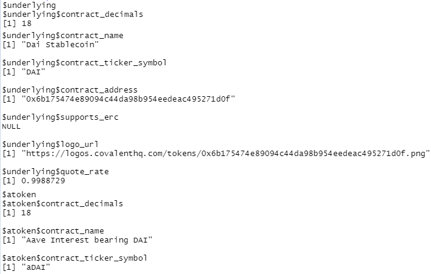
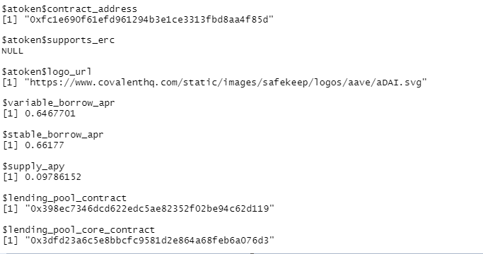

```{r setup, include=FALSE}
knitr::opts_chunk$set(echo = TRUE, warning = FALSE, message = FALSE, fig.align = "center", fig.width=10, fig.height=7, out.width=600)
```

## Covalent API

Covalent provides a unified API bringing visibility to billions of blockchain data points and it's free for everyone. To get started, you can simply sign up with an email address and get an API key. To learn more about Covalent, please visit https://www.covalenthq.com/. 

<p align="center">


</p>

---
## Covalent Documentation

After you have created an account and obtained an API key, you should carefully read all the information provided in the [Covalent Documentation](https://www.covalenthq.com/docs/api/#overview). 

We will be following these two endpoints:


Each parameter is bracketed with {}. Thus, we will need to fill in `chain_id` and `address`.  


---

## httr
In this case study, we will show you how to use `httr` package to obtain data through Covalent API. `httr` provide a wrapper for the curl package, customized to the demands of modern web APIs. First, we can use the `GET()` function to retrieve information from a url, which returns `response()` object. To get the content of this object, we will use the `content()` function along with the `parsed` parameter to convert it into an R object as follows.

```{r}
library(httr)
assets <- GET("https://api.covalenthq.com/v1/1/networks/aave/assets/")
assets_parsed <- content(assets, "parsed")
assets
```

---

## httr (continued...)
Let's take a look at the structure of `assets_parsed`. Note that it gives information on each asset. 
```{r, eval = FALSE}
str(assets_parsed)
```

<p align="center">


</p>

---

## AAVE network assets

Now that we have the data, we can use the following to obtain information on the first asset

```{r, eval = FALSE}
assets_parsed$data$items[[1]]
```

.pull-left[

]
.pull-right[

]

---

## GET transactions

Recall `GET /v1/{chain_id}/address/{address}/transactions_v2/` from Covalent Documenation. To demonstrate, we fill `chain_id` with 1 as it represents Ethereum Network and `address` with `$atoken$contract_address` from previous slide. 

```{r}
transaction <- GET("https://api.covalenthq.com/v1/1/address/0xfc1e690f61efd961294b3e1ce3313fbd8aa4f85d/transactions_v2/?format=csv")
transaction_parsed <- content(transaction, "parsed")
dim(transaction_parsed)
```

---

## Transactions Data
Let's take a look a the first few rows of the data. 
```{r, eval = FALSE}
head(transaction_parsed)
```


---

## Conclusion

You have just used Covalent API for the first time! Now you can explore more and obtain other data. 

<br> <br> <br>

<p align="right">


</p>
