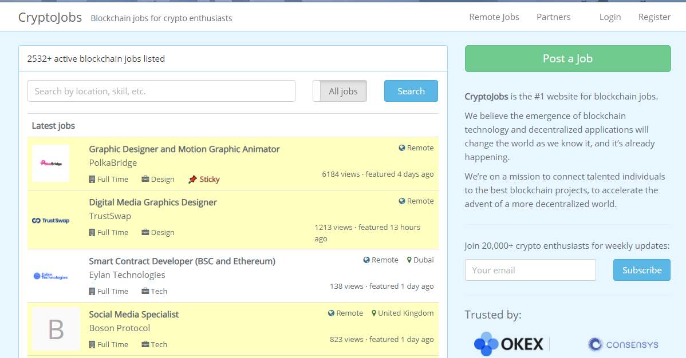

```{r setup, include=FALSE}
knitr::opts_chunk$set(echo = TRUE, warning = FALSE, message = FALSE, fig.align = "center", fig.width=11, fig.height=7)
```

## Cryptojobs

Cryptojobs is the number one website for blockchain jobs. This website is for employers who are looking for blockchain experts and for blockchain experts who are looking for job opportunities. For more information, check out https://crypto.jobs/. 

<p align="center">



</p>

---

## Data and libraries

We scraped the data from Cryptojobs on 4/15/2021. In this case study, We will be using these libraries as well. 

```{r}
library(tidyverse)
library(lubridate)
library(tidytext)
library(ggrepel)
library(RColorBrewer)
library(ggwordcloud)

scrape_date <- ymd("2021-04-15")
jobs <- read_csv("data/Crypto_Jobs_data_2.csv")
```

<br> <br>

<p align="middle">


</p>
---

## The Data

The data has 260 rows and 13 columns, where each row represents a job posting. The columns are as follow

* `Name` - The job title.
* `Company` - The name of the company.
* `Type` - Whether the job is Full-Time or Part-Time.
* `Field` - The field of the job. For example, a job could be in Marketing field.
* `Tag` - A tag used in the website.
* `Remote` - Whether the job is remote. 
* `Country` - Country of the job location. It is blank if the job is remote. 
* `View` - The number of times of which the job posting was viewed.
* `Time` - The date when the job posting was created. 
* `URL` - The link to the job posting.
* `Description` - The detail of the job description and requirements.
* `Skills` - The skills required for the job.
* `Compensation` - The compensation that the company offers.

---

## The Data (continued...)

Below shows the first few rows of the data.

```{r}
head(jobs)
```

---

## Monthly Count of Crypto Job Postings

First, we count the number of Monthly job postings via `group_by()` and `floor_date()` functions.

```{r}
jobs_monthly <- jobs %>%
    group_by(Month = floor_date(Time, "month")) %>%
    summarise(Count = n()) %>%
    arrange(Month) 
```

Then, we can simply use `ggplot()` to create the plot. 

```{r, eval = FALSE}
ggplot(data = jobs_monthly, aes(x = Month, y = Count)) +
  geom_point() + geom_line() +
  scale_x_date(date_breaks = "2 months" , date_labels = "%b-%y")+
  labs(
        title = "Monthly Count of Crypto Job Postings",
        subtitle = paste0("For jobs available on the site as of ", scrape_date),
        x = "Date",
        y = "Number of Job Postings"
    )
```

---

## Monthly Count of Crypto Job Postings (continued...)

```{r, echo = FALSE}
ggplot(data = jobs_monthly, aes(x = Month, y = Count)) +
  geom_point() + geom_line() +
  scale_x_date(date_breaks = "2 months" , date_labels = "%b-%y")+
  scale_y_continuous(breaks = scales::pretty_breaks(n=10))+
  labs(
        title = "Monthly Count of Crypto Job Postings",
        subtitle = paste0("For jobs available on the site as of ", scrape_date),
        x = "Date",
        y = "Number of Job Postings"
    )
```

---

## Job Titles Word/Two-grams Count by Location

Now, we will see some of the common words/two-grams that are in the Job Titles. We will create the following two tables by removing words like "of", "and", "a", and make the job titles all lower case. Then, we will use `unnest_tokens()` to get all the words/two-grams. 

```{r}
jobs_words <- jobs %>%
    mutate(Name = gsub(" of | and | a |^a ", "", tolower(Name))) %>%
    unnest_tokens(word, Name) 
jobs_twograms <- jobs %>%
    mutate(Name = gsub(" of | and | a |^a ", "", tolower(Name))) %>%
    unnest_tokens(twograms, Name, token = "ngrams", n = 2, n_min = 2)
```

<br>

<p align="left">


</p>

---

## Job Titles Word/Two-grams Count by Location (continued...)

Now that we have the words and two-grams of the Job Titles. We can count them as follows.

```{r}
word_count <- jobs_words %>%
    filter(!is.na(Country)) %>%
    group_by(Country, word) %>%
    summarise(Count = n()) %>%
    arrange(desc(Count)) %>%
    slice(1:5) 

twogram_count <- jobs_twograms %>%
    filter(!is.na(Country)) %>%
    group_by(Country, twograms) %>%
    summarise(Count = n()) %>%   
    arrange(desc(Count)) %>%
    slice(1:5)
```

---

## Top Five Words by Country for Job Titles

Now, let's plot them! We will use `expr()` and `eval()` to create plots for each of the countries in one shot as follows.

```{r}
p1 <- expr(ggplot(data = word_count, aes(x = word, y = Count, fill = Country)) +
    geom_bar(stat = "identity", colour = "black") +
    scale_fill_brewer(palette = "Set3") +
    facet_wrap(~Country, scales = "free") +
    theme_minimal(14) +
    theme(
        axis.text.x = element_text(angle = 20, hjust = 1),
        legend.position = "off",
        plot.margin = margin(10, 10, 10, 60)
    ) +
    labs(
        title = "Top Five Words by Country for Job Titles",
        subtitle = paste0("For Countries with at least 20 Postings on Crypto.jobs as of ", scrape_date)
    ))
p1s <- eval(p1)
```

---

## Top Five Words by Country for Job Titles (continued...)

```{r, echo = FALSE}
p1s
```


---

## Your Turn

Create a `Top Five 2-grams by Country for Job Titles` plot. 

--

## Answers

```{r}
p2 <- expr(ggplot(data = twogram_count, aes(x = twograms, y = Count, fill = Country)) +
    geom_bar(stat = "identity", colour = "black") +
    scale_fill_brewer(palette = "Set3") +
    facet_wrap(~Country, scales = "free") +
    theme_minimal(14) +
    theme(
        axis.text.x = element_text(angle = 20, hjust = 1),
        legend.position = "off",
        plot.margin = margin(10, 10, 10, 60)
    ) +
    labs(
        title = "Top Five 2-Grams by Country for Job Titles",
        subtitle = paste0("For Countries with at least 20 Postings on Crypto.jobs as of ", scrape_date)
    ) )
p2s <- eval(p2)
```

---

## Top Five 2-Grams by Country for Job Titles

```{r, echo = FALSE}
p2s
```

---

## Skills Required by Field Word Cloud

Now, we will create a table that gives us the normalized count of skills required by field. 

```{r}
jobs_skills <- jobs %>%
    mutate(Field = factor(Field, levels = unique(jobs$Field))) %>%
    group_by(Field) %>%
    mutate(Skill_list = gsub("(good)|(excellent)|(skills)", "", tolower(Skills))) %>% #Remove 'stop words'
    mutate(Skill_list = gsub("(communications)", "(communication)", Skill_list)) %>% #Remove typos
    mutate(Skill_list = strsplit(Skill_list, ",|;|\\. | & | and | or ")) %>%
    unnest(Skill_list) %>%
    mutate(Skill_list = str_trim(Skill_list)) %>% #Remove spaces
    filter(!is.na(Skill_list), Skill_list != "") %>%
    group_by(Field, Skill_list) %>%
    summarise(Count = length(Skill_list)) %>%
    arrange(desc(Count)) %>%
    group_by(Field) %>%
    mutate(max = max(Count), min = min(Count)) %>%
    mutate(Count = ifelse( (max-min) ==0, 1, (Count - min) / (max - min))) #Normalize 
```


---

## Skills Required by Field Word Cloud (continued...)

Now that we have the table ready, we can plot it. 

```{r}
col_palette <- colorRampPalette(brewer.pal(8, "Set1"))(9)

p3 <- ggplot(data = jobs_skills, aes(label = Skill_list, size = Count, color = Field)) +
    scale_color_manual(values = col_palette) +
    scale_size_continuous(range = c(2, 22)) +
    geom_text_wordcloud_area(area_corr_power = 1, shape = "square", xlim = c(0, 1), ylim = c(0, 1), rm_outside = TRUE) +
    geom_rect(data = jobs_skills %>% group_by(Field) %>% slice(1), colour = NA, xmin = -Inf, xmax = Inf, ymin = -Inf, ymax = Inf, aes(fill = Field), alpha = 0.15) +
    scale_fill_manual(values = col_palette) +
    theme_minimal(14) +
    facet_wrap(~Field, scales = "free") +
    theme(
        plot.title = element_text(face = "bold"),
        axis.text = element_text(face = "bold", colour = "#656373"),
        strip.text = element_text(face = "bold"),
        legend.position = "off"
    ) +
    labs(title = "Skills Required by Field",
         subtitle = paste0("For Crypto.jobs postings as of ", scrape_date, " "))
```

---

## Skills Required by Field Word Cloud (continued...)

```{r, echo = FALSE}
p3
```

---

## Conclusion 

You have learned to use `tidytext` package for text mining and `ggwordcloud` package to create word cloud. You should now try to create some other analysis with the data!

<br> <br> <br> <br> <br>

<p align="right">


</p>
