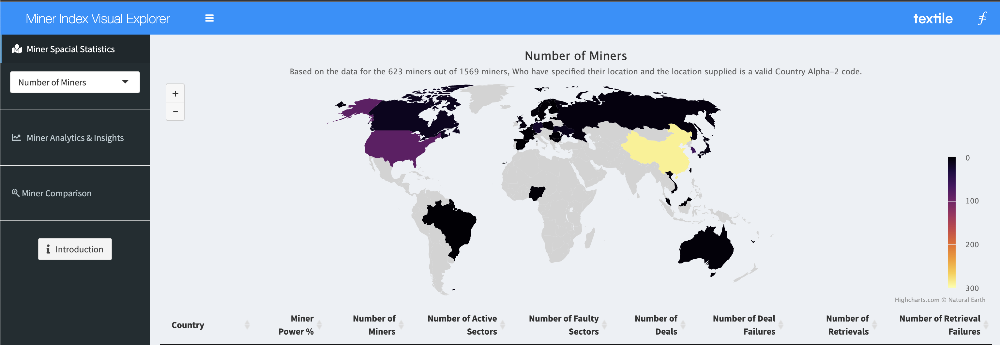

```{r setup, include=FALSE}
knitr::opts_chunk$set(echo = TRUE, warning = FALSE, message = FALSE, fig.align = "center", fig.width=18, dpi=300)
```

## Filecoin

As part of the Gitcoin Round 9 textile Hackathon our team took on the task of creating a Miner Index Visual Explorer. Using data from the new Filecoin Miner Index API, we've developed a collection of visualizations to help network enthusiasts get a high level overview of the health and performance of storage miners. The default page contains a global breakdown of miner activity and decentralization as measured by the percentage of miner power and the number of miners. Here performance is measured through the number of faulty sectors and retrieval failures. 

In this case study, we deconstruct the application into the component visuals and walk through the process of extracting all the relevant pieces from our application. We hope you enjoy!

---

## Case Study Goals

Because the analysis was originally constructed as a Shiny application, we will be deconstructing the analysis into a format suitable format for slides and for an ad-hoc R analysis. We will deconstruct it into a `geographic` and a `distributional` analysis. For the original application, please [Click Here](https://crypto.omnianalytics.io/apps/git-9-textile-hack/)



---

## Loading R Libraries

A set of R libraries are required to follow along. You can load them all with the following lines (install if necessary):

```{r}
## Loading Libraries
library(knitr)
library(kableExtra)
library(httr)
library(jsonlite)
library(tidyverse)
library(lubridate)
library(ggplot2)
library(dplyr)
library(ISOcodes)
library(highcharter)
library(widgetframe)
```

---

## Loading the Data

The data has been exported as an RDS file, so we can begin by simply reading it in, and taking a look at the raw data:

```{r}
m_d <- readRDS("data/filecoin_miner_data.RDS")

m_d[,1:5] %>%
    head(n = 5) %>%
    kable
```

---

## Cleaning the Data

Next we perform some preliminary cleaning steps:

```{r}
var_map <- list("Miner Power %" = "fc_relativePower",
                "Num Active Sectors" = "fc_activeSectors",
                "Num Faulty Sectors" = "fc_faultySectors",
                "Total Deals" = "tt_deal_total",
                "Total Deals Failure" = "tt_deal_failure")

input <- list(sel_min = m_d$miner_address[1:5],
              select_column = "Miner Power %")

country_df <- data.frame(ID=unique(m_d$miner_location),Country_Code=ISO_3166_1$Alpha_3[match(unique(m_d$miner_location),ISO_3166_1$Alpha_2)],Country_Name=ISO_3166_1$Name[match(unique(m_d$miner_location),ISO_3166_1$Alpha_2)])
country_df <- country_df[complete.cases(country_df),]

m_d$miner_location_A3 <- country_df$Country_Code[match(m_d$miner_location,country_df$ID)]
m_d$miner_location_Country <- country_df$Country_Name[match(m_d$miner_location,country_df$ID)]
m_d$fc_askPrice <- as.numeric(m_d$fc_askPrice)/10^18
m_d$fc_askVerifiedPrice <- as.numeric(m_d$fc_askVerifiedPrice)/10^18
m_d$fc_minPieceSize <- as.numeric(m_d$fc_minPieceSize)/1024^3
m_d$fc_maxPieceSize <- as.numeric(m_d$fc_maxPieceSize)/1024^3
```

---

## Cleaning the Data (Part Two)

```{r}
## Cleaning functions
tfr_rate <- function(x)
{
	res <- sapply(unlist(strsplit(x,"<->")),function(x) as.numeric(strsplit(x,";")[[1]][2]))[which.max(sapply(unlist(strsplit(x,"<->")),function(x) as_datetime(strsplit(x,";")[[1]][1])))]
	if(length(res)==0) return(NA)
	paste(round(res,4),"MiB/s")
}

# if(length(input$sel_min)<2) return(NULL)
min_d <- t(m_d[m_d$miner_address %in% input$sel_min,])
colnames(min_d) <- min_d[1,]
min_d <- min_d[-1,,drop=FALSE]
min_d <- min_d[c(31,2:9,11:18,28:29),,drop=FALSE]

```

---

## Cleaning the Data (Part Three)

```{r}
rownames(min_d) <- c("Country", "Last Updated", "Miner Power %",
					 "Ask Price (FIL)", "Ask Price Verified (FIL)",
					 "Min Piece Size", "Max Piece Size",
					 "Num Active Sectors", "Num Faulty Sectors",
					 "Total Deals", "Last Deal",
					 "Total Deals Failure", "Last Deal Failure",
					 "Total Retrievals", "Last Retrieval",
					 "Total Retrievals Failure", "Last Retrieval Failure",
					 "Last Deal Transfer Rate", "Last Retrieval Transfer Rate"
					)
min_d["Miner Power %",] <- paste(round(as.numeric(min_d["Miner Power %",])*100,4),"%")
min_d["Last Updated",] <- as.character(as_datetime(min_d["Last Updated",]))
min_d["Ask Price (FIL)",] <- ifelse(is.na(min_d["Ask Price (FIL)",]),NA,paste(min_d["Ask Price (FIL)",],"FIL"))
min_d["Ask Price Verified (FIL)",] <- ifelse(is.na(min_d["Ask Price Verified (FIL)",]),NA,paste(min_d["Ask Price Verified (FIL)",],"FIL"))
min_d["Min Piece Size",] <- paste(min_d["Min Piece Size",],"GB")
min_d["Max Piece Size",] <- paste(min_d["Max Piece Size",],"GB")
min_d["Last Deal",] <- as.character(as_datetime(min_d["Last Deal",]))
min_d["Last Deal Failure",] <- as.character(as_datetime(min_d["Last Deal Failure",]))
min_d["Last Retrieval",] <- as.character(as_datetime(min_d["Last Retrieval",]))
min_d["Last Retrieval Failure",] <- as.character(as_datetime(min_d["Last Retrieval Failure",]))
min_d["Last Deal Transfer Rate",] <- sapply(min_d["Last Deal Transfer Rate",],tfr_rate)
min_d["Last Retrieval Transfer Rate",] <- sapply(min_d["Last Retrieval Transfer Rate",],tfr_rate)
```

---

## Examining the Data

With the data cleaned, let's take a peak at the result:

```{r}
DT::datatable(min_d[1:6,],options = list(scrollX = TRUE,pageLength = 50, dom = 't',ordering=F))
```

---

## Geographic Distributions

Because we have country-level information on the amount of activity, the first thing we want to do is visualize this on a nice world map. We start by generating the requisite data:

```{r}
data_plot <- m_d[!is.na(m_d$miner_location_A3),]
data_plot_s <- split(data_plot,data_plot$miner_location_A3)
data_map <- data.frame(
						Country_A3 = names(data_plot_s),
						Country = sapply(data_plot_s,function(x) x$miner_location_Country[1]),
						`Number of Miners` = sapply(data_plot_s,nrow),
						`Miner Power %` = round(sapply(data_plot_s,function(x) sum(x$fc_relativePower))*100,4),
						`Number of Active Sectors` = sapply(data_plot_s,function(x) sum(as.numeric(x$fc_activeSectors))),
						`Number of Faulty Sectors` = sapply(data_plot_s,function(x) sum(as.numeric(x$fc_faultySectors))),
						`Number of Deals` = sapply(data_plot_s,function(x) sum(as.numeric(x$tt_deal_total))),
						`Number of Deal Failures` = sapply(data_plot_s,function(x) sum(as.numeric(x$tt_deal_failure))),
						`Number of Retrievals` = sapply(data_plot_s,function(x) sum(as.numeric(x$tt_retrieval_total))),
						`Number of Retrieval Failures` = sapply(data_plot_s,function(x) sum(as.numeric(x$tt_retrieval_failure))),
						check.names=FALSE
					)
rownames(data_map) <- NULL
```

---

## A Generic Mapping Function

Since we have several variables to visualize, let's start by defining a generic mapping function. We can then call this function repeatedly, passing in the variables we wish to visualize!

```{r}
produce_map <- function(col="Miner Power %") {
    hc1 <- hcmap(
		"custom/world-robinson-lowres", data = data_map,
		name = gsub("Number of ","",col), value = col, borderWidth = 0,
		nullColor = "#d3d3d3", joinBy = c("iso-a3", "Country_A3")
	) %>%
    hc_colorAxis(stops = color_stops(colors = viridisLite::inferno(8))) %>%
    hc_mapNavigation(enabled = TRUE) %>%
    hc_subtitle(text = paste(
    	"Based on the data for the", nrow(data_plot),
    	"miners out of", nrow(m_d),
    	"miners, Who have specified their location and the location supplied is a valid Country Alpha-2 code."
    )) %>%
    hc_title(text=col) %>%
    hc_legend(layout = "vertical", align = "right")

    frameWidget(hc1)
}
```

Now we can produce a number of visualizations of different variables!

---

## Miner Power % by Country

```{r, echo=FALSE}
produce_map(col="Miner Power %")
```

---

## Number of Miners by Country

```{r, echo=FALSE}
produce_map(col="Number of Miners")
```

---

## Number of Active Sectors by Country

```{r, echo=FALSE}
produce_map(col="Number of Active Sectors")
```

---

## Number of Faulty Sectors by Country

```{r, echo=FALSE}
produce_map(col="Number of Faulty Sectors")
```

---

## Number of Deals by Country

```{r, echo=FALSE}
produce_map(col="Number of Deals")
```

---

## Number of Deal Failures by Country

```{r, echo=FALSE}
produce_map(col="Number of Deal Failures")
```

---

## Geographic Analysis

The maps shown previously are *interactive* - please explore at your leisure! Some of the takeaways include:

- Miner Power as a percentage is highest in China, with Germany and the United States high in the rankings as well
- The Number of Miners is especially highest in China - The only other country that comes close is the United States
- The Number of Active Sectors tells a similar story, but with the differences even more pronounced - China has around 10 million, while the next highest country, the United States, has around 2.5 million. The story is similar for Faulty Sectors
- Interestly, the pattern flips for the Number of Deals - the United States tops the list on this metric, and Norway makes an appearance towards the top. For deal failures, China is again in the lead.

---

## Distributional Visualizations

Next, let's construct a generic function to look at the distribution of these various values:

```{r}
hc_hist <- function(col) {
    data_plot <- m_d
    data_plot[[col]] <- data_plot[[var_map[[col]]]]

    hc2 <- hchart(
    		as.numeric(data_plot[,col]),
    		breaks=ifelse(length(table(as.numeric(data_plot[,col])))>20,20,length(table(as.numeric(data_plot[,col])))),
    		name = col
    	) %>% 
        hc_yAxis(type = "logarithmic",title = list(text = "Count")) %>%
        hc_xAxis(title = list(text = col)) %>%
        hc_title(text = paste(col,"Histogram (Logarithmic Y Axis)")) %>%
        hc_legend(enabled=FALSE)
    
    frameWidget(hc2)
}
```
---

## Distribution of Miner Power %

```{r, echo=FALSE}
hc_hist(col="Miner Power %")
```

---

## Distribution of Number of Active Sectors

```{r, echo=FALSE}
hc_hist(col="Num Active Sectors")
```

---

## Distribution of Number of Faulty Sectors 

```{r, echo=FALSE}
hc_hist(col="Num Faulty Sectors")
```

---

## Distribution of Number of Deals

```{r, echo=FALSE}
hc_hist(col="Total Deals")
```

---

## Distribution of Number of Deal Failures

```{r, echo=FALSE}
hc_hist(col="Total Deals Failure")
```

## Distributional Analysis

- Keep in mind that these charts are on a log scale, meaning that the counts on the Y axis are logged. The vast majority of miner power values are near 0, but some have as much as 6.5% power!
- Active sectors also tends to be near 0, but on the high end approaches 1.8 mllion.
- The distribution of faulty sectors is more even, while still peaking near zero, there are a smattering that range between one and ten thousand.
- Deals and deal failures tend to exhibit the same general pattern as the other variables.

---

## Conclusion

We hope this case study gave some insight on how to both decompose the code of a Shiny application, functionalize some common components, and then call the functions with different variables to do a thorough but easy analysis on Filecoin. Be on the look out for further case studies coming down the pipeline!
