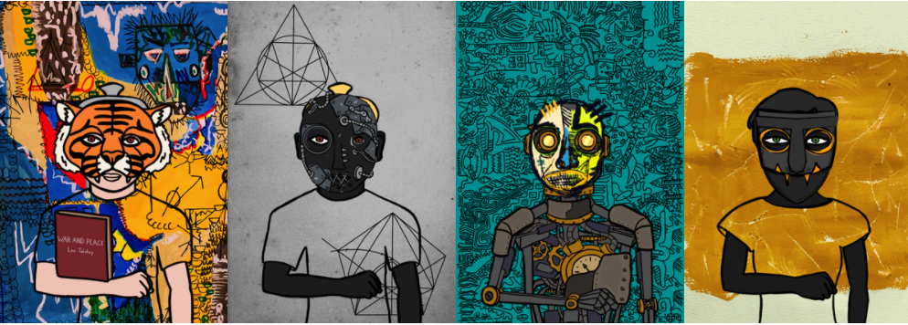

```{r setup, include=FALSE}
knitr::opts_chunk$set(echo = TRUE, warning = FALSE, message = FALSE, fig.align = "center", fig.width=10, fig.height=7, out.width=600)
```

## Hashmasks

According to their official website, Hashmasks is a living digital art collectible created by over 70 artists globally. It is a collection of 16,384 unique digital portraits brought to the Ethereum ecosystem by Suum Cuique Labs from Zug, Switzerland. In addition to having a unique piece of art, by holding the artwork you accumulate the NCT token on a daily basis, which allows you to choose a name for your portrait. This unconventional mixture of tokenomics, scarcity and visual aesthetics create a user experience where art enthusiasts  are compelled to collect, hoard and sporadically trade the Hashmasks in their possession. In this analytics case study, we'll be using data to gain a broad understanding of what visual traits make a mask more or less rare.


<p align="center">



</p>

---

## Getting Started

We will be using the tidyverse library, an "opinionated collection of R packages designed for data science. All packages share an underlying design philosophy, grammar, and data structures."

```{r}
library(tidyverse)
```


<br> <br><br> <br>
<p align="center">


</p>
---

## The Data

The data we use in this case study are available here: https://docs.google.com/spreadsheets/d/1rLagIfx4dSU_4ZbhuRxTjPYg0A5-ZQC8PIhLs29srwI/edit#gid=282814562.

Our dataset contains columns that track the skin color, character type, eye color, mask type, an item indicator and a rarity score.

Let's view the first few rows of the data:

```{r}
hashmasks_raw <- read_csv('All Hashmasks.csv')

sample_n(hashmasks_raw,5)
```

---

## The Data (continued...)

To make our dataset a little tidier, we will remove the `X2`, `URL` and `Preview` columns as they are not useful in our analysis. 

```{r}
hashmasks <- hashmasks_raw %>%
  select(-X2, -URL, -Preview)

sample_n(hashmasks,5)
```

---

## Traits

Each hashmask is unique and here are traits that are provided: 

* `Skin` - Blue, Dark, Freak, Gold, Gray, Light, Mystical, Steel, Transparent, Wood 
* `Character` - Female, Golden Robot, Male, Mystical, Puppet, Robot
* `Eyes` - Blue, Dark, Freak, Glass, Green, Heterochromatic, Mystical, Painted
* `Mask` - Abstract, African, Animal, Aztec, Basic, Chinese, Crayon, Doodle, Hawaiian, Indian, Mexican, Pixel, Steampunk, Street, Unique, Unmasked
* `Item` - Book, Bottle, Golden Toilet Paper, Mirror, No Item, Shadow Monkey, Toilet Paper

Note that, there are a total of 1545 unique combination of these traits for the Hashmasks. 

---

## Rarity 

Each Hashmask has a `Rarity` score that ranges between 0 and 100. This `Rarity` score is based on the aforementioned traits. This is referred to Explicit Rarity on the official website. 

For instance, only 1% of all Hashmasks (165 Hashmasks)  have `Gold` Skins and thus having `Gold` Skin will have a higher than average `Rarity` score. 

Also, there are 416 Hashmasks that have `Rarity` of 0 and only 9 Hashmasks that have `Rarity` of 100.

Here is a summary of the `Rarity` score:

```{r}
hashmasks %>% filter(!is.na(Rarity)) %>% summarise(Mean = mean(Rarity), Median = median(Rarity))
```

---

## Exploring the Rarity

We can also view the `Rarity` scores on a graph.  Here we've created a sorted `Rarity` curve.

```{r, echo = FALSE}
hashmasks %>%
  arrange(Rarity) %>%
  mutate(Index = 1:nrow(.)) %>%
  ggplot(aes(x=Index, y= Rarity, color = Rarity))+
  geom_line(size = 2)+
  scale_y_continuous(breaks = scales::pretty_breaks(n=10), expand = c(0,0))+
  scale_x_continuous(breaks = scales::pretty_breaks(n=20), expand = c(0,0),limits = c(0, 16500))+
  labs(title = "Hashmasks Rarity Curve",
       y= "Rarity Score")+
  scale_colour_gradient(low = "red", high = "green")+
  theme(legend.position = "OFF")
```

---

## The code

```{r, eval = FALSE}
hashmasks %>%
  arrange(Rarity) %>%
  mutate(Index = 1:nrow(.)) %>%
  ggplot(aes(x=Index, y= Rarity, color = Rarity))+
  geom_line(size = 2)+
  scale_y_continuous(breaks = scales::pretty_breaks(n=10), expand = c(0,0))+
  scale_x_continuous(breaks = scales::pretty_breaks(n=20), expand = c(0,0),limits = c(0, 16500))+
  labs(title = "Hashmasks Rarity Curve",
       y= "Rarity Score")+
  scale_colour_gradient(low = "red", high = "green")+
  theme(legend.position = "OFF")
```

---
## Exploring the traits

We can use `ggplot2` to plot the distribution of each trait. For instance,

```{r, echo = FALSE}
skincolor <-  c(Freak = "#516818", Dark = "#613F04", Light = "#FACD7F", 
                Gold = "gold", Wood = "#DEA034", Gray = "#3F4756", 
                Steel = "#8B7D64", Blue = "#20407B", Mystical = "#E5CAE5", Transparent = "#F8F4F8")

hashmasks %>%
  ggplot(aes(x = Skin, fill = Skin))+
  geom_bar(color = "black")+
  scale_y_continuous(breaks = scales::pretty_breaks(n=20), expand = c(0,0), limits = c(0,4800))+
  geom_text(aes(label= scales::percent(..count../sum(..count..))), stat= "count", vjust = -0.25)+
  theme(legend.position = "OFF")+
  labs(title = "Distribution of Hashmasks' Skin Types")+
  scale_fill_manual(values = skincolor)
```

---

## The code

```{r, eval = FALSE}
skincolor <-  c(Freak = "#516818", Dark = "#613F04", Light = "#FACD7F", 
                Gold = "gold", Wood = "#DEA034", Gray = "#3F4756", 
                Steel = "#8B7D64", Blue = "#20407B", Mystical = "#E5CAE5", Transparent = "#F8F4F8")

hashmasks %>%
  ggplot(aes(x = Skin, fill = Skin))+
  geom_bar(color = "black")+
  scale_y_continuous(breaks = scales::pretty_breaks(n=20), expand = c(0,0), limits = c(0,4800))+
  geom_text(aes(label= scales::percent(..count../sum(..count..))), stat= "count", vjust = -0.25)+
  theme(legend.position = "OFF")+
  labs(title = "Distribution of Hashmasks' Skin Types")+
  scale_fill_manual(values = skincolor)
```

---

## Exploring the traits (continued...)

We can also look at the boxplots for each trait. For instance,

```{r, echo = FALSE}
ggplot(hashmasks, aes(x = Skin, y = Rarity, fill = Skin))+
  geom_boxplot()+
  labs(title = "Boxplot of Rarity vs Skin")+
  scale_fill_manual(values = skincolor)+
  theme(legend.position = "OFF")+
  scale_y_continuous(breaks = scales::pretty_breaks(n=10))
```

---

## The Code

```{r, eval = FALSE}
ggplot(hashmasks, aes(x = Skin, y = Rarity, fill = Skin))+
  geom_boxplot()+
  labs(title = "Boxplot of Rarity vs Skin")+
  scale_fill_manual(values = skincolor)+
  theme(legend.position = "OFF")+
  scale_y_continuous(breaks = scales::pretty_breaks(n=10))
```

---

## Your Turn

1. Plot the `Distribution of Hashmasks' Eyes Types` using `ggplot2`. 
2. Plot the `Boxplot of Rarity vs Eyes` using `ggplot2`. 


<br> <br><br><br>
<p align="center">


</p>
---

## Answers

### 1. 

.pull-left[
```{r p1, eval = FALSE}
eyescolor <-  c(Freak = "#D34818", Dark = "#47585E", Green = "#9AC828", 
               Blue = "#289FC8", Glass = "gold", Painted = "black", 
               Mystical = "#F2C623", Heterochromatic = "red")
hashmasks %>%
  ggplot(aes(x = Eyes, fill = Eyes))+
  geom_bar(color = "black")+
  scale_y_continuous(breaks = scales::pretty_breaks(n=20), 
                     expand = c(0, 0), limits = c(0, 8000))+
  geom_text(aes(label= scales::percent(..count../sum(..count..))), 
            stat= "count", vjust = -0.25)+
  theme(legend.position = "OFF")+
  labs(title = "Distribution of Hashmasks' Eyes Types")+
  scale_fill_manual(values = eyescolor)
```
]

.pull-right[
```{r p1-out, ref.label="p1", echo=FALSE}
```

]
---

### 2.

.pull-left[
```{r p2, eval = FALSE}
ggplot(hashmasks, 
       aes(x = Eyes, 
           y = Rarity, 
           fill = Eyes))+
  geom_boxplot()+
  labs(title = "Boxplot of Rarity vs Eyes")+
  scale_fill_manual(values = eyescolor)+
  theme(legend.position = "OFF")+
  scale_y_continuous(
    breaks = scales::pretty_breaks(n=10)
    )
```
]

.pull-right[
```{r p2-out, ref.label="p2", echo=FALSE}
```

]

---

## Regression 

We try to fit a regression that gives Rarity based on the traits provided. This will give us an estimate of the effect of each individual train on a Hashmask's rarity score.

```{r}
model <- lm(Rarity ~ relevel(as.factor(Skin), ref = "Gray")+
           relevel(as.factor(Character), ref = "Male")+
           relevel(as.factor(Eyes), ref = "Dark")+
           relevel(as.factor(Mask), ref = "Mexican")+
           relevel(as.factor(Item), ref = "No Item"), 
           data = hashmasks)
```

Note that we use `relevel` to make the most common attribute in each trait as the base level so that it is easier to interpret the coefficients. 

---
## Regression (continued...)

```{r}
summary(model)
```

---

## Regression (continued...)

However, the regression has failed due to some of the traits are highly dependent on each other. Specifically, we have the following unique combinations of traits:

* `Skin` is `Wood` if and only if `Character` is `Puppet` if and only if `Eyes` is `Painted` 
* `Skin` is `Steel` if and only if `Character` is `Robot`
* `Skin` is `Mystical` if and only if `Character` is `Mystical` if and only if `Eyes` is `Mystical`
* `Skin` is `Gold` if and only if `Character` is `Golden Robot`

One way to go around this is to combine these traits into one column as follows:
```{r}
data <- hashmasks %>% unite("SCE", Skin:Character:Eyes) 
model2 <- lm(Rarity ~ 
           relevel(as.factor(SCE), ref = "Gray_Male_Dark")+
           relevel(as.factor(Mask), ref = "Mexican")+
           relevel(as.factor(Item), ref = "No Item"), data = data)
```

---
## Regression (continued...)

```{r}
summary(model2)
```

---
## Conclusion
Our journey into Haskmasks showed us how to plot the rarity of a mask along a curve, how to use boxplots to compare characteristic traits against their rarity scores, and ultimately how to estimate the effect each trait has on mask exclusivity. Are there any other interesting analysis you can think of?  If so, feel free to share them with us!


<p align="center">


</p>


