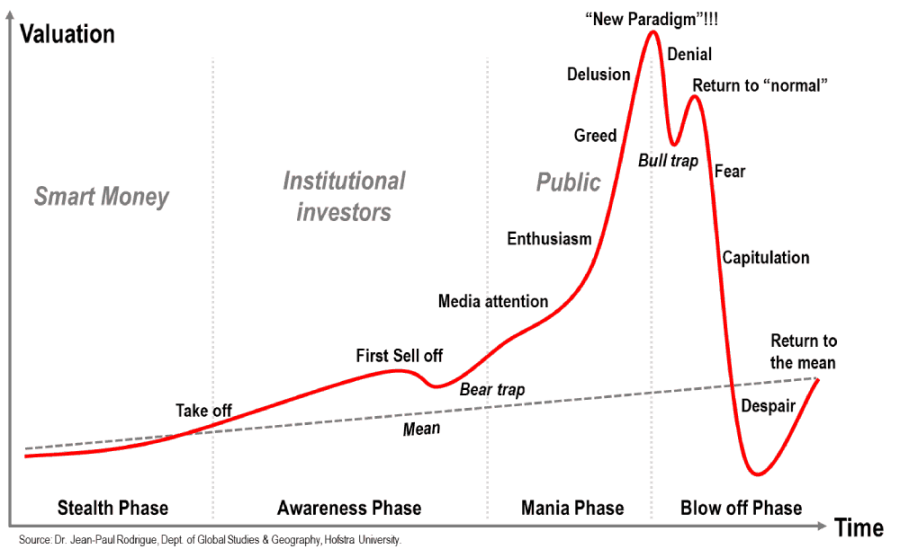

```{r setup, include=FALSE}
knitr::opts_chunk$set(echo = TRUE, warning = FALSE, message = FALSE, fig.align = "center", fig.width=10, fig.height=7, out.width=600)

```

## The Investment Curve

As much as we love the technology, we can not escape the financial aspect of cryptocurrency.  When hype takes hold price movement, both up and down, come swiftly and boldly.  These movements aren't too foreign to the markets and have actually been well studied.  Dr. Jean-Paul Rodrigue of Hofstra University created the a diagram to depict the change in sentiment and interest of an asset which, according to his research, are the fundamental causes of the extreme volatility. As part of our R course, in this brief case study we'll walk you through the recreation of Dr. Rodrigue's famous graph using the ggplot2 library.


<p align="center">



</p>

---

## Motivation

Because we were interested in making some enhancements to the original graph, we decided that we'd produce a version in `ggplot2`, slowly building up the individual layers of the graph, to best match the appearance of the original. This mean both generating data that matched the curvature of the plot itself, as well as utilizing the immense theme-ing and customization capabilities that the `ggplot2` platform provides. Let's get started! 

We will be using the following libraries:

```{r}
library(tidyverse)
library(ggrepel)
library(knitr)
library(kableExtra)
```

<p align="center">


</p>
---

## Process (Curve)

To begin re-creating this in `ggplot2`, we used a data extraction tool which roughly approximates data in the X and Y plane matching the red line. This compromises 280 points in order to match the granularity of the original. The first few rows are shown below:

```{r}
cv <- read_csv("data/Investment_Bubble_Cycle.csv") %>%
    mutate(Y = Y + 50) #added 50 to Y to have more space between the curve and the x-axis
cv %>%
    head() %>%
    kable() %>%
    kable_styling(bootstrap_options = c("striped", "hover"), full_width = FALSE)
```

---

## Process (Linear Trend)

The same procedure was done to extract data for the linear fit that runs on a positive slope through the plot. The first few rows of data are shown below:

```{r}
ln <- read_csv("data/Investment_Bubble_Cycle_Line.csv") %>%
    mutate(Y = Y + 50 + 28) #added 28 to Y to shift the line to the correct position

ln %>%
    head() %>%
    kable() %>%
    kable_styling(bootstrap_options = c("striped", "hover"), full_width = FALSE)
```

---

## Initial plot 

With the data at hand, we can produce our first plot to see how well the line approximates the curve. The `geom_line()` function handles both the straight dashed line, by specifying the linetype aesthetic, and the curvy colored red line. Remember that when you hard-code a value, such as "red", or "dashed", the aesthetic mapping should NOT be specified within the `aes()` call, but rather outside of it. Also, the `size = 1.5` is to increase the thickness of the red curve.


```{r}
p1 <- ggplot(data = ln, aes(x = X, y = Y)) +
    geom_line(linetype = "dashed") +
    geom_line(data = cv, colour = "red", size = 1.5) 

```

---

```{r}
p1
```

---

## Labeling

It's a start! Next let's go ahead and label the various portions of the curve as is done in the original image. Unfortunately, there are no real shortcuts here - We have to manually specify the X / Y position of the text labels to keep it consistent with the original as follows.

1. Get the points where the labels are by using the indexes in the cv table.
2. Create a `Label` column for the labels
3. Using `ifelse()`, we adjust the position for each label as needed. 

<p align="left">


</p>
---


```{r}
mapping = tibble(
    X = cv$X[c(20, 50, 70, 75, 105, 125, 138, 150, 175, 165, 185, 208, 225, 255, 280)],
    Label = c("Take off", "First Sell off", "Bear trap", "Media attention", "Enthusiasm",
              "Greed", "Delusion", "\"New Paradigm\"!!!", "Bull trap", "Denial",
              "Return to \"normal\"", "Fear", "Capitulation", "Despair", "Return to\nthe mean")
) %>%
    left_join(cv) %>%
    mutate(Y = ifelse(Label %in% c("Bear trap"), Y - 40, Y),
           Y = ifelse(Label %in% c("Media attention"), Y + 30, Y),
           X = ifelse(Label %in% c("Enthusiasm"), X - 50, X),
           X = ifelse(Label %in% c("Greed"), X - 30, X),
           X = ifelse(Label %in% c("Delusion"), X - 40, X),
           X = ifelse(Label %in% c("Denial"), X + 30, X),
           Y = ifelse(Label %in% c("Denial"), Y + 10, Y),
           X = ifelse(Label %in% c("Return to \"normal\""), X + 90, X),
           Y = ifelse(Label %in% c("\"New Paradigm\"!!!"), Y + 15, Y),
           Y = ifelse(Label %in% c("Return to\nthe mean"), Y - 30, Y),
           X = ifelse(Label %in% c("Fear"), X + 25, X),
           X = ifelse(Label %in% c("Capitulation"), X + 55, X),
           Y = ifelse(Label %in% c("Despair"), Y + 45, Y),
           X = ifelse(Label %in% c("Despair"), X + 18, X),
           Y = ifelse(Label %in% c("Bull trap"), Y - 30, Y))
```


---

Now that we have the `mapping` table, we will use `geom_text()` to show the labels on the plot. 

```{r}
p2 <- p1 + 
    geom_text(data = mapping, aes(label = Label), vjust = -1.5, fontface = "bold", size = 3.5)
p2
```

---

## Plot Sections

Now let's divide the plot into the Smart Money, Institutional Investors, and Public regions as per the original, as well as the different phases. First, we will need to create another table manually using cv table as follows:

```{r}
verticals <- tibble(
    X = cv$X[c(20, 70, 150)],
)

sub_labels <- tibble(
    X = cv$X[c(8, 45, 92, 250)],
    lbl = c("Stealth Phase", "Awareness Phase", "Mania Phase", "Blow off Phase"),
    lbl2 = c("Smart Money", "Institutional Investors", "Public", NA)
)
```

---

Then, this is a simple `geom_vline()` call passing in the locations of each boundary. With this, we can append two sets of labels: the labels running along the center, and along the bottom. We'll also annotate the Mean line as done in the original using `annotate()`.     

```{r}
p3 <- p2 + geom_vline(data = verticals, aes(xintercept = X), linetype = "dotted", colour = "grey80") +
    geom_text(data = sub_labels, aes(label = lbl, y = 10), fontface = "bold") +
    geom_text(data = sub_labels, aes(label = lbl2, y = 375), fontface = "bold", colour = "grey80", size = 6) +
    annotate("text", x = 425, y = 108, label = "Mean", angle = 4, fontface = "bold")
```

---

```{r}
p3
```

---

## Black/White Theme

We're getting closer. Most of the data presented in the original is now present. But we're missing a lot of the styling. The first thing we'll do is switch to the black and white theme provided in ggplot2 with `theme_bw()`:

```{r}
p4 <- p3 + theme_bw()
```

---

```{r}
p4
```

---

## Final Steps

Now the similarities are really starting to take shape. The primary component left is to stylize the axes and other elements of the theme. In particular, we remove axis ticks and labels using `element_blank()`, and modify the panel border to span the left and bottom edges, with an arrow at each end using `element_line()` and `element_text()`. This allows us to then move and place the Valuation and Time labels much like in the original chart.

<p align="right">


</p>
---

## Plot Code

```{r}
p5 <- p4 + theme(
    axis.ticks = element_blank(),
    axis.text = element_blank(),
    panel.border = element_blank(), 
    axis.line = element_line(size = 1.5, colour = "grey55", arrow = grid::arrow(length = unit(0.3, "cm"))),
    axis.title = element_text(size = 16, face = "bold", hjust = 1),
    axis.title.y = element_text(angle = 0, margin = margin(l = 20, r = -80)),
    axis.title.x = element_text(hjust = 1.08, vjust = 4.5),
    plot.margin=unit(c(1.5,2.5,1.5,1.2),"cm"),
    panel.grid = element_blank()
) +
    labs(
        x = "Time",
        y = "Valuation"
    )
```

---

## Final Plot

```{r}
p5
```

---

## Conclusion

And there you have it. Now that we've fully "digitized" the original, we can make modifications as needed. We integrated an interactive version of this chart into a Shiny app, where we're looking to collect responses about where you believe we are in the current Bitcoin hype cycle. Please check it out here:

https://crypto.omnianalytics.io/apps/investment-curve/

The full code is available as a GitHub gist here: https://gist.github.com/erichare/1c03f8b7e8fb57f6a6edbcfc23a86457


<p align="right">


</p>