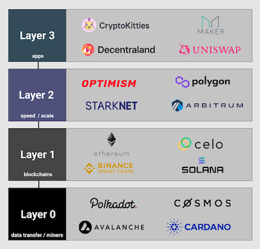

```{r setup, include=FALSE}
knitr::opts_chunk$set(echo = TRUE, warning = FALSE, message = FALSE, fig.align = "center", fig.width=14, dpi=300)

library(knitr)
library(kableExtra)
library(tidyverse)
library(lubridate)
library(hrbrthemes)
library(viridis)
library(calendR)
library(forcats)
library(RColorBrewer)
library(patchwork)

brownian_forecast <- function(data, newdata, cap = 10, sims = 1000) {
    # Build the brownian motion data
    btc_brownian <- data %>%
        mutate(Returns = c(1, Contracts[-1] / lag(Contracts, 1)[-1])) %>%
        mutate(Returns = pmin(cap, pmax(1 / cap, Returns)),
               ScaledReturns = Returns - 1)
    
    # Simulate returns according to the number of times
    simulated_returns <- as.data.frame(do.call(cbind, lapply(1:sims, function(i) {
        sample(na.omit(btc_brownian$Returns), size = nrow(newdata), replace = TRUE)
    })))
    
    # Build the predictions dataset
    btc_brownian_preds <- cbind(Date = newdata$Date, simulated_returns) %>%
        gather(key = Simulation, value = Value, 2:ncol(.)) %>%
        group_by(Simulation) %>%
        mutate(CumeValue = cumprod(Value),
               Future = CumeValue * data$Contracts[length(data$Contracts)]) %>%
        group_by(Date) %>%
        summarise(Prediction = mean(Future),
                  Upper = quantile(Future, .975),
                  Lower = quantile(Future, .025),
                  Method = "Brownian Motion")
    
    return(btc_brownian_preds)
}
```

## Introduction

A Layer 2 chain, or L2 chain, helps to keep in check the growth of L1 chains such as Ethereum.



---

## Goals

As L2 chains continue to grow, it is worth devoting some statistical expertise to attempting to forecast their growth.

In this case study, we will focus on two: `Polygon` and `Optimism`, and use a Brownian Motion based forecasting technique in order to forecast the growth.

Let's get started!

---

## The Data

First, let's begin by loading in our two sources of data. We'll start with `Polygon`:

```{r}
pol <- read_csv("data/polygon.csv")

pol %>%
    head %>%
    kable
```

---

## Optimism Data

Next, the `Optimism` data:

```{r}
optim <- read_csv("data/optimistic.csv")

optim %>%
    head %>%
    kable
```

---

## A First Glance at the Polygon Data

We do some minor data cleaning below:

```{r}
## Day of week
pol$Day <- weekdays(pol$`Date(UTC)`)
pol$Day <- factor(pol$Day, levels=weekdays(pol$`Date(UTC)`[2]+0:6))
pol$Contracts <- pol$`No. of Verified Contracts`
optim$Day <- weekdays(optim$`Date(UTC)`)
optim$Day <- factor(optim$Day, levels=weekdays(pol$`Date(UTC)`[2]+0:6))
optim$Contracts <- optim$`No. of Verified Contracts`


## Weekday wise Contracts Deployed
pol_pld <- pol[pol$Contracts>0,]
pol_plot <- pol_pld %>%
			ggplot(aes(x=Day, y=Contracts, fill=Day)) +
			geom_boxplot() +
			scale_fill_viridis(discrete = TRUE, alpha=0.6) +
			geom_jitter(color="black", size=0.4, alpha=0.9) +
			theme(legend.position="none",plot.title = element_text(size=11)) +
			ggtitle("Contracts Verified Weekday Wise (Polygon Chain)") +
			xlab("Weekday")+
			scale_y_continuous(limits = quantile(pol_pld$Contracts, c(0.01, 0.99)))
```

---

We immediately see a strong weekend effect in the number of contracts verified for Polygon

```{r, echo=FALSE}
pol_plot
```

---

## A First Glance at the Optimism Data

We perform a similar routine for the optimism data

```{r}
optim_pld <- optim[optim$Contracts>0,]
optim_plot <- optim_pld %>%
			ggplot(aes(x=Day, y=Contracts, fill=Day)) +
			geom_boxplot() +
			scale_fill_viridis(discrete = TRUE, alpha=0.6) +
			geom_jitter(color="black", size=0.4, alpha=0.9) +
			theme(legend.position="none",plot.title = element_text(size=11)) +
			ggtitle("Contracts Verified Weekday Wise (Optimistic Chain)") +
			xlab("Weekday")+
			scale_y_continuous(limits = quantile(optim_pld$Contracts, c(0.01, 0.99)))
```

---

The weekend effect is much less pronounced for the Optimism chain, though there still remains a noticeable dropoff in verified contracts on Sundays.

```{r, echo=FALSE}
optim_plot
```

---

## Polygon Calendar (2022)

We can visualize a calendar of the 2022 Polygon data using the following code:

```{r}
pol22d <- data.frame(Date = seq(ymd('2022-01-01'),ymd('2022-12-31'), by = 'days'), Contracts = 0)
pol22d$Contracts <- pol$Contracts[match(pol22d$Date,pol$`Date(UTC)`)]
pol22d$ContractsCuts <- as.character(cut(pol22d$Contracts, c(0:6*100),right=FALSE))
pol22d$ContractsCuts <- fct_reorder(pol22d$ContractsCuts, pol22d$Contracts)
pol22 <- calendR(
					title = "Polygon 2022",title.size = 20,mbg.col = 2,weeknames = c("M","T","W","T","F","S","S"),subtitle = "Contracts Verified",subtitle.size = 10,months.col = "white",
					year = 2022,special.days = as.character(pol22d$ContractsCuts),special.col = brewer.pal(length(levels(pol22d$ContractsCuts)), "Oranges")[order(levels(pol22d$ContractsCuts))],legend.pos = "bottom"
				)
```

---

```{r, echo=FALSE}
pol22
```

---

## Polygon Calendar (2021 + 2022)

And for 2021 + 2022 combined:

```{r}
pol21d <- data.frame(Date = seq(ymd('2021-01-01'),ymd('2021-12-31'), by = 'days'), Contracts = 0)
pol21d$Contracts <- pol$Contracts[match(pol21d$Date,pol$`Date(UTC)`)]
pol21d$ContractsCuts <- as.character(cut(pol21d$Contracts, c(0:5*100,3900,4000),right=FALSE,dig.lab=10))
pol21d$ContractsCuts <- fct_reorder(pol21d$ContractsCuts, pol21d$Contracts)
pol21 <- calendR(
					title = "Polygon 2021",,title.size = 20,mbg.col = 2,weeknames = c("M","T","W","T","F","S","S"),subtitle = "Contracts Verified",subtitle.size = 10,months.col = "white",
					year = 2021,special.days = as.character(pol21d$ContractsCuts),special.col = brewer.pal(length(levels(pol21d$ContractsCuts)), "Oranges")[order(levels(pol21d$ContractsCuts))],legend.pos = "bottom"
				)
pol_calplot <- pol21+pol22
```

---

```{r, echo=FALSE}
pol_calplot
```

---

## Optimism Calendar (2022)

A similar routine allows us to compute the calendar for Optimism:

```{r}
opt22d <- data.frame(Date = seq(ymd('2022-01-01'),ymd('2022-12-31'), by = 'days'), Contracts = 0)
opt22d$Contracts <- optim$Contracts[match(opt22d$Date,optim$`Date(UTC)`)]
opt22d$ContractsCuts <- as.character(cut(opt22d$Contracts, c(0,1,1:4*20),right=FALSE))
opt22d$ContractsCuts <- fct_reorder(opt22d$ContractsCuts, opt22d$Contracts)
opt22 <- calendR(
					title = "Optimistic 2022",,title.size = 20,mbg.col = 2,weeknames = c("M","T","W","T","F","S","S"),subtitle = "Contracts Verified",subtitle.size = 10,months.col = "white",
					year = 2022,special.days = as.character(opt22d$ContractsCuts),special.col = brewer.pal(length(levels(opt22d$ContractsCuts)), "Oranges")[order(levels(opt22d$ContractsCuts))],legend.pos = "bottom"
				)
```

---

```{r, echo=FALSE}
opt22
```

---

## Optimism Calendar (2021 + 2022)

And for 2021 + 2022 combined:

```{r}
opt21d <- data.frame(Date = seq(ymd('2021-01-01'),ymd('2021-12-31'), by = 'days'), Contracts = 0)
opt21d$Contracts <- optim$Contracts[match(opt21d$Date,optim$`Date(UTC)`)]
opt21d$ContractsCuts <- as.character(cut(opt21d$Contracts, c(0,1,1:4*10),right=FALSE))
opt21d$ContractsCuts <- fct_reorder(opt21d$ContractsCuts, opt21d$Contracts)
opt21 <- calendR(	
					title = "Optimistic 2021",,title.size = 20,mbg.col = 2,weeknames = c("M","T","W","T","F","S","S"),subtitle = "Contracts Verified",subtitle.size = 10,months.col = "white",
					year = 2021,special.days = as.character(opt21d$ContractsCuts),special.col = brewer.pal(length(levels(opt21d$ContractsCuts)), "Oranges")[order(levels(opt21d$ContractsCuts))],legend.pos = "bottom"
				)
optim_calplot <- opt21+opt22
```

---

```{r, echo=FALSE}
optim_calplot
```

---

## Brownian Motion

Lastly, we use brownian motion in order to forecast each

```{r}
## Brownian Motion
polbd <- pol[5:nrow(pol),]
polbd$Date <- polbd$`Date(UTC)`
polbd <- polbd[,c("Date","Contracts")]
optimbd <- optim
optimbd$Date <- optimbd$`Date(UTC)`
optimbd <- optimbd[,c("Date","Contracts")]
polbd_n <- data.frame(Date = max(polbd$Date)+1:30)
pol_forecast <- brownian_forecast(polbd,polbd_n)
optimbd_n <- data.frame(Date = max(optimbd$Date)+1:30)
optim_forecast <- brownian_forecast(optimbd,optimbd_n)
```

---

## Polygon Forecast

```{r}
pol_forecast %>%
    head %>%
    kable
```

---

## Optimism Forecast

```{r}
optim_forecast %>%
    head %>%
    kable
```
