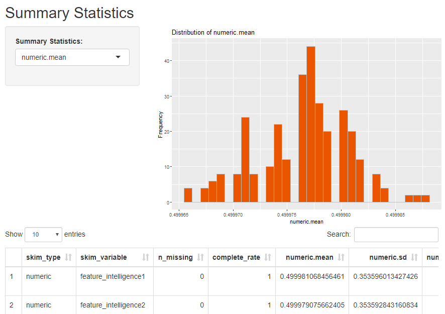

```{r setup, include=FALSE}
knitr::opts_chunk$set(echo = TRUE)
```

## It's So Shiny!

Shiny is an R package that allows you to easily create interactive web applets using R.

  - Produced by RStudio.
  - Code can be entirely within R (or customized with HTML/Javascript).
  - Take a look at Rstudio's [showcase](http://shiny.rstudio.com/gallery/) of shiny applets.

## Example  

<center></center>


## Shiny Documentation and Help

  - [RStudio Tutorial](http://rstudio.github.io/shiny/tutorial/#welcome)
    - Good source of information.

  - [Shiny Setup, Showcase, and Server setup](http://shiny.rstudio.com/)

    - Useful if you want to use shiny on your own webserver.

  - [Shiny Github Page](https://github.com/rstudio/shiny)

    - See the latest updates.

  - [Shiny mailing List](https://groups.google.com/forum/#!forum/shiny-discuss)

    - Check the tutorial first, then search the mailing list.


## Installing Shiny

```{r,eval = F}
install.packages("shiny")
```

## Your Turn
* Download the code file for the example applet, Example_01.R.
* Create a new folder named "dataforshiny" in the same directory as Example_01.R.
* Download the sample.csv file and put it in the data folder.

Run the applet

## Example_01 app

<center></center>
