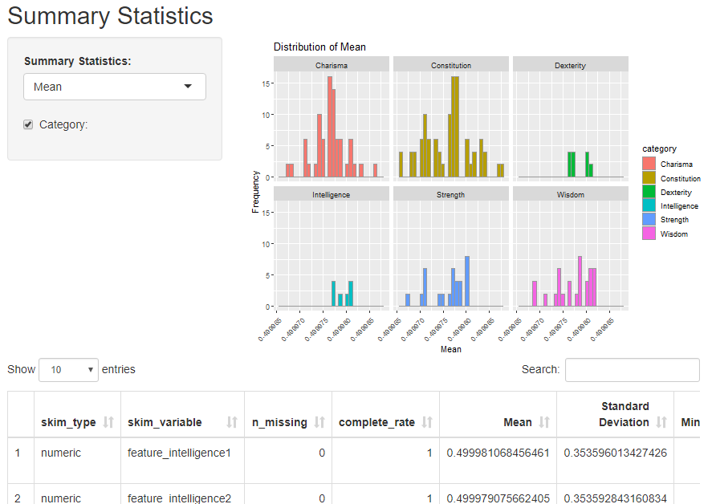

```{r setup, include=FALSE}
knitr::opts_chunk$set(echo = TRUE, eval = FALSE)
```

## Let's build a Shiny App!

First, download the dataforshiny folder containing 5 csv.files. These data were obtained from the Numerai Tournament training data. 

### The plan

####
We will build an app that lets user to explore the Numerai Tournament training data in various different ways.

We will first build an app for each of the 5 datasets in the folder. After that, we will combine these apps into one!


## The summary data

We have seen and used this dataset in the previous section. Let's start with the existing code in Example_01.R and add more functionality.

First, we can change the names of the columns so that they are more readable:

```{r}
#change column names of summary statistcs
names(summary)[5:11] <- c("Mean",
                          "Standard Deviation",
                          "Minimum",
                          "First Quartile",
                          "Median",
                          "Third Quartile",
                          "Maximum")
```

##

Next, let's add a column named Category.

```{r}
#create category in summary table
summary$category<-ifelse(startsWith(summary$skim_variable,
              'feature_intelligence') ,'Intelligence',
              ifelse(startsWith(summary$skim_variable,
              'feature_charisma'),'Charisma',
              ifelse(startsWith(summary$skim_variable,
              'feature_strength'), 'Strength',
              ifelse(startsWith(summary$skim_variable,
              'feature_dexterity'), 'Dexterity',
              ifelse(startsWith(summary$skim_variable,
              'feature_constitution'),'Constitution', 'Wisdom')))))
```


Thus, we can now plot a similar histogram across different categories by simply adding <b> +facet(~category) </b>.

##

Let's create a <b> checkboxInput </b> to let the user pick between the two plots.

```{r}
#in UI
checkboxInput("category", "Category:", FALSE)

#in server
  output$summaryplot <- renderPlot({
    if (input$category){
      ggplot(summary, aes_string(x=input$sum_stat, fill = "category")) +
        geom_histogram(color="grey60")+
        labs(title=paste0("Distribution of ", input$sum_stat),
             x=input$sum_stat, y = "Frequency") +
        facet_wrap(~category) +
        theme(axis.text.x = element_text(angle = 45,
                                         vjust = 1, size = 9, hjust = 1))

    } else {
      ggplot(summary, aes_string(x=input$sum_stat)) +
        geom_histogram(fill = "#EA5600", color="grey")+
        labs(title=paste0("Distribution of ", input$sum_stat),
             x=input$sum_stat, y = "Frequency")        
    }
  })

```

## First app done!

You can download the code part1.R and make sure it is in the same directory as the folder dataforshiny.

<center></center>
