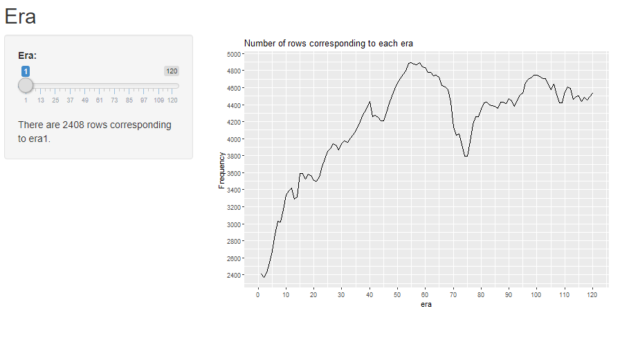

```{r setup, include=FALSE}
knitr::opts_chunk$set(echo = TRUE, eval = FALSE)
```

## The era-table data

Let's load the data and use the R shiny template provided in 9-2-ShinyStructure.

```{r}
era_table <- read.csv("data/era_table.csv", header=T)

ui <- fluidPage(

  # Application title
  titlePanel("Title"),

  sidebarPanel(
    # Define some inputs here
  ),

  mainPanel(
    # output (from the server) go here
  )

)

server <- function(input, output) {
  # do something
}
```


## Your turn

1. Change the title to "Era".
2. In the sidebarPanel, create a <b> slideInput </b> so the user can pick an Era ranging from 1 to 120.
3. In the mainPanel, display a line plot, where, x is the first column and y is the second column using <b> ggplot2 </b>.


##

### 1.
```{r}
titlePanel("Era")
```

### 2.

```{r}
sliderInput("era1", "Era:", min = 1, max = 120, step=1, value = 1)
```

##

### 3.
```{r}
#in UI
plotOutput("eraplot")

#in Server
output$eraplot <- renderPlot({
    ggplot(data = era_table, aes(x = era, y = n, group = 1)) +
      geom_line()+
      scale_y_continuous(breaks = scales::pretty_breaks(n=10))+
      scale_x_continuous(breaks = seq(0, 120, by = 10))+
      labs(title="Number of rows corresponding to each era", y="Frequency")
  })
```


## textOutput
Lastly, we can add a textoutput telling us what the y-value is for each corresponding era the user picked in the slider. Note that, the y-value is actually the number of rows in each era in the training data.

```{r}
#in UI
textOutput("erainfo1")

#in Server
output$erainfo1 <- renderText({
        paste0("There are ", era_table$n[era_table$era==input$era1],
               " rows corresponding to era", input$era1, ".")
  })  
```

## Second app done!
You can download the code part2.R and make sure it is in the same directory as the folder dataforshiny. 

<center></center>
