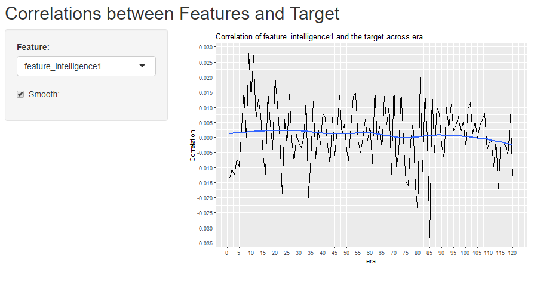

```{r setup, include=FALSE}
knitr::opts_chunk$set(echo = TRUE, eval = FALSE)
```

## The correlations data

Let's load the data and use the R shiny template provided in 9-2-ShinyStructure.

```{r}
correlations_by_era <- read.csv("dataforshiny/correlations.csv", header=T)

ui <- fluidPage(

  # Application title
  titlePanel("Title"),
  
  sidebarPanel(
    # Define some inputs here
  ),
  
  mainPanel(
    # output (from the server) go here
  )

)

server <- function(input, output) {
  # do something
}
```


## Your turn

1. Change the title to "Correlations between Features and Target".
2. In the sidebarPanel, create a <b> varSelectInput </b> that allows user to select the names of the columns 2 to 311.
3. In the sidebarPanel, create a <b> checkboxInput </b> named "Smooth:" that is unchecked by default.
4. In the mainPanel, display a line plot x is the first column and y is the column that the user has selected using <b> ggplot2 </b>. Make sure the title also changes corresponding to the selected column.


##

### 1. 
```{r}
titlePanel("Correlations between Features and Target")
```

### 2.

```{r}
varSelectInput("feature", "Feature:", correlations_by_era[2:311])
```

##

### 3.
```{r}
checkboxInput("smooth", "Smooth:", FALSE)
```

### 4.
```{r}
#in UI
plotOutput("corrplot")

#in Server
  output$corrplot <- renderPlot({
      ggplot(data=correlations_by_era, aes_string(x="era", y=input$feature))+
        geom_line()+
        labs(title=paste0("Correlation of ", input$feature ," and 
                          the target across era"), y="Correlation")+
        scale_y_continuous(breaks = scales::pretty_breaks(n=10))+
        scale_x_continuous(breaks = seq(0, 120, by = 5)) 
  })
```


##
At this point, you are probably wondering what the <b> checkboxInput </b> is for. 

It is to let user choose whether to display a smooth line in the plot. We have done something similar with our first app!

```{r}
output$corrplot <- renderPlot({
    if (input$smooth){
      ggplot(data=correlations_by_era, 
             aes_string(x="era", y=input$feature))+
        geom_line()+
        labs(title=paste0("Correlation of ", 
                          input$feature ," and the target across era"), 
             y="Correlation")+
        scale_y_continuous(breaks = scales::pretty_breaks(n=10))+
        scale_x_continuous(breaks = seq(0, 120, by = 5))+geom_smooth(se=FALSE)            
      
    } else {
      ggplot(data=correlations_by_era, aes_string(x="era", y=input$feature))+
        geom_line()+
        labs(title=paste0("Correlation of ", input$feature ," and 
                          the target across era"), y="Correlation")+
        scale_y_continuous(breaks = scales::pretty_breaks(n=10))+
        scale_x_continuous(breaks = seq(0, 120, by = 5)) 
    }
})
```


## Fourth app done!
You can download the code part4.R and make sure it is in the same directory of the folder dataforshiny. 

<center></center>


