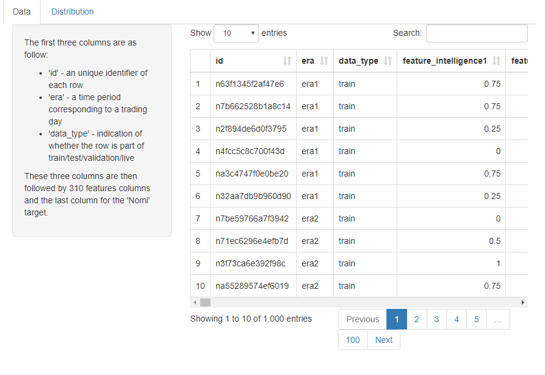

```{r setup, include=FALSE}
knitr::opts_chunk$set(echo = TRUE, eval = FALSE)
```

## The sample-numerai-training-data

Let's load the data. For this data set, we will use the <b> tabsetPanel </b> for multiple tabs.

```{r}
training_data <- read.csv("dataforshiny/sample-numerai-training-data.csv", header=T)
ui <- fluidPage(
  tabsetPanel(
              tabPanel("tab1",
                  sidebarPanel(
                         # Define some inputs here),
                  mainPanel(
                         # output (from the server) go here)
                       ),
              tabPanel("tab2",
                       sidebarPanel(
                         # Define some inputs here),
                       mainPanel(
                         # output (from the server) go here)
              )
  )
)

server <- function(input, output) {
  # do something
}
```

## First tab

We will simply display some description of the data in the sidepanel using HTML (it is okay if you do not know HTML, we use it here to make the text look prettier) and show the data in the mainpanel.

```{r}
#in UI
tabPanel("Data",
sidebarPanel(HTML(" <p>The first three columns are as follow: </p>
              <ul>
              <li> 'id' - an unique identifier of each row </li>
              <li> 'era' - a time period corresponding to a trading day </li>
              <li> 'data_type' - indication of whether the row is
              part of train/test/validation/live </li>
              </ul>
              <p> These three columns are then followed by 310 features columns and
              the last column for the 'Nomi' target. </p> ")),
# Show Data
mainPanel(
      dataTableOutput("training"))
#in Server
  output$training <- renderDataTable({
    datatable(data=training_data, style = 'bootstrap',
              class = 'table-bordered',options = list(scrollX = TRUE))
  })
)
```

## Your turn

1. Create a second tab and change the title to "Distributions".
2. In the sidebarPanel, create a <b> varSelectInput </b> that allows the user to select the names of columns 4 to 314.
3. In the mainPanel, display a bar chart of the variable selected by the user.  


##

### 1.
```{r}
tabPanel("Distribution",
```

### 2.

```{r}
varSelectInput("var", "Variable:", training_data[4:314])
```

##

### 3.
```{r}
#in UI
plotOutput("distribution1")

#in Server
  output$distribution1 <- renderPlot({
      ggplot(training_data, aes_string(x=input$var))+
        geom_bar(fill = "#EA5600", color="grey")+ theme(axis.title.x = element_blank())+
        scale_x_continuous(breaks = seq(0, 1, by = 0.25))
  })
```


##
Let's add another barchart of the facet across different 'targets'. To make it more colorful, we create another column named 'target_factor'.

```{r}
#in UI
plotOutput("distribution2")

#in Server

  output$distribution2 <- renderPlot({
      training_data$target_factor <- as.factor(training_data$target)

      ggplot(training_data, aes_string(x=input$var, fill="target_factor"))+
        geom_bar()+ theme(axis.title.x = element_blank())+
        scale_x_continuous(breaks = seq(0, 1, by = 0.25)) +
        facet_wrap(~target_factor)
  })
```

##
Since it does not make sense to plot 'target' facet across 'target'. We will use <b> if{} </b> on the second plot.

```{r}
#in server
output$distribution2 <- renderPlot({
      training_data$target_factor <- as.factor(training_data$target)
    if(input$var != "target"){
      ggplot(training_data, aes_string(x=input$var, fill="target_factor"))+
        geom_bar()+ theme(axis.title.x = element_blank())+
        scale_x_continuous(breaks = seq(0, 1, by = 0.25)) +
        facet_wrap(~target_factor)
    }
  })
```


## Fifth app done!
You can download the code part5.R and make sure it is in the same directory as the folder dataforshiny. 

<center></center>
