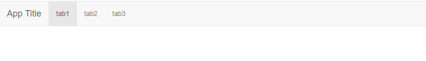
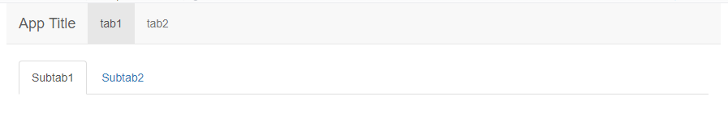
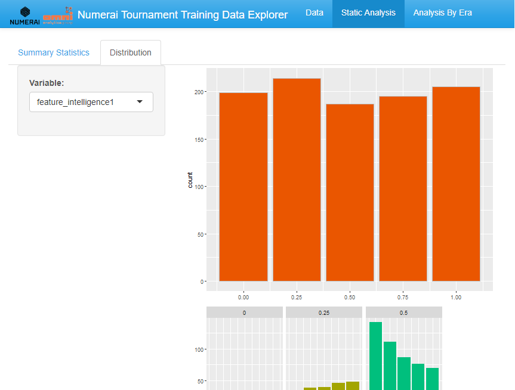

```{r setup, include=FALSE}
knitr::opts_chunk$set(echo = TRUE, eval = FALSE)
```

## All in one!

We have created 5 simple apps. It is time to put it all together. We will do the following: 

* Use the <b> navbarPage() </b> to create a top level navigation bar. 

* Create three separate tabs in the navigation bar.

* Create subtabs in these tabs.

* Distribute the apps we created in these tabs. 

* Choose a theme from <b> shinythemes </b> package.

* Add a logo

## Navigation bar with 3 tabs

Here is a very simple template that we can follow. 
```{r}
navbarPage("App Title",
  tabPanel("tab1",
           #put whatever you like in this tab
           ),
  tabPanel("tab2",
           #put whatever you like in this tab
           ),
  tabPanel("tab3",
           #put whatever you like in this tab
           )
)
```

Note that it is very similar to the <b> tabsetPanel() </b>. 

<center></center>


## Subtabs
In fact, we can put a <b> tabsetPanel() </b> inside the <b> tabPanel() </b> so that we have another level of tabs under each tab. 

```{r}
navbarPage("App Title",
  tabPanel("tab1", 
           tabsetPanel(
             tabPanel("Subtab1",
                      #put whatever you like in this subtab
                      ),
            tabPanel("Subtab2",
                     #put whatever you like in this subtab
                    )
           )),
  tabPanel("tab2",
           #put whatever you like in this tab
           )
)
```

<center></center>

## Distribute the apps in different tabs!

```{r}
  navbarPage("App Title",
             tabPanel("tab1", 
                      #put fifth app tab1 here
                      ),
             tabPanel("tab2", 
                      mainPanel(tabsetPanel(
                        tabPanel("Subtab1",
                                 #put first app here
                        ),
                        tabPanel("Subtab2",
                                 #put fifth app tab2 here
                        )
                      ))),
             tabPanel("tab3", 
                      mainPanel(tabsetPanel(
                        tabPanel("Subtab1",
                                 #put second app here
                        ),
                        tabPanel("Subtab2",
                                 #put third app here
                        ),
                        tabPanel("Subtab3",
                                 #put fourth app here
                                 )
                      )))
  )
```

## Add a theme

We can also add a theme very easily using <b> shinythemes </b> package. Here, I picked the 'cerulean' theme. 

```{r}
#load library
library(shinythemes)

ui <- fluidPage(theme = shinytheme("cerulean"),
                #the rest of your code
                )
```


## Add a logo

We can add our logo next to our app title. Here, we will need to use <b> addResourcePath() </b> and <b> img() </b>.

```{r}
addResourcePath('logo.png', 'images/logo.png')
ui <-fluidPage(theme = shinytheme("cerulean"), 
               navbarPage(title=div(img(src="logo.png", height =30), 
                                    "Numerai Tournament Training Data Explorer"),
                          
                        #the rest of your code  
                        )
)
```

Note that the logo I have is too big so we make it fit the navigation bar using the <b> height </b> parameter.

## A few things to watch out for

In the first four of our apps, we had the <b> titlePanel() </b>. Remove those and put those titles as titles for the tab or subtab. 

There are a lot of parentheses and curly brackets in the code. Make sure those are all accounted for. Otherwise you will get an error!

Lastly, make sure you import all the neccessary libraries and datasets at the beginning of the app.

## Final app done!

You can download the code final.R and make sure it is in the same directory of the folder dataforshiny. 

<center></center>


