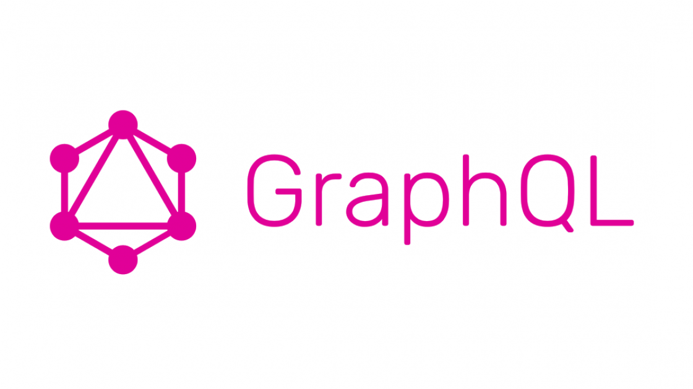

```{r setup, include=FALSE}
knitr::opts_chunk$set(echo = TRUE, warning = FALSE, message = FALSE, fig.align = "center", fig.width=10, fig.height=7, out.width=600)
```

## Background

Numerai is a modern-day hedge fund where a large pool of anonymous data scientists submit stock market predictions in a weekly tournament. These predictions are then crowd-sourced into an AI-based ensemble model that performs trades on behalf of Numerai. Over the last 3 years, the Numerai network has seen explosive growth and this case study will teach you how to analyze that growth using R's graphQL capabilities.


---

## GraphQL

Numerai's API uses GraphQL as a backend, which is a structured query language much like SQL itself.

- Developed initially as an internal project by Facebook
- Provides a method for development of APIs much like REST
- Flexible and rich compared to REST and therefore may be less suitable for more simple web APIs
- Where REST APIs are organized as a collection of endpoints, GraphQL is organized as a collection of types and fields with their associated datatype specification.

Let's take a look at how to interact with GraphQL in R...

<div style="text-align: center;"></div>

---

## GraphQL in R

There are two primary methods of accessing the Numerai data:

- Directly, using the `ghql` R package
- Indirectly, by downloading the parsed JSON data from the Numerai API and reading it into R

We will use `ghql` to keep the steps reproducible.


<p align="right">


</p>
---

## `ghql`

Let's begin by installing `ghql`:

```{r, eval=FALSE}
install.packages("ghql")
```

Next, we connect to the Numerai API:

```{r}
library(ghql)

con <- GraphqlClient$new(
  url = "https://api-tournament.numer.ai/"
)
```

This connection object maintains the GraphQL client connection to the Numerai API server. Note that it is an <a href="https://adv-r.hadley.nz/r6.html">R6-style object</a> and hence is initialized with the GraphqlClient’s new() function

---

## Making a Leaderboard Query 

We can perform a query with the following:

```{r}
qry <- Query$new() #create a new query

qry$query('leaderboard', '{
  v2Leaderboard {
    username
    corrRep
    mmcRep
    return_52Weeks
    return_13Weeks
  }
}')

result <- con$exec(qry$queries$leaderboard) #execute query 
```

Note that we begin with the initialization of a new instance of the R6 `Query` class, and then call the `query()` method, passing in two arguments:

- The name of the resulting object 
- The raw GraphQL query that is to be executed

Here 'leaderboard' indicates the name of the query.

---

## Viewing the Results 

```{r, echo=FALSE, message=FALSE}
library(jsonlite)
library(dplyr)
library(knitr)
library(kableExtra)
library(ggplot2)
```

A quick peak at the raw return value shows JSON data that we need to parse using the `fromJSON()` function, in order to retrieve a data frame:

```{r}
print(paste0(substring(result, 1, 50), "..."))
```

And the parsed data:

```{r}
nmr <- fromJSON(result)[[1]]$v2Leaderboard

head(nmr, 3) %>%
  kable()
```

---

## 52 Week Returns

Now we can use `ggplot()` in order to visualize aspects of the data!

```{r, message=FALSE, fig.height=5, warning=FALSE}
ggplot(data = nmr, aes(x = return_52Weeks)) +
  geom_histogram(fill = "blue", colour = "black") +
  labs(title = "52 Week Returns on Staked NMR in the 'Classic' Tournament", x = "52 Week Returns")
```

---

## 13 Week Returns

Now we can use `ggplot()` in order to visualize aspects of the data!

```{r, message=FALSE, fig.height=5, warning=FALSE}
ggplot(data = nmr, aes(x = return_13Weeks)) +
  geom_histogram(fill = "blue", colour = "black") +
  labs(title = "13 Week Returns on Staked NMR in the 'Classic' Tournament", x = "13 Week Returns")
```

---

## 52 Week Returns vs 13 Week Returns

```{r, message=FALSE, fig.height=5, warning=FALSE}
ggplot(data = nmr, aes(x = return_13Weeks, y = return_52Weeks)) +
  geom_point() +
  geom_smooth(method = "lm") +
  labs(title = "52 Week Returns vs 13 Week Returns")
```

---

## Correlation vs MMC

```{r, message=FALSE, fig.height=5, warning=FALSE}
ggplot(data = nmr, aes(x = corrRep, y = mmcRep)) +
  geom_point() +
  geom_smooth(method = "lm") +
  labs(title = "Correlation vs MMC")
```

---

## Conclusion

You can now do the following using `ghql` and `jsonlite` R packages:

* Connect to Numerai API
* Create a Query
* Execute a query
* Parse the data

Try it yourself!


<p align="right">


</p>

