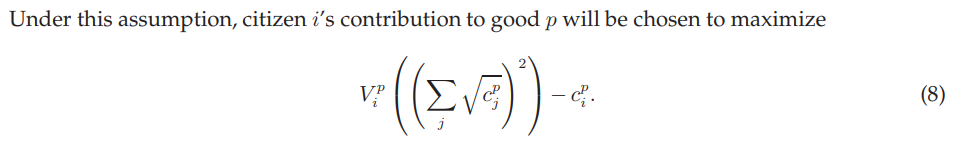
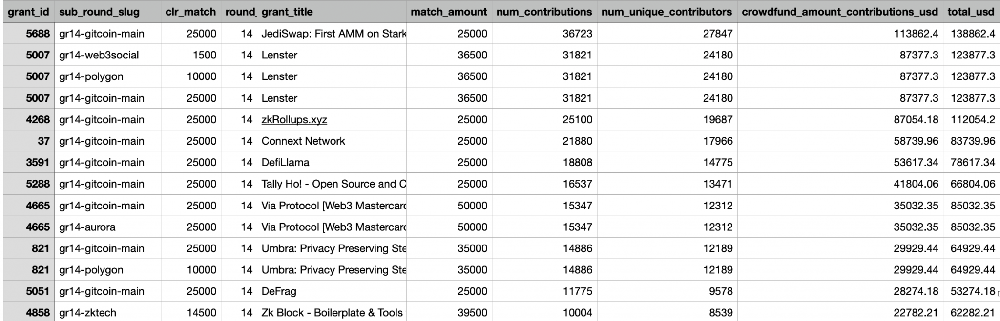

```{r setup, include=FALSE}
knitr::opts_chunk$set(echo = TRUE, warning = FALSE, message = FALSE, fig.align = "center")

library(tidyverse)
library(knitr)
library(kableExtra)
```

## Introduction

Quadratic Funding is defined by wtfisqf.com as “the mathematically optimal way to fund public goods in a democratic community.” The Gitcoin team further refers to it as the Wisdom of the Crowds. Gitcoin allocates donations from larger donators based on a Quadratic Funding formula, weighting grants which receive many small donations over those that receive a few large ones.

Formulaically, Quadratic Funding can be described in such a manner that the amount received by a given is equal to the square of the sum of the square roots of contributions received, multiplied by some constant factor (Buterin, Hitzig, Weyl, 2018). This can be quantified in the formula below:

```{r, echo=FALSE}

```

---

## Optimality

While the core details of this mechanism are not the focus of this article, Quadratic Funding has been shown to be the optimal allocation method, despite the fact that very little research has been conducted on how matching allocations based on this method behave when implemented and applied in a true, real-world environment.

In this case study, we will give a visual description of the capital allocation resulting from Gitcoin’s implementation of the Quadratic Funding mechanism, using data from Gitcoin Grants Round 14.

---

## Data

We’ve pulled Round 14 Gitcoin Grants data. The data contains the following variables:

- *grant_id* – Grant name
- *sub_round_slug* – Eco-system Round Name
- *clr_match* – Total Funds Available for that Round
- *round_num* – Round ID
- *grant_title* – Grant Title
- *match_amount* – Total Match from that Round
- *num_contributions* – Number of Contributors to the Grant
- *num_unique_contributors* – Unique Contributors to the Grant
- *crowdfund_amount_contributions_usd* – Funding Amount in USD
- *total_usd* – Total Amount in USD

---

## Data Preview

A previous of the first 15 rows of this data is given in the image below:

```{r, echo=FALSE}

```

---

## Reading the Data in R

The code for loading the data here is quite simple, and reproduced below:

```{r, eval=FALSE}
library(tidyverse)
library(ggrepel)
library(ggthemes)
library(omnitheme)

raw_gr14 <- read_csv("data/GR14 Final Results - 6 29 2022.csv")

raw_gr14 %>% 
    select(grant_id, sub_round_slug, clr_match, round_num, grant_title, match_amount,
           num_contributions, num_unique_contributors, crowdfund_amount_contributions_usd, total_usd) %>%
  head(n = 20) %>% 
  kable
```

---

```{r, echo=FALSE}
library(tidyverse)
library(ggrepel)
library(ggthemes)
library(omnitheme)

raw_gr14 <- read_csv("data/GR14 Final Results - 6 29 2022.csv")

raw_gr14 %>% 
    select(grant_id, sub_round_slug, clr_match, round_num, grant_title, match_amount,
           num_contributions, num_unique_contributors, crowdfund_amount_contributions_usd, total_usd) %>%
  head(n = 20) %>% 
  kable %>% 
  kable_styling(font_size = 8)
```

---

## Variable Derivation

The next step was to derive some important statistics based on the available data above. Specifically, we derive the following variables:

- **Average Contribution Amount per Unique Contributor** – This value represents a ratio of the overall contributions, divided by the number of unique contributors, to roughly estimate the per-unique-contributor contribution value for each grant.

- **Min-Max Scaled Number of Unique Contributors** – We apply a min-max scaling routine, subtracting the minimum value across all grants and dividing by the range, in order to scale the number of unique contributors to a range where 0 represents the grant with the fewest number, and 1 represents the grant with the largest number.

- **Min-Max Scaled Average Contribution Amount per Unique Contributor** – The same procedure from above is applied, but to the first derived variable. In this instance, 0 represents the grant with the lowest average contribution amount per unique contributor, while 1 represents the grant with the highest.

- **Equal Weight Score** – We derive this equal weight score by the two above derived variables, taking the Min-Max Scaled Number of Unique Contributors and adding the Min-Max Scaled Average Contribution Amount per Unique Contributor, which yields a variable that ranges from 0 (lowest on both of the derived metrics) to 2 (highest on both).

---

## Data Transformation

The last step is to produce a tall or long version of this dataset, suitable for plotting using standard analysis tools such as R and ggplot2. 

The tall version eschews the one-row-per-grant format of the previous data and instead produces one row per grant and variable combination, across the variables of interest. 

In the following slides, we walk through the basic `dplyr` routines to perform these data transformations, and show a preview of the resulting dataset.

---

## Variable Derivation Code

We use some simple dplyr transformations in order to produce these and rename some variables to help with analysis later on:

```{r, eval=FALSE}
processed_gr14 <- raw_gr14 %>%
    rename(`Unique Contributors` = num_unique_contributors, `Crowdfunded Contributions ($)` = crowdfund_amount_contributions_usd,
           `Avg $ Per Contributor` = avg_contramt_per_ucontr, `Equal Weight Score` = eql_weight_score,
           `Round Matching Funds ($)` = clr_match) %>%
    gather(key = Variable, value = Value, `Unique Contributors`, `Crowdfunded Contributions ($)`,
           `Avg $ Per Contributor`, `Equal Weight Score`) %>%
    mutate(Variable = factor(Variable, levels = c("Unique Contributors", "Crowdfunded Contributions ($)",
                                        "Avg $ Per Contributor", "Equal Weight Score")),
           sub_round_slug = gsub("gr14-", "", tools::toTitleCase(sub_round_slug))) %>%
    select(Variable, Value, `Round Matching Funds ($)`, grant_id, sub_round_slug)
```

---

The key feature of this dataset is we now have one row per grant and variable combination, which matches a “third-normal form” in the SQL world, which is suitable for analyzing via plotting and visualization methods in ggplot2.

```{r, echo=FALSE}
processed_gr14 <- raw_gr14 %>%
    rename(`Unique Contributors` = num_unique_contributors, `Crowdfunded Contributions ($)` = crowdfund_amount_contributions_usd,
           `Avg $ Per Contributor` = avg_contramt_per_ucontr, `Equal Weight Score` = eql_weight_score,
           `Round Matching Funds ($)` = clr_match) %>%
    gather(key = Variable, value = Value, `Unique Contributors`, `Crowdfunded Contributions ($)`,
           `Avg $ Per Contributor`, `Equal Weight Score`) %>%
    mutate(Variable = factor(Variable, levels = c("Unique Contributors", "Crowdfunded Contributions ($)",
                                        "Avg $ Per Contributor", "Equal Weight Score")),
           sub_round_slug = gsub("gr14-", "", tools::toTitleCase(sub_round_slug))) %>%
    select(Variable, Value, `Round Matching Funds ($)`, grant_id, sub_round_slug)

processed_gr14 %>% head(n = 10) %>% kable
```

---

## Visualization

With this dataset, we are ready to write our `ggplot2` code to produce a matrix highlighting our derived variables across all the ecosystem rounds. Let's take a look:

```{r, eval=FALSE}
ggplot(processed_gr14, aes(x = Value, y = `Round Matching Funds ($)`)) +
    geom_point(colour = "#0F0132", size = 1) + 
    geom_smooth() +
    geom_text_repel(aes(label = grant_id)) +
    scale_x_continuous(breaks = scales::pretty_breaks(n = 10), labels = scales::comma) +
    scale_y_continuous(breaks = scales::pretty_breaks(n = 5), labels = scales::dollar,
                       expand = expansion(mult = c(0, 0.25))) +
    facet_wrap(sub_round_slug~Variable, scales = "free", ncol = 4) +
    theme(
        axis.text.x = element_text(angle = 20, hjust = 1),
        axis.title = element_text(size = 45),
        plot.title = element_text(size = 40, hjust = .5),
        plot.subtitle = element_text(size = 16, hjust = .5)
    ) +
    labs(
        title = 'Gitcoin Grants 14 Eco-System Round Quadratic Funding Analysis',
        subtitle = 'A Scatterplot Matrix of per Grant Matching allocations as a Function of the Number of Unique Contributors and Average per Donor Contribution Amount',
        x = "Value"
    )
```

---

This plot is far too large to display on a single slide. Please click the thumbnail below for a full size version:

<a target='_blank' href='https://crypto.omnianalytics.org/wp-content/uploads/2023/01/smoother_and_labels.png'>
```{r, echo=FALSE, out.height=500, out.width=125}
knitr::include_graphics("images/smoother_and_labels.png")
```
</a>

---

## Analysis

Particular attention should be paid to the Equal Weight Score (the far right column). The idea of the equal weight score is to identify those grants which both have a high average contribution, but also a large number of unique contributors. In the chart, this is plotted along the x axis, with a theoretical maximum of 2 as mentioned (for a grant that was best on both metrics). The Y axis provides the Round Matching Funds. In an ideal world, our Equal Weighting Score would be correlated, in the sense that the grants that had the highest matching values were ones that both had a higher average contribution, but also and in particular a large number of unique donors.

Indeed, that pattern presents itself strongly, though the pattern varies across ecosystem rounds. In sound rounds, such as GR14-Aurora, one grant overwhelms the others – in this case, Grant ID 4665, Via Protocol [Web3 Mastercard] - Best UX among any-to-any cross-chain swaps – This grant had over 12,000 unique contributors, with an average per-contributor contribution of nearly $3. It’s equal weight score reached 1.43771, while no other grant in this round achieved even 1.1. In some other rounds, there was not a clear “winner”, but a pattern emerged where generally higher equal weight scores were correlated with higher matching amounts. For instance, GR14-Protocollabs exhibits a distinct upward trend, though not linear – the highest equal weighting score actually had a slightly lower matching amount than the second highest.

One thing to note as you analyze this matrix of charts is that the X axis varies as a function of the round, it is not fixed across rounds. This is to aid in the interpretation of the per-round trend. Note for example, GR14-Web3social has a Grant ID 5007 that gets quite close to the theoretical maximum of 2. This grant, Lenster, had over 24,000 unique contributors at $3.6136 per contributor, putting it towards the top of the list. In other rounds, the scale doesn’t reach nearly that high, as most grants have more modest figures in terms of contributors and the average contribution.

---

## Conclusion

While the per-round pattern varies quite distinctively, the clear trend is that the equal weighting score (which provides 50% weight to the number of unique contributors and a 50% weight to the average contribution amount) was positively correlated with the matching amount. 

This lends credence to the idea that we began this article with – Quadratic funding is an effective Wisdom of the Crowds approach, which doesn’t punish grants that happen to have smaller, but more frequent donations. 

This type of approach helps the Gitcoin Grants Program provide meaningful matching contributions to projects that have a disproportionately positive impact on a large number of users, even if those users don’t have the financial means or wherewithal to donate large sums at once.
