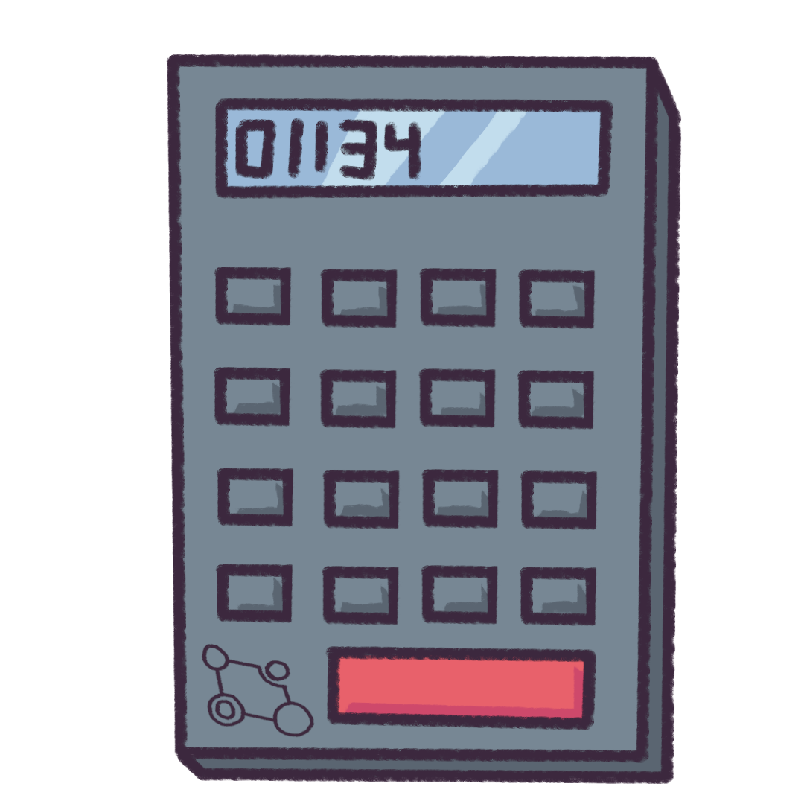

```{r setup, include=FALSE}
knitr::opts_chunk$set(echo = TRUE, warning = FALSE, message = FALSE, fig.align = "center")

```

## Tornado Cash

Tornado.cash is a fully autonomous, decentralized transaction mixer that provides private value transfers on the Ethereum blockchain. On December 17th, a Decentralized Autonomous Organization was formed around the Tornado.Cash protocol, and it's native token `$vTORN` was distributed to early adopters and users of the service.  As it stands, the `$vTRON` tokens have a 45 day lock up where transfers have been disabled until governance has decided on the best way forward.  Having said that, it is quite common for token's "airdropped" on to users to have some fair market trade value.  

---

## Motivation

This case study will be speculative in nature and involve the procurement of the data, transforming variables using a few common themes we've learned from other cryptocurrency analysis, and end with a set of estimates of the average expected dollar value of the tokens a recipient will gain.

We will be using the following libraries:

```{r}
library(knitr)
library(tidyverse)
library(kableExtra)
library(formattable)
library(scales)
```

<p align="center">


</p>
---

## The Data
For data, we'll use the open sourced table of wallet addresses and the raw amounts supplied by the team within their announcement: https://github.com/tornadocash/airdrop/blob/master/airdrop.csv.

We took the liberty and named the columns as `Wallet Address` and `Raw`. Below are the first few columns of the data:

```{r}
torn <- read_csv("airdrop.csv")
torn %>%
  head() %>%
  kable() %>%
  kable_styling(bootstrap_options = c("striped", "hover"), full_width = FALSE)
```

---

## Number Of Tokens 
First, we can convert the `Raw` column to the number of TORN TOkens by simply dividing it by $10^(18)$. 

```{r}
torn <- torn %>% mutate(TORN = Raw/10^(18))
torn %>% summarise( sum = sum(TORN))
```
We can see that we have a total of $50000$ TORN Tokens.

<p align="right">


</p>
---

## Summary Statistics

Now let us look a the summary statistics of these TORN Tokens.  

```{r}
summary(torn$TORN)
```
From the summary, we can see that the mean is slightly higher than the third quartile and the maximum is very big compared to the rest. 


---

## Distribution of TORN Tokens

Let's take a look at the distribution of the TORN Tokens using `ggplot2` and `scales` packages. 

```{r, eval = FALSE}
torn %>% ggplot(aes(x=TORN))+ geom_histogram(color="darkblue", fill="lightblue", boundary=0)+
  scale_y_continuous(breaks = scales::pretty_breaks(n=10))+ 
  scale_x_continuous(breaks = scales::pretty_breaks(n=20))+
  labs(title = "Distribution of TORN Tokens", x = "TORN Tokens")
```

<p align="left">


</p>
---

```{r, echo = FALSE}
torn %>% ggplot(aes(x=TORN))+ geom_histogram(color="darkblue", fill="lightblue", boundary=0)+
  scale_y_continuous(breaks = scales::pretty_breaks(n=10))+ 
  scale_x_continuous(breaks = scales::pretty_breaks(n=20))+
  labs(title = "Distribution of TORN Tokens", x = "TORN Tokens")
```

---

## Log transformation
Since there are many huge values (outliers), we can use log transform the x-axis to have a better sense of the distribution via `scale_x_log10()`.

Also, note that we created `scaleFUN` to make sure it displays 2 decimals.

```{r, eval = FALSE}
scaleFUN <- function(x) sprintf("%.2f", x)
x_breaks = c(0.01,0.03,0.1,0.3, 1, 3, 10,30,100,300,1000)
p1 <- torn %>% ggplot(aes(x=TORN))+
  geom_histogram(color="darkblue", fill="lightblue", boundary=0)+
  scale_y_continuous(breaks = scales::pretty_breaks(n=10))+
  scale_x_log10(breaks = x_breaks,
                labels = scaleFUN)+
  labs(title = "Distribution of TORN Tokens", x = "TORN Tokens")+
  theme(axis.text.x = element_text(angle = 45, vjust=0.9))
```

---

```{r, echo = FALSE}
scaleFUN <- function(x) sprintf("%.2f", x)
x_breaks = c(0.01,0.03,0.1,0.3, 1, 3, 10,30,100,300,1000)
torn %>% ggplot(aes(x=TORN))+
  geom_histogram(color="darkblue", fill="lightblue", boundary=0)+
  scale_y_continuous(breaks = scales::pretty_breaks(n=10))+
  scale_x_log10(breaks = x_breaks,
                labels = scaleFUN)+
  labs(title = "Distribution of TORN Tokens", x = "TORN Tokens")+
  theme(axis.text.x = element_text(angle = 45, vjust=0.9))
```

---

## Market Capitalization Estimates  

The market capitalization of a token is simply: Number of Tokens * The price of the token. We will assume that the $500000$ tokens are the only tokens in existence.

We chose the following market capitalizations: 
<b> Val1MCap, Val2MCap, Val5MCap, Val10MCap, Val25MCap, Val50MCap, Val100MCap, Val250MCap, Val500MCap, Val1BCap </b>

along with some other recent air drops: 
<b> `$Badger2MCap`, `$MIR17MCap`, `$1Inch164MCap`, `$UNI734MCap` </b>.

For instance, to get <b> Val1MCap </b>, we will need the price of the token to be $2 as we have $500000$ tokens. 

---

Let's create these the table where we have the dollar value of each of `Wallet Address` based on the market capitalization. We Can simply multiply by the appropriate price of the token with the number of tokens for each row as follows:

```{r}
cap <- torn %>% 
  select(TORN) %>%
  mutate(Val1MCap = TORN*2,
         '$Badger2MCap' = TORN*4,
         Val5MCap = TORN*10,
         Val10MCap = TORN*20,
         'MIR17MCap' = TORN*34,
         Val25MCap = TORN*50,
         Val50MCap = TORN*100,
         Val100MCap = TORN*200,
         '$Inch164MCap' = TORN*328,
         Val250MCap = TORN*500,
         Val500MCap = TORN*1000,
         '$UNI734MCap' = TORN*1468,
         Val1BCap = TORN*2000) 
```

---

## The Market Capitalization Table

Below shows the first few rows and columns of the table:

```{r}
cap %>%
  select(1:8) %>%
  head() %>%
  kable() %>%
  kable_styling(bootstrap_options = c("striped", "hover"), full_width = FALSE)
```

---

## Summary of Market Capitalization

For simplicity, we can use the following summary statistics to give an overview of what people can expect:

<b> Maximum, 90th percentile, 75th percentile, Median, Mean, 25th percentile, 10th percentile, Minimum </b> 

We will first use `gather()` to pivot the table into a long table so we can `group_by()` market capitalization.

```{r}
summary <- cap %>% 
  gather() %>%
  group_by(key) %>%
  summarise(Max = max(value),
            '90%-tile' = quantile(value, 0.9),
            '70%-tile' = quantile(value, 0.75),
            Median = mean(value),
            '25%-tile' = quantile(value, 0.25),
            '10%-tile' = quantile(value,0.1),
            Min = min(value)) %>%
  column_to_rownames(var="key")
```

---

```{r}
summary
```

## Readibility  
For readibility, let's transpose the table, round the values to 2 decimals, and reorder the market capitalization as follows. 

```{r}
summary_t <- t(summary)

summary_t <- as.data.frame(summary_t) %>%
  rownames_to_column(., var = "rowname") %>%
  mutate_if(is.numeric, round, 2) %>%
  column_to_rownames(var="rowname") %>%
  select(TORN,
         Val1MCap,
         '$Badger2MCap',
         Val5MCap,
         Val10MCap,
         'MIR17MCap',
         Val25MCap,
         Val50MCap,
         Val100MCap,
         '$Inch164MCap',
         Val250MCap,
         Val500MCap,
         '$UNI734MCap',
         Val1BCap)
  
```

---

```{r}
summary_t
```

---

## Formattable 
To make it prettier, we can use `formattable` to create colors based on the values as follows:

```{r, eval = FALSE}
colortile <- function(min.color = "lightpink", max.color = "lightgreen", fun = "currency") {
  fun <- match.fun(fun)
  formatter("span", x ~ fun(x),
            style = function(y) style(
              display = "block",
              direction = "rtl",
              "border-radius" = "4px",
              "padding-right" = "2px",
              "background-color" = csscolor(gradient(as.numeric(y),min.color='lightpink', max.color = 'lightgreen'))
            )
  )
}

formattable(summary_t,
  lapply(1:nrow(summary_t), function(row) {
  area(row, col = -1) ~ colortile()
    }
  )
)
```

---
<p align="center">


</p>


---
## Conclusion


<p align="right">


</p>