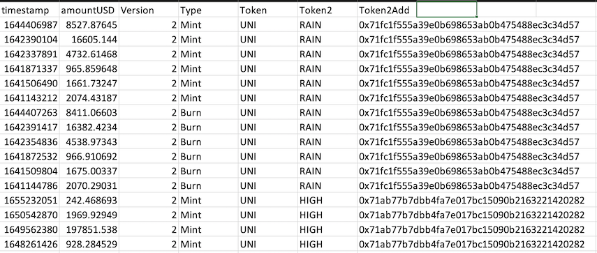
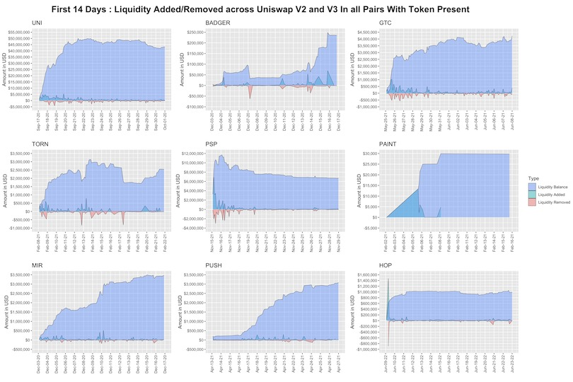

```{r setup, include=FALSE}
knitr::opts_chunk$set(echo = TRUE, warning = FALSE, message = FALSE, fig.align = "center")
```

## Introduction

This brief README/tutorial will walk you through our submission for the Uniswap Community Analytics Bounty #13. Let's get started@

```{r}
## Load Libraries
library(tidyverse)
library(uniswappeR)
```

---

## Objective

For this bounty we chose to analyze the liquidity provision patterns of Uniswap market makers during the first two weeks after an airdrop. 

The 9 airdropped tokens of interest are Uniswap ($UNI), Badger DAO ($BADGER), Tornado Cash ($TORN), ParaSwap ($PSP), MurALL ($PAINT), Mirror Protocol ($MIR), Ethereum Push Notification Service ($PUSH), and Hop Protocol ($HOP). 

This analysis will use statistical graphics to compare and contrast trends in liquidity provider behavior across the first two weeks of some of the eco-systems' most popular airdrops.

---

## Data

Using the `uniswappeR` package, we called the get_liq_data function to extract data for each of the 9 tokens across both the v2 and v3 Uniswap pools. Looping through and saving the results, we compiled the liq_burns.RDS dataset. This data is a list of time series dataframes, which each contain 7 columns, and in total comprise 117,524 rows. A preview of the data is shown below:



---

## Analysis

From here, we tied together the data around each token to create area plots that track the amount of liquidity added and removed over time. 

To follow up, we produced cumulative area plots that show the total amount of liquidity of each. The areas are colored by whether, at the particular time points, the liquidity for each of the nine tokens was positive. 

Added liquidity is shown in green, while removed liquidity is shown in red. The overall blue area comprises the total liquidity balance as a function of time.

---

## Liquidity Plot



---

## Results (Part One)

We see that the trend in liquidity added/removed over time is highly dependent on the token, with the maximum liquidity provided over the first two weeks topping out at over $50 million for $UNI while it stayed at a lowly, stagnant $30,000 for $PAINT. 

From a macro perspective, there is a substantial amount of diversity in the shape of the cumulative amount of liquidity provided. Uniswap experience a logarithmic rise to its plateau as it reached its $50M saturation mark in only 5 days. 

Gitcoin, the Hop Protocol, and Murall, to a lesser extent, all had the same trend within their cumulative liquidity amounts. The EPNS protocol had a growth pattern more similar to an "S curve" where, after a slow start marred with a lack of liquidity, providers swooped in later to inject $3M over the course of a week, then the deposits tapered off. Paraswap unfortunately saw a nearly 40% decline in liquidity after it spiked in the first few days. 

---

## Results (Part Two)

Of all the protocols, Tornado Cash has exhibited the most variability in its liquidity. It had a slower than usual start, a massive jump, a dip, then a resurgence only to suffer further declines until it reach it caught its footing by finishing on an upward trend. When observing the initial liquidity provisions for each platform it is fairly standard that most liquidity is provided at the initial on-set of the pool's creation. 

In this two week span and for the airdrops analyzed here, there was some additional liquidity added during the middle and later parts of the period, but the vast majority for each was added at the beginning. The removal of liquidity is a bit more variable overtime. From each graph, we see don't see too many patterns categorizing when money leaves a pool. 

It should be noted that both $GTC and $PSP saw stark increases in the amount of liquidity leaving in the first week. In Gitcoin's case, the outflows didn't stifle overall liquidity since inflows actually outpaced them as they increased the overall balance. For Paraswap, unfortunately, this was not so.

---

## Conclusion

Ultimately, our foray into this data yielded some interesting findings about how the liquidity distributions have varied across the nine tokens. These customized set of visualizations are useful tools that highlight the variation in liquidity provider behavior. 

Through the use of these graphs it becomes immediately clear that there is much more we could do. For one, this analysis could be expanded beyond the tokens from this, and potentially an API could be deployed to allow a similar dataset and chart to be generated for the token of one's choosing. In addition, the time frame need not be restricted to this two week period, and could be expanded far beyond. Lastly, the liquidity could also be compared to each token's overall market capitalization, to give even more insight into the token's performance and how it has behaved on the Uniswap platform.
