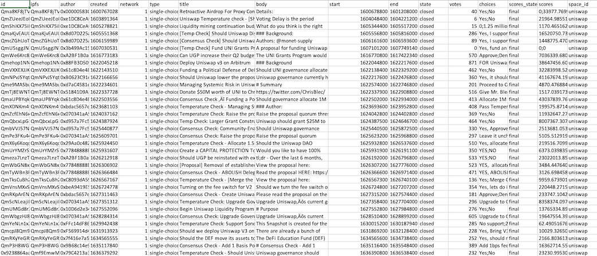
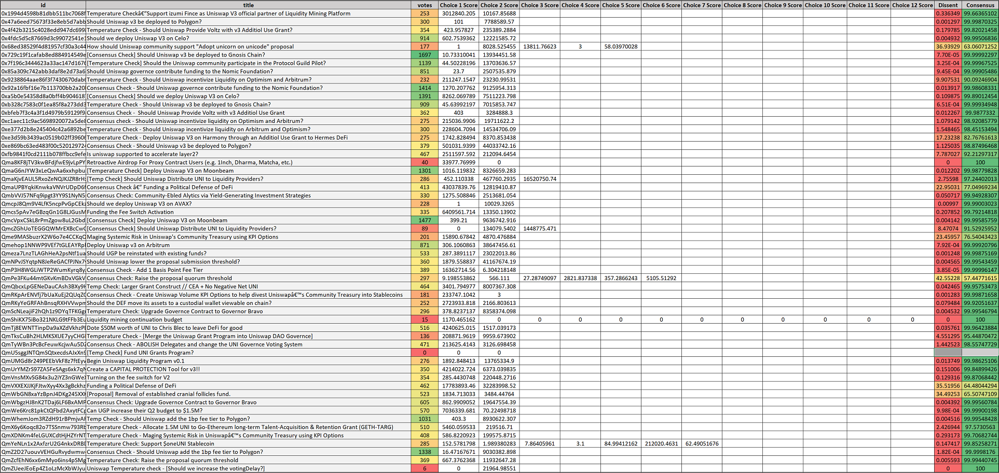
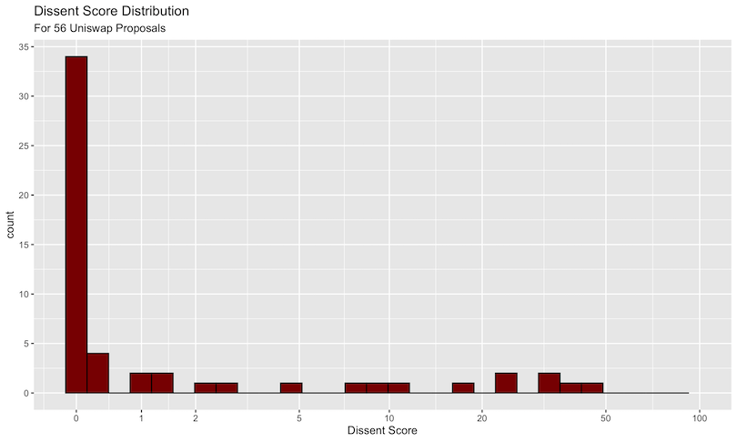
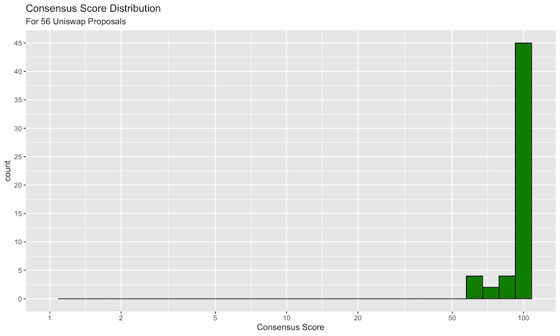

```{r setup, include=FALSE}
knitr::opts_chunk$set(echo = TRUE, warning = FALSE, message = FALSE, fig.align = "center")
```

```{css, echo=FALSE}
pre {
  max-height: 300px;
  overflow-y: scroll;
}

pre[class] {
  max-height: 100px;
}
```

## Objective

For this bounty we are opting to "dip our toes" into the messy world of blockchain governance. Our question of interest is "Can we visualize and quantify the degree of contentiousness of Uniswap proposals?” If it is possible, we'd like to use the derived statistics and graphs to provide initial insights into how we might understand cohesion and dissent within the decentralized Uniswap community.

Let's get started!

---

## Data

Our team created a specialized set of scrapers that pulled all active and closed governance proposals listed under Uniswap’s space on snapshot.page. Below is a screen capture of the data that show its comma separated structure. 

In total, the data covers 56 proposals, and includes 16 columns of attributes about those governance articles seeking ratification. For our analysis, the key fields are the choices and scores which, when combined, allow us to compute metrics on consensus and dissent.

A screenshot of the data is shown on the following slide...

---

## Data Screenshot



---

## Analysis

To initiate this analysis, we performed a data cleaning routine on this data to parse and remove special characters. The key aspect of this cleaning was the parsing of the choices and scores columns. 

Unlike traditional normal forms for data, multiple choices (and the scores for each choice) are encoded within individual rows. This meant that we had to separate out the individual components using string splitting routines. We used R and dplyr to accomplish this. In doing so, we encountered one additional issue. Since the data itself was encoded such that the choices and scores are separated with the ";" character, one proposal presented a special challenge because within its choices it to a ";" character. This meant that the automated routine saw an additional choice option that wasn't in the original data. 

Once we special-cased this particular issue, we achieved a clean form for the data. This afforded us the chance to create our first visualization characterizing Uniswap voter consensus.

---

## Data Manipulation Code

We used `R` and the associated `tidyverse` packages to perform the primary manipulation routine, which is reproduced below. In particular, we:

1. Split the `choices` and `scores` fields by the semicolon operator
2. Produce one unnested row per value
3. Sum up the choices across all proposals
4. Compute dissent as a ratio between the top score and the total sum of scores

```{r, eval=FALSE}
prop <- read_csv("prop_df.csv") %>%
    mutate(
        choices = strsplit(choices, ";"),
        scores = strsplit(scores, ";")
    ) %>%
    select(id, title, votes, choices, scores) %>%
    unnest(c(choices, scores)) %>%
    group_by(id) %>%
    mutate(choices = factor(choices, labels = paste0("Choice ", 1:length(unique(choices)), " Score"))) %>%
    spread(key = choices, value = scores) %>%
    mutate(across(starts_with("Choice "), readr::parse_number)) %>%
    rowwise() %>%
    mutate(
        ScoreSum = sum(c(`Choice 1 Score`, `Choice 2 Score`, `Choice 3 Score`, `Choice 4 Score`,
                             `Choice 5 Score`, `Choice 6 Score`, `Choice 7 Score`, `Choice 8 Score`,
                             `Choice 9 Score`, `Choice 10 Score`, `Choice 11 Score`, `Choice 12 Score`), na.rm = TRUE)
    ) %>%
    mutate(
        Dissent = 100 * (1 - (max(c(`Choice 1 Score`, `Choice 2 Score`, `Choice 3 Score`, `Choice 4 Score`,
                         `Choice 5 Score`, `Choice 6 Score`, `Choice 7 Score`, `Choice 8 Score`,
                         `Choice 9 Score`, `Choice 10 Score`, `Choice 11 Score`, `Choice 12 Score`), na.rm = TRUE) / ScoreSum))
    ) %>%
    select(-ScoreSum) %>%
    mutate(Consensus = 100 - Dissent)
```

---

## Dissent Visualization Code

Next, we take the transformed data and use `ggplot` to produce our histograms of distributions of dissent for the 56 proposals. The code is shown below, where we use a pseudo log scale to help visualize the X axis.

```{r, eval=FALSE}
p1 <- ggplot(data = prop, aes(x = `Dissent`)) +
    geom_histogram(colour = "black", fill = "red4") +
    scale_y_continuous(breaks = scales::pretty_breaks(n = 10)) +
    scale_x_continuous(trans=scales::pseudo_log_trans(base = 10),
                       breaks = c(0, .01, .02, .05, .1, .2, .5, 1) * 100,
                       limits = c(NA, 100),
                       labels = function(.) scales::percent(. / 100, accuracy = 1)) +
    labs(
        title = "Dissent Score Distribution",
        subtitle = "For 56 Uniswap Proposals",
        x = "Dissent Score",
        y = "Count"
    )
```

---

## Consensus Score Code

Finally, we produce a near identical plot, but this time on the Consensus dimension.

```{r, eval=FALSE}
p2 <- ggplot(data = prop, aes(x = `Consensus`)) +
    geom_histogram(colour = "black", fill = "green4") +
    scale_y_continuous(breaks = scales::pretty_breaks(n = 10)) +
    scale_x_log10(breaks = c(.01, .02, .05, .1, .2, .5, 1) * 100,
                  limits = c(1, NA),
                  labels = function(.) scales::percent(. / 100, accuracy = 1)) +
    labs(
        title = "Consensus Score Distribution",
        subtitle = "For 56 Uniswap Proposals",
        x = "Consensus Score",
        y = "Count"
    )
```

---

## Dissent Distributions


---

## Interpretation

At first glance, the obvious lack of general dissent is immediately obvious. Of the 56 proposals, only 6 have any semblance of disagreement among the voters. The vast majority of proposals pass above the 80% threshold. With these graphs we are able to visualize the overall community voter consensus, but we'd like to go a step further and quantify it. To do so we generated a simple "dissent" score. 

Roughly speaking, our dissent metric is computed as the sum of the scores of the least-common choices divided by the overall sum of the scores. For example, if a proposal has the choices, {No , Yes} with respective scores of {2 , 3} the dissent score would be 2 / 5 = .4, implying a 40% dissent rate. 

Note that, likewise, if the voting distribution was 3 No’s and 2 Yes’es, this would also yield a 40% dissent score alluding to the property of symmetrical invariance within our metric. After computing these scores for every proposal out of the 56 in the dataset we constructed the following dataset:

---

## Dissent Heatmap



---

## Dissent Histogram

We ended up placing these scores on a pseudo-logscale and plotted their overall frequency to create the following figure.



---

## Consensus

Ultimately we confirmed quantitatively that there was high consensus amongst Uniswap voters and most of the dissent scores tend towards zero. It turns out, voting isn't all that contentious within the Uniswap protocol. 

Though the proposals themselves may sometimes be controversial, or even tongue-in-cheek, voting distributions suggest that most people tend to vote the same way. Though of course, for certain proposals this does not hold, with some achieving a 50% dissent rate! With that in mind, maybe the better view of the data is a Consensus rate instead.

When we look at consensus, we see the following...

---

## Consensus Distribution



---

## Conclusion

Ultimately, we found that there is little dissent in terms of the voting results across the 56 analyzed proposals. With that said, however, our results immediately suggested some further possible extensions. For instance, a Strength of Association analysis showing which 1-grams and 2-grams are most highly correlated with proposals being passed or rejected could provide some insight onto the types of proposals that have the most success. 

Likewise, analyzing wallet balances to determine if there is a correlation between wallet balance and proposals being passed could be illuminating. Finally, an investigation into whether there are particular "instigators" which tend to vote against the consensus could expose sifty trolls within the community.
