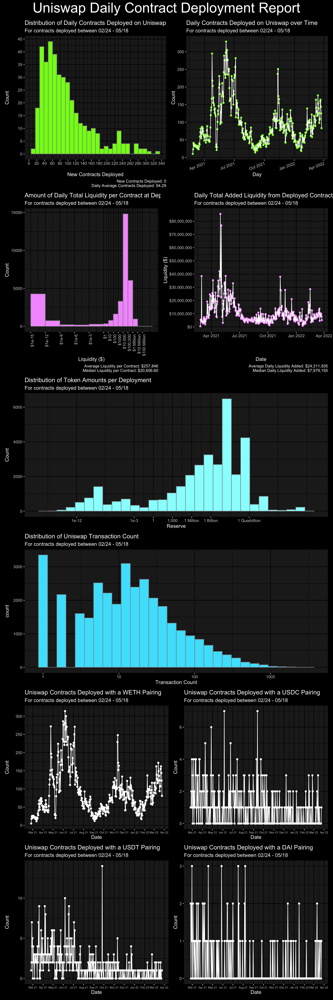

```{r setup, include=FALSE}
knitr::opts_chunk$set(echo = TRUE, warning = FALSE, message = FALSE, fig.align = "center")
```

## Introduction

This brief README/tutorial will walk you through the process we took in order to produce the individual Uniswap Report Plots, and ultimately the final report! To produce this report, you need a recent version of R, as well as the following R packages:

```{r}
## Load Libraries
library(tidyverse)
library(lubridate)
library(patchwork)
library(grid)
library(ggnetwork)
library(scales)
library(magick)
```

We also recommend the use of RStudio as your R IDE, as this will ease the process of debugging any coding issues and saving the state of your R session. Once R, RStudio, and the above packages are installed, we're ready to begin!

---

## Data

The very first step is to process the raw data and ensure it is suitable for the analysis. The data is provided as RDS files, which is an R binary storage format that can be directly read into your session via the `readRDS()` call:

```{r}
## Load Uniswap Pair Info Dataset
uni <- readRDS("pairs_info.rds") %>%
    as_tibble() %>%
    mutate(across(where(is.character), readr:::parse_guess))
```

---

## Outliers

There is one extreme outlier in the data (`LAWA`) that we will remove in order to ensure that the remaining results are interpretable:

```{r}
## Remove Outlier
uni <- uni[!(uni$Pr_Token1_Ticker %in% c("LAWA")),]
uni <- uni[!(uni$Pr_Token0_Ticker %in% c("LAWA")),]
```

---

## Data Pre-Processing

Next, we do a little pre-processing of the dates so that we can track the date and time at which the report was generated:

```{r}
## Get the day of infographic and split data set to the new one
current_time <- Sys.time()-hours(1)
attr(current_time,"tzone") <- "GMT"
current_date <- as_date(current_time)
uni$Pr_Date <- as_date(uni$Pr_Created)
new <- uni[uni$Pr_Date == current_date,]
uni <- uni[uni$Pr_Date <= current_date,]
```

We are now ready to begin with the analysis!

---

## Aggregate Metrics

We next produce the code required to produce a handful of important metrics:

---

## Average daily contracts deployed

```{r}
avg_cont <- uni %>%
    mutate(Date = as_date(Pr_Created)) %>%
    group_by(Day = day(Date), Month = month(Date), Year = year(Date)) %>%
    summarise(Count = n()) %>%
    ungroup() %>%
    summarise(`Average Daily Count` = mean(Count)) %>%
    pull(`Average Daily Count`)

avg_cont
```

---

## Average amount of liquidity

```{r}
avg_liq <- uni %>%
    summarise(`Average Liquidity` = mean(Pr_Liquidity_USD)) %>%
    pull(`Average Liquidity`)

avg_liq
```

---

## Median amount of liquidity

```{r}
med_liq <- uni %>%
    summarise(`Average Liquidity` = median(Pr_Liquidity_USD)) %>%
    pull(`Average Liquidity`)

med_liq
```

---

## Average daily liquidity

```{r}
daily_liq <- uni %>%
    mutate(Date = as_date(Pr_Created)) %>%
    group_by(Day = day(Date), Month = month(Date), Year = year(Date)) %>%
    summarise(Liq = sum(Pr_Liquidity_USD)) %>%
    ungroup() %>%
    summarise(`Average Daily Liquidity` = mean(Liq)) %>%
    pull(`Average Daily Liquidity`)

daily_liq
```

---

## Median daily liquidity

```{r}
daily_liq_med <- uni %>%
    mutate(Date = as_date(Pr_Created)) %>%
    group_by(Day = day(Date), Month = month(Date), Year = year(Date)) %>%
    summarise(Liq = sum(Pr_Liquidity_USD)) %>%
    ungroup() %>%
    summarise(`Average Daily Liquidity` = median(Liq)) %>%
    pull(`Average Daily Liquidity`)

daily_liq_med
```

---

## Final Steps

Finally, to prepare for the visualization stage, we produce some pairs datasets:

```{r}
v1 <- uni %>%
    select(Pr_Token0_Reserve, Pr_Token0_Ticker) %>%
    filter(!(Pr_Token0_Ticker %in% c("WETH", "ETH", "WBTC", "renBTC", "USDC", "USDT", "DAI", "USDN")))

v2 <- uni %>%
    select(Pr_Token1_Reserve, Pr_Token1_Ticker) %>%
    filter(!(Pr_Token1_Ticker %in% c("WETH", "ETH", "WBTC", "renBTC", "USDC", "USDT", "DAI", "USDN")))

v3 <- v1 %>%
    rename(reserve = Pr_Token0_Reserve, ticker = Pr_Token0_Ticker) %>%
    bind_rows(v2 %>% rename(ticker = Pr_Token1_Ticker, reserve = Pr_Token1_Reserve))
```

And now, we are ready for the exciting part. The plots!

---

## Visualizations

One important concept that you may have picked up on by now is the fact that, rather than just returning the result in this README, we are storing the results in variables for later use. That is how we will ultimately produce the full report. We will keep up that theme in this section, where every plot we produce will be stored in a variable for later reference.

To start, we compute the daily distribution of contracts deployed on Uniswap.

---

```{r}
p1 <- uni %>%
    mutate(Date = as_date(Pr_Created)) %>%
    group_by(Day = day(Date), Month = month(Date), Year = year(Date)) %>%
    summarise(Count = n()) %>%
    ungroup() %>%
    ggplot(aes(x = Count)) +
    geom_histogram(colour = "grey60", fill = "purple") +
    scale_y_continuous(breaks = seq(0, 100, by = 5)) +
    scale_x_continuous(breaks = seq(0, 400, by = 20)) +
    labs(
        title = "Distribution of Daily Contracts Deployed on Uniswap",
        subtitle = paste0("For contracts deployed between ",format(min(as_date(uni$Pr_Created)),"%m/%d")," - ", format(current_date, "%m/%d")),
        caption = paste0("New Contracts Deployed: ", nrow(new), "\nDaily Average Contracts Deployed: ", round(avg_cont, digits = 2)),
        y = "Count",
        x = "New Contracts Deployed"
    )
```

---

```{r}
p1
```

---

Next, we look at the daily contracts deployed as a function of time, in a time series format, once again storing the variable so we can later refer to it.

```{r}
p2 <- uni %>%
    mutate(Date = as_date(Pr_Created)) %>%
    group_by(Day = day(Date), Month = month(Date), Year = year(Date)) %>%
    summarise(Count = n()) %>%
    ungroup() %>%
    mutate(Day = ymd(paste(Year, Month, Day, sep = "/"))) %>%
    ggplot(aes(x = Day, y = Count)) +
    geom_point(colour = "purple") +
    geom_line() +
    scale_y_continuous(breaks = scales::pretty_breaks(n = 10)) +
    scale_x_date(breaks = scales::pretty_breaks(n = 10)) +
    labs(
        title = "Daily Contracts Deployed on Uniswap over Time",
        subtitle = paste0("For contracts deployed between ",format(min(as_date(uni$Pr_Created)),"%m/%d")," - ", format(current_date, "%m/%d"))
    ) +
    theme(axis.text.x = element_text(angle = 20, hjust = 1))

```

---

```{r}
p2
```

---

We can look, at a log scale, the distribution of the total liquidity per contract at deployment, which spans quite a range (from near zero, to well into the millions)

```{r}
p3 <- uni %>%
    ggplot(aes(x = Pr_Liquidity_USD)) +
    geom_histogram(colour = "grey60", fill = "green4",breaks = c(10^(seq(-15,-3,by=3)),10^(seq(0,10,by=1)))) +
    scale_y_continuous() +
    scale_x_log10( breaks = c(10^(seq(-15,-3,by=3)),10^(seq(0,8,by=1))),
                labels = c("$1e-15","$1e-12","$1e-9","$1e-6","$1e-3","$1","$10","$100","$1000","$10,000","$100,000","$1 Million","$10 Million","$100 Million")) +
    labs(
        title = "Amount of Daily Total Liquidity per Contract at Deployment",
        subtitle = paste0("For contracts deployed between ",format(min(as_date(uni$Pr_Created)),"%m/%d")," - ", format(current_date, "%m/%d")),
        y = "Count",
        x = "Liquidity ($)",
        caption = paste0("Average Liquidity per Contract: ", scales::dollar(avg_liq), "\nMedian Liquidity per Contract: ", scales::dollar(med_liq))
    ) +
    theme(axis.text.x = element_text(angle = 90, hjust = 1))
```

---

```{r}
p3
```

---

The daily total added liquidity as a function of time is shown next:

```{r}
p4 <- uni %>%
    mutate(Date = as_date(Pr_Created)) %>%
    group_by(Day = day(Date), Month = month(Date), Year = year(Date)) %>%
    summarise(Pr_Liquidity_USD = sum(Pr_Liquidity_USD)) %>%
    ungroup() %>%
    mutate(Day = ymd(paste(Year, Month, Day, sep = "/"))) %>%
    filter(Pr_Liquidity_USD <= 500000000) %>%
    ggplot(aes(x = Day, y = Pr_Liquidity_USD)) +
    geom_point(colour = "green4") +
    geom_line() +
    scale_y_continuous(labels = scales::dollar, breaks = scales::pretty_breaks(n = 10)) +
    labs(
        title = "Daily Total Added Liquidity from Deployed Contracts on Uniswap over Time",
        subtitle = paste0("For contracts deployed between ",format(min(as_date(uni$Pr_Created)),"%m/%d")," - ", format(current_date, "%m/%d")),
        x = "Date",
        y = "Liquidity ($)",
        caption = paste0("Average Daily Liquidity Added: ", scales::dollar(daily_liq), "\nMedian Daily Liquidity Added: ", scales::dollar(daily_liq_med))
    )
```

---

```{r}
p4
```

---

Similar to the previous histogram, we produce a logged version of the token amounts, which also spawns a significant range from near zero to trillions.

```{r}
p5 <- ggplot(v3, aes(x = reserve)) +
    geom_histogram(colour = "grey60", fill = "red4") +
    scale_y_continuous() +
    scale_x_log10(labels = c("1e-12", "1e-3", "1", "1,000", "1 Million", "1 Billion", "1 Quadrillion"),
                       breaks = c(1e-12, 1e-3, 1, 1000, 1000000, 1000000000, 10^15)) +
    labs(
        title = "Distribution of Token Amounts per Deployment",
        subtitle = paste0("For contracts deployed between ",format(min(as_date(uni$Pr_Created)),"%m/%d")," - ", format(current_date, "%m/%d")),
        y = "Count",
        x = "Reserve"
    )
```

---

```{r}
p5
```

---

The distribution of transaction counts is a bit more normal and is produced with the following code:

```{r}
p6 <- ggplot(data = uni, aes(x = Pr_Tx_Count)) +
    geom_histogram() +
    scale_x_log10() +
    geom_histogram(colour = "grey60", fill = "orangered3") +
    labs(
        title = "Distribution of Uniswap Transaction Count",
        subtitle = paste0("For contracts deployed between ",format(min(as_date(uni$Pr_Created)),"%m/%d")," - ", format(current_date, "%m/%d")),
        x = "Transaction Count"
    )
```

---

```{r}
p6
```

---

Next, we produce two side by side plots, showing the number of Uniswap contracts over time deployed with a WETH and USDC pair respectively.

```{r, fig.show='hold', out.width="49%"}
p71 <- uni %>%
    mutate(first = ifelse(Pr_Token0_Ticker < Pr_Token1_Ticker, Pr_Token0_Ticker, Pr_Token1_Ticker),
           second = ifelse(Pr_Token0_Ticker >= Pr_Token1_Ticker, Pr_Token0_Ticker, Pr_Token1_Ticker)) %>%
    mutate(Date = as_date(Pr_Created)) %>%
    select(Date, first, second) %>%
    filter(first == "WETH" | second == "WETH") %>%
    group_by(Date) %>%
    summarise(Count = n()) %>%
    ggplot(aes(x = Date, y = Count)) +
    geom_point() + 
    geom_line() +
    scale_y_continuous(breaks = scales::pretty_breaks(n = 10)) +
    scale_x_date(date_breaks = "1 months", date_labels = "%b %y") +
    labs(
        title = "Uniswap Contracts Deployed with a WETH Pairing",
        subtitle = paste0("For contracts deployed between ",format(min(as_date(uni$Pr_Created)),"%m/%d")," - ", format(current_date, "%m/%d"))
    ) +
    theme(axis.text.x = element_text(size = 6))
```

---

```{r}
p72 <- uni %>%
    mutate(first = ifelse(Pr_Token0_Ticker < Pr_Token1_Ticker, Pr_Token0_Ticker, Pr_Token1_Ticker),
           second = ifelse(Pr_Token0_Ticker >= Pr_Token1_Ticker, Pr_Token0_Ticker, Pr_Token1_Ticker)) %>%
    mutate(Date = as_date(Pr_Created)) %>%
    select(Date, first, second) %>%
    filter(first == "USDC" | second == "USDC") %>%
    group_by(Date) %>%
    summarise(Count = n()) %>%
    ungroup() %>%
    complete(Date = seq.Date(min(Date), max(Date), by="day"), fill = list(Count = 0)) %>%
    ggplot(aes(x = Date, y = Count)) +
    geom_point() + 
    geom_line() +
    scale_y_continuous(breaks = scales::pretty_breaks(n = 5)) +
    scale_x_date(date_breaks = "1 months", date_labels = "%b %y") +
    labs(
        title = "Uniswap Contracts Deployed with a USDC Pairing",
        subtitle = paste0("For contracts deployed between ",format(min(as_date(uni$Pr_Created)),"%m/%d")," - ", format(current_date, "%m/%d"))
    ) +
    theme(axis.text.x = element_text(size = 6))
```

---

```{r}
p71
```

---

```{r}
p72
```

---

And now we do something similar, producing two side by side plots, showing the number of Uniswap contracts over time deployed with a USDT and DAI pair respectively.

```{r, fig.show='hold', out.width="49%"}
p73 <- uni %>%
    mutate(first = ifelse(Pr_Token0_Ticker < Pr_Token1_Ticker, Pr_Token0_Ticker, Pr_Token1_Ticker),
           second = ifelse(Pr_Token0_Ticker >= Pr_Token1_Ticker, Pr_Token0_Ticker, Pr_Token1_Ticker)) %>%
    mutate(Date = as_date(Pr_Created)) %>%
    select(Date, first, second) %>%
    filter(first == "USDT" | second == "USDT") %>%
    group_by(Date) %>%
    summarise(Count = n()) %>%
    ungroup() %>%
    complete(Date = seq.Date(min(Date), max(Date), by="day"), fill = list(Count = 0)) %>%
    ggplot(aes(x = Date, y = Count)) +
    geom_point() + 
    geom_line() +
    scale_y_continuous(breaks = scales::pretty_breaks(n = 5)) +
    scale_x_date(date_breaks = "1 months", date_labels = "%b %y") +
    labs(
        title = "Uniswap Contracts Deployed with a USDT Pairing",
        subtitle = paste0("For contracts deployed between ",format(min(as_date(uni$Pr_Created)),"%m/%d")," - ", format(current_date, "%m/%d"))
    ) +
    theme(axis.text.x = element_text(size = 6))

```

---

```{r}
p74 <- uni %>%
    mutate(first = ifelse(Pr_Token0_Ticker < Pr_Token1_Ticker, Pr_Token0_Ticker, Pr_Token1_Ticker),
           second = ifelse(Pr_Token0_Ticker >= Pr_Token1_Ticker, Pr_Token0_Ticker, Pr_Token1_Ticker)) %>%
    mutate(Date = as_date(Pr_Created)) %>%
    select(Date, first, second) %>%
    filter(first == "DAI" | second == "DAI") %>%
    group_by(Date) %>%
    summarise(Count = n()) %>%
    ungroup() %>%
    complete(Date = seq.Date(min(Date), max(Date), by="day"), fill = list(Count = 0)) %>%
    ggplot(aes(x = Date, y = Count)) +
    geom_point() + 
    geom_line() +
    scale_y_continuous(breaks = scales::pretty_breaks(n = 3)) +
    scale_x_date(date_breaks = "1 months", date_labels = "%b %y") +
    labs(
        title = "Uniswap Contracts Deployed with a DAI Pairing",
        subtitle = paste0("For contracts deployed between ",format(min(as_date(uni$Pr_Created)),"%m/%d")," - ", format(current_date, "%m/%d"))
    ) +
    theme(axis.text.x = element_text(size = 6))
```

---

```{r}
p73
```

---

```{r}
p74
```

---

## Report

And now we can produce the final report! To do so, we use `patchwork` in order to "add" the plots together and form a basic report layout, using arithmetical operations. We append some annotations and details to it to further the design.

```{r, fig.height=30, fig.width=10}
res <- (p1 + p2) / (p3 + p4) / p5 / p6 / (p71 + p72) / (p73 + p74) + plot_annotation(
    title = "Uniswap Daily Contract Deployment Report",
    subtitle = NULL,
    caption = NULL,
    tag_levels = NULL,
    tag_prefix = NULL,
    tag_suffix = NULL,
    tag_sep = NULL,
    theme = theme(plot.title = element_text(size = 30, hjust = 0.5))
)
```

---

```{r, fig.height=30, fig.width=10}
res
```

---

The last step is that we use the `magick` package to produce a slightly cooler version of the report - we simply write out the report as an image, read it in with the `image_read()` function, and perform a negation operation. With that, we have our final report!

```{r, fig.height=30, fig.width=10}
ggsave(res, filename = "uniswap.png", dpi = 300, height = 30, width = 10)
im <- image_read("uniswap.png") %>% image_negate()
image_write(im, "uniswap_invert.png")
# file.remove("uniswap.png")
```

---

```{r}

```

---

## Deployment

This document is fully self-contained as an RMarkdown. Because the final step in the code up above is the output of the final report image, the steps for deploying this report creation process as a service or an automated procedure is very simple:

1. Copy `report.Rmd` and all associated data and image dependencies to the server location of your choosing
2. Install all R dependency packages on the server listed at the start of this document
3. Confirm you can successfully compile the report with the following command: `rmarkdown::render('foo.Rmd', 'html_document')`
4. If successful, you are able to schedule the execution of this procedure at an interval. You can use the `Rscript` binary to execute the command from the unix command line: `Rscript -e "rmarkdown::render('foo.Rmd', 'html_document')"`. Simply set up a CRON job at the specified interval to re-rendering the report automatically!

---

## Conclusion

We hope you enjoyed this quick tutorial / walkthrough of how to produce our Uniswap Report. Please contact us if you have any questions, and be on the lookout for more analysis of this nature in the near future!
