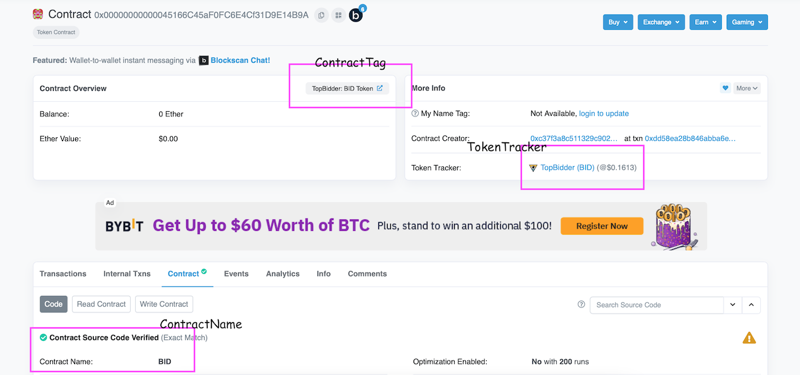

```{r setup, include=FALSE}
knitr::opts_chunk$set(echo = TRUE, warning = FALSE, message = FALSE, fig.align = "center", fig.width=14, dpi=300)

library(knitr)
library(kableExtra)
library(tidyverse)
library(lubridate)
library(ggthemes)
library(omnitheme)

theme_set(theme_fivethirtyeight())
```

## Introduction

The Unlock Protocol is an attempt to bring Content Monetization to the Web3 ecosystem, allowing just a few lines of code to be added in order to paywall or provide premium content.

Unlike traditional paywall models, this is entirely decentralized and open source!

<br><br>
<div style='text-align: center'></div>

---

## Unlock Contract

To create gated content, developers make `createUpgradeableLockAtVersion` calls to the Unlock Contract at `0x3d5409cce1d45233de1d4ebdee74b8e004abdd13`.  Using these interactions with the contract as our data, we decided to do an exploration of who was using the Unlock Protocol and what other contracts might they be transacting with. 

The contract we scraped data from was the following:

https://etherscan.io/address/0x3d5409cce1d45233de1d4ebdee74b8e004abdd13

We scraped all the accounts who had interacted with this contract.


---

## Unlock Contract Scraping

Next, for those individual accounts, we browsed to their page and scraped all the addresses they have interacted with. We then used those final contracts and scraped this info for each if it was a contract and skipped it if it was an address.

Ultimately, the final data set consisted of wallet addresses that interacted with the Unlock contract and all of the other contract addresses that wallet interacted with on the Ethereum blockchain.



---     

## Goals

Using the scraped [data](https://github.com/Omni-Analytics-Group/eth-data-science-course/tree/master/case-studies/unlock-protocol/data), we wish to do the following:

- Clean and process the data to make it suitable for analysis
- Analyze both the aggregate and the over-time growth metrics of the Unlock Protocol
- Get a feel for the number of unique contracts and wallets interacting with the protocol
- Say something about the top tags names, and token trackers.

Let's get started!

---

## The Data

First, let's begin by loading in our data and taking a first peak. Note that for verbosity, we are removing a few contract columns when displaying here.

```{r}
unlock <- read_csv("data/unlock_data.csv")

unlock %>%
    select(Block, Time, Type, ContractTag, ContractName, TokenTracker) %>%
    head(n = 5) %>%
    kable
```

---

## Time Period

To get some context for the time period for which we are analyzing, we take a look at the `min` and the `max` of the time variable:

```{r}
min(unlock$Time)
```

```{r}
max(unlock$Time)
```

We see that the data covers the time period between December 2015 and May 2022.

---


## Some Quick Statistics

Aggregating over all time, the total number of transactions is:

```{r}
nrow(unlock)
```

The number of unique wallets is:

```{r}
length(unique(unlock$From))
```

And the number of unique contracts is:

```{r}
length(unique(unlock$Contract))
```

---

## Transactions Over Time

How has the number of transactions per month changed as a function of time?

```{r}
ghp1 <- unlock %>%
    mutate(Date = as_date(Time)) %>%
    mutate(Date = ymd(paste(year(Date), month(Date), "01", sep = "-"))) %>%
    group_by(Date) %>%
    summarise(Count = n()) %>%
    mutate(CumeCount = cumsum(Count)) %>%
    ggplot(aes(Date, CumeCount)) +
        geom_line(colour = "#D64555", size = 1.25) +
        geom_bar(stat = "identity", aes(y = Count), fill = "#D64555", colour = "grey60") +
        scale_x_date(date_breaks = "3 months", date_labels = "%b %y") +
        scale_y_continuous(labels = scales::comma, breaks = scales::pretty_breaks(n = 10)) +
        watermark_img("unlock.png", width = 70, location = "tl", alpha = 0.3) +
        labs(
            title = "Cumulative Number of Transactions over Time",
            subtitle = "For the Unlock Protocol",
            y = "Transactions",
            x = "Date"
        )
```

---

We see a steady growth that accelerated in 2020, including a particularly large spike in December 2021.

```{r, echo=FALSE}
ghp1
```

---

## Top Contract Tags

Now let's compute the list of the contracts most frequently interacted with that have been identified by the contract tag:

```{r}
p2 <- unlock %>%
    filter(!is.na(ContractTag)) %>%
    group_by(ContractTag) %>%
    summarise(Count = n()) %>%
    arrange(desc(Count)) %>%
    slice(1:30) %>%
    mutate(ContractTag = factor(ContractTag, levels = rev(ContractTag))) %>%
    ggplot(aes(x = Count, y = ContractTag)) +
        geom_bar(stat = "identity", fill = "#D64555", colour = "grey60") +
        scale_x_continuous(labels = scales::comma, breaks = scales::pretty_breaks(n = 10)) +
        watermark_img("unlock.png", width = 70, location = "br", alpha = 0.3) +
        labs(
            title = "Top 30 Most Interacted with Contracts identified by  Contract Tag",
            subtitle = "For Wallets that have also interacted with the Unlock Protocol",
            y = "Contract Tag",
            x = "Number of Transactions"
        )
```

---

Towards the top of the list, we see Uniswap V2, USD Coin, and DAI, with Uniswap V2 leading the way with well over 12,000 transactions associated.

```{r, echo=FALSE}
p2
```

---

## Top Contract Names

We can use nearly the same routine to look at the top contracts, but this time by their names:

```{r}
p3 <- unlock %>%
    filter(!is.na(ContractName)) %>%
    group_by(ContractName) %>%
    summarise(Count = n()) %>%
    arrange(desc(Count)) %>%
    slice(1:30) %>%
    mutate(ContractName = factor(ContractName, levels = rev(ContractName))) %>%
    ggplot(aes(x = Count, y = ContractName)) +
        geom_bar(stat = "identity", fill = "#D64555", colour = "grey60") +
        scale_x_continuous(labels = scales::comma, breaks = scales::pretty_breaks(n = 10)) +
        watermark_img("unlock.png", width = 70, location = "br", alpha = 0.3) +
        labs(
            title = "Top 30 Most Frequented Contracts by Contract Names",
            subtitle = "For Wallets that have also interacted with the Unlock Protocol",
            y = "Contract Name",
            x = "Number of Transactions"
        )
```

---

The story is much the same, with Uniswap at the top, followed by the NFT project InBetweeners and the FiatTokenProxy for USDC.

```{r, echo=FALSE}
p3
```

---

## Top Token Trackers

Finally, we do the same analysis looking at the top token trackers:

```{r}
p4 <- unlock %>%
    filter(!is.na(TokenTracker)) %>%
    group_by(TokenTracker) %>%
    summarise(Count = n()) %>%
    arrange(desc(Count)) %>%
    slice(1:30) %>%
    mutate(TokenTracker = factor(TokenTracker, levels = rev(TokenTracker))) %>%
    ggplot(aes(x = Count, y = TokenTracker)) +
        geom_bar(stat = "identity", fill = "#D64555", colour = "grey60") +
        scale_x_continuous(labels = scales::comma, breaks = scales::pretty_breaks(n = 10)) +
        watermark_img("unlock.png", width = 70, location = "br", alpha = 0.3) +
        labs(
            title = "Top 30 Token Trackers of All Time",
            subtitle = "For the Unlock Protocol",
            y = "Token Tracker",
            x = "Number of Transactions"
        )
```

---

Now, InBetweeners rises to the top, and USDC + DAI round out the rest of the top three.

```{r, echo=FALSE}
p4
```

---

## Conclusion

We hope you enjoyed this brief look into the Unlock Protocol and analyzing data on transactions associated with it from the blockchain. Be on the lookout for many more case studies coming down the pipeline and maybe even a grant where we'll take a much deeper dive into the data generated by the Unlock Protocol!

<br><br>
<div style='text-align: center'></div>
