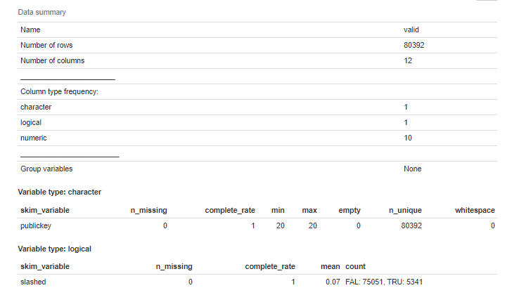
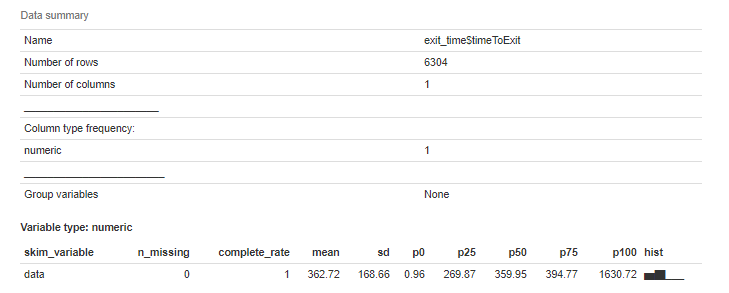
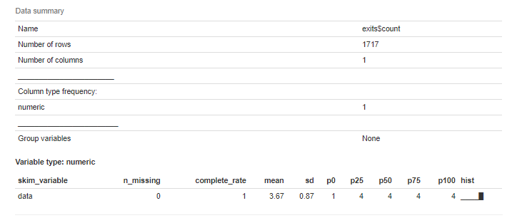
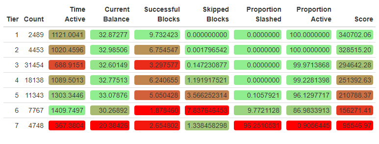

```{r setup, include=FALSE}
knitr::opts_chunk$set(echo = TRUE, warning = FALSE, message = FALSE, cache = FALSE, tidy = FALSE )
options(htmltools.dir.version = FALSE)
```


## Case study

- Explore and perform analysis on a real dataset using R.
- The goal is to gain an understanding of R for data management, exploration, and analysis.

--

## What is Ethereum?

Ethereum is a technology that lets you send cryptocurrency to anyone for a small fee. It also powers applications that everyone can use and no one can take down. It's the world's programmable blockchain and a marketplace for financial services, games and apps that can't steal your data or censor you.

Ethereum also has its own cryptocurrency, namely 'ETHER' or 'ETH' for short. Check out more about Ethereum and ETH on https://ethereum.org/.

<p align="center">


</p>
---

## Validator Dataset

This dataset is obtained from the Beacon Scan block explorer, where it captured and characterized a validator's "journey" as a validator joins the Ethereum 2.0 Medalla testnet.

--

### More on this "journey"

To participate as a validator, Ethereum 1.0 holders will transfer 32 ETH into a deposit contract that creates an equivalent 32 bETH credit on Ethereum 2.0’s Beacon Chain. This places the validator into an activation queue. Before blockchain activation there is an eligibility period where the queued validator must wait until the first epoch it is eligible to be activated. At any point after the eligibility epoch has passed, the validator may complete the setup of the beacon chain client and join the network. Once online, the validator’s activation epoch is logged and it may begin being assigned to propose blocks or participate in block attestations. For the validators who can no longer commit to their responsibilities, after a set duration of time, it is possible to exit the network. Beacon clients that exit have a time stamp logged of the epoch their client was disabled and when their funds are withdrawn.
---

## Explore the data in R

Let's load the data and look at the first few rows. Here we will use the <b> tidyverse </b> package. Note that the syntax is slightly different while reading a csv file. Also, we can use the <b> sample_n() </b> function to show n random rows.

--

```{r}
#load library
library(tidyverse)
#Load data
valid_raw <- read_csv("validator_data.csv")
#Show 5 random rows of the data
sample_n(valid_raw,5)
```


---

## The variables

The 11 variables are:

* `...1` - The row index of the validator.
* `publickey` - The public key identifying the validator.
* `index` - The index number of the validator.
* `currentBalance` - The current balance, in ETH, of the validator.
* `effectiveBalance` - The effective balance, in ETH, of the validator.
* `proposed` - The number of blocks assigned, executed, and skipped by the validator.
* `eligibilityEpoch` - The epoch number that the validator became eligible.
* `activationEpoch` - The epoch number that the validator activated.
* `exitEpoch` - The epoch number that the validator exited.
* `withEpoch` - Epoch when the validator is eligible to withdraw their funds.  This field is not applicable if the validator has not exited.
* `slashed` - Whether the given validator has been slashed.

---

## Data manipulation

To be suitable for analysis, this data required some minor data manipulation. We will utilize the <b> stringi </b> package to assist with string processing. The steps are as follows:

1. Remove '...1' using <b> select(-`...1`) </b>.
2. Convert 'proposed' to ASCII using <b> mutate() </b> and <b> stri_trans_general() </b>.
3. Separate 'proposed' to three separate columns 'assigned', 'executed', and 'skipped' using <b> separate() </b>.
4. Parse the 'assigned', 'executed', 'skipped''currentBalance' and 'effectiveBalance' using <b> parse_number() </b> so that they become numeric variables.
5. Convert 'eligibilityEpoch', 'activationEpoch', 'exitEpoch' and 'withEpoch' to numeric.

--

```{r}
library(stringi)
valid <- valid_raw %>%
    select(-`...1`) %>%
    mutate(proposed = stri_trans_general(proposed, "latin-ascii")) %>%
    separate(proposed, into = c("assigned", "executed", "skipped"),sep = " ", extra = "merge") %>%
    mutate(across(c(assigned, executed, skipped, currentBalance, effectiveBalance), parse_number)) %>%
    mutate(eligibilityEpoch = as.numeric(ifelse(eligibilityEpoch == "genesis", 0, eligibilityEpoch))) %>%
    mutate(activationEpoch = as.numeric(ifelse(activationEpoch == "genesis", 0, activationEpoch))) %>%
    mutate(exitEpoch = as.numeric(ifelse(exitEpoch == "genesis", 0, exitEpoch))) %>%
    mutate(withEpoch = as.numeric(ifelse(activationEpoch == "withEpoch", 0, withEpoch)))

```

---

Let's take a look at the data after all the manipulation.

```{r}
sample_n(valid,5)
```

It looks great! All the columns are now in the correct format.

---

Let's summarize the data using the <b> skim() </b> function from the <b> skimr </b> package. This command produces a simple summary table of centrality and spread statistics of our collected features.
```{r, eval = FALSE}
library(skimr)
skim(valid)
```

--

.center[]

---


.center[]

We see that the data consists of 80392 rows and 12 columns (1 character, 1 logical, and 10 numeric), along with various summary statistics. Note that we do have missing data in some of the columns.

---

## Activation

Activation is the first step towards compliance for any node attempting to join the active validator set. Let's find out how many validators are activated over time.

1. Sort the data by 'activationEpoch' using <b> arrange() </b>.
2. Count the number of each 'activationEpoch' group using <b> group_by() </b> and <b> summarise(n()) </b>.

--

.pull-left[
```{r t1, eval=FALSE}
# number of activated validators over time
num_activated <- valid %>%
    arrange(activationEpoch) %>%
    group_by(activationEpoch) %>%
    summarise(count = n())
head(num_activated)
```
]


.pull-right[
```{r t1-out, ref.label="t1", echo=FALSE}
```
]
---
We can plot a scatterplot using <b> geom_point </b> from the <b> ggplot2 </b> package to see how the number changes over time. We will exclude activationEpoch 0 using the <b> filter() </b> function for the purpose of getting a better graph.

--

.pull-left[
```{r p1, eval=FALSE}
num_activated %>%
  filter(activationEpoch>0) %>%
  ggplot(aes(x=activationEpoch, y=count))+
  geom_point(size=0.5)+
  scale_y_continuous(breaks = scales::pretty_breaks(n = 10)) +
  scale_x_continuous(breaks = scales::pretty_breaks(n = 10)) +
  labs(
      title = "Activated Validators over Time",
      x = "Activation Epoch",
      y = "Number of Activated Validators"
    )
```

From the graph, we see that 4 is a very common number of activated validators over time.

]


.pull-right[
```{r p1-out, ref.label="p1", echo=FALSE}
```
]


---
Let's take a look at the time series of the cumulative number over time by using the <b> cumsum() </b> and the <b> geom_line() </b> functions.

.pull-left[
```{r p2, eval=FALSE}
num_activated %>%
    mutate(cume_count = cumsum(count)) %>%
    ggplot(aes(x = activationEpoch, y = cume_count)) +
    geom_line() +
    scale_y_continuous(breaks = scales::pretty_breaks(n = 10)) +
    scale_x_continuous(breaks = scales::pretty_breaks(n = 10)) +
    labs(
        title = "Activated Validators over Time",
        x = "Activation Epoch",
        y = "Cumulative Number of Activated Validators"
    )
```
A close inspection of the graph reveals two visible anomalies; one between Epoch 3238 and 3440, and the other, between 14189 and 14311. In both instances no new validators were activated on the blockchain for over 150 epochs which suggests there was some fault in the network’s activation functionality.
]


.pull-right[
```{r p2-out, ref.label="p2", echo=FALSE}
```
]


---

## Exit

For validators attempting to leave the network, there is a mandatory lock-in period that is enforced. It is only after this time frame that a staker is allowed to withdraw their funds and leave the network. This process is a two step procedure where the node client software is first shut down and the bETH is withdrawn from the network. Let's find the distribution of the time from activation to exit. First, we create a temporary variable: 'timetoExit' using the formula:

$$ \frac{6.4}{60} * (\text{exitEpoch} - \text{activationEpoch}) $$
, where the $6.4$ is the conversion from Epoch to minute and $60$ is the conversion from minute to hour. Then, we can plot a histogram using <b> geom_histogram </b>.


---


.pull-left[
```{r p3, eval=FALSE}
valid %>%
    mutate(timeToExit = 6.4 / 60 * (exitEpoch - activationEpoch)) %>%
    ggplot(aes(x = timeToExit)) +
    geom_histogram(fill = "#EA5600", colour = "grey60") +
    scale_x_continuous(breaks = seq(0, 1500, by = 100)) +
    labs(
        title = "Distribution of Time to Exit for Validators",
        x = "Time to Exit (Hours)"
    )
```
The histogram looks great! We can visualize the table to see exactly how many validators exited as well as other summary statistics. We will simply use the same formula as mentioned and filter out the rows where 'timeToExit' is empty using <b> is.na() </b>.

.pull-right[
```{r p3-out, ref.label="p3", echo=FALSE}
```
]

---


```{r, eval = FALSE}
exit_time <- valid %>%
  mutate(timeToExit = 6.4 / 60 * (exitEpoch - activationEpoch)) %>%
  filter(!is.na(timeToExit))
skim(exit_time$timeToExit)
```

.center[]

We see that a total of 6304 validators have exited with an average of 363 hours or around 15.1 days. Also, the fastest exit time is actually less than 1 hour.

---

## Your turn

We can better observe these trends over time with both a traditional time series plot and a cumulative count graph that tracks the number of validators exiting throughout the epochs.

1. Get the data (i.e. count the exitEpoch and also obtain the cumulative sum) and display 3 random rows of the data.
2. Get the summary of the count.
3. Plot a time series of the count and color the line blue.
4. Plot a time series of the cumulative sum.

<p align="right">


</p>
---

## Answers

### 1.
```{r}
exits <- valid %>%
  group_by(exitEpoch) %>%
  filter(!is.na(exitEpoch)) %>%
  summarise(count = n()) %>%
  mutate(count_cume = cumsum(count))

sample_n(exits,3)
```


---

### 2.
```{r, eval = FALSE}
skim(exits$count)
```

.center[]

---

### 3.
.pull-left[
```{r p4, eval=FALSE}
ggplot(data = exits, aes(x = exitEpoch, y = count)) +
  geom_line(color='blue') +
  scale_x_continuous(breaks = scales::pretty_breaks(n = 10)) +
  labs(
    title = "Exiting Validators by Epoch",
    x = "Exit Epoch",
    y = "Count"
  )
```
]


.pull-right[
```{r p4-out, ref.label="p4", echo=FALSE}
```
]

---

### 4.
.pull-left[
```{r p5, eval=FALSE}
ggplot(data = exits, aes(x = exitEpoch, y = count_cume)) +
  geom_line() +
  scale_x_continuous(breaks = scales::pretty_breaks(n = 10)) +
  scale_y_continuous(breaks = scales::pretty_breaks(n = 10)) +
  labs(
    title = "Cumulative Exiting Validators by Epoch",
    x = "Exit Epoch",
    y = "Count"
  )
```
]


.pull-right[
```{r p5-out, ref.label="p5", echo=FALSE}
```
]

---

## Investigation into the Block Proposal Process
To start, we will look at the distribution of the numbers of blocks 'assigned', 'executed' and 'skipped.' One way to do this is to simply create a plot for each column, which we already know how to do. For example, we can do the following:

--

.pull-left[
```{r p6, eval=FALSE}
valid %>%
  group_by(assigned) %>%
  ggplot(aes(x=assigned)) +
  geom_bar() +
  labs(title = "Distribution of Assigned")
```
]


.pull-right[
```{r p6-out, ref.label="p6", fig.height=6, echo=FALSE}
```
]

---

Let's do it a different way and plot all three variables using the <b> facet_wrap() </b> function. Here are the steps:

1. Subset the 'assigned', 'executed' and 'skipped' columns using <b> select() </b>.
2. Collapse the subset into long form with two columns: 'variable' and 'value' using <b> gather() </b>.
3. Group by the variable and value using <b> group_by </b>.
4. Add <b> facet_wrap(~variable) </b> to create a plot for each variable.

Note that we use <b> fill = variable </b> and <b> scale_fill_brewer(palette = "Dark2") </b> to customize the colors on each plot. Lastly, since the legend is not needed, we add <b>theme(legend.position = "off") </b>.

--
.pull-left[
```{r p7, eval=FALSE}
valid %>%
    select(assigned, executed, skipped) %>%
    gather(key = variable, value = value) %>%
    group_by(variable, value) %>%
    ggplot(aes(x = value, fill = variable)) +
    geom_bar() +
    scale_fill_brewer(palette = "Dark2") +
    scale_x_continuous(breaks = seq(0, 35)) +
    scale_y_continuous(breaks = scales::pretty_breaks(n = 10)) +
    facet_wrap(~variable, nrow = 3) +
    labs(
        title = "Distribution of Assigned, Executed, and Skipped Blocks"
    ) +
    theme(legend.position = "off")
```
]


.pull-right[
```{r p7-out, ref.label="p7", fig.height=5, echo=FALSE}
```
]

---

From the barcharts, we observe that each validator status is distributed exponentially where most nodes have not had any assignments, executed blocks or skipped assignments. Globally however, the average validator has been assigned to 6 slots, has successfully proposed 4 blocks and has missed 2 slot assignments.

A quick exercise for you: How would you obtain the averages mentioned in one try? Take a few minutes to try it out!

--

Here is one method:
```{r}
valid %>%
    select(assigned, executed, skipped) %>%
    gather(key = variable, value = value) %>%
    group_by(variable) %>%
    summarise(mean(value))
```

---

## Your turn

By treating the executions and assignments skipped as proportions, we can visualize the distributions of both execution success and skipped slot as rates. To do so we define each variable by taking the number of executed or skipped blocks, and dividing them by the total number of assigned blocks.

* Create two histogram plots that show the distribution of 'Execution Rate' and 'Skipped Rate'. Give clear titles and different colors for these two plots.

<br><br>

<p align="left">


</p>
---

## Answers
### First plot

.pull-left[
```{r p8, eval=FALSE}
valid %>%
    mutate(`Execution Rate` = executed / assigned) %>%
    ggplot(aes(x = `Execution Rate`)) +
    geom_histogram(fill = "#EA5600") +
    scale_y_continuous(labels = scales::comma, breaks = seq(0, 35000, by = 5000)) +
    scale_x_continuous(labels = function(.) scales::percent(., accuracy = 1), breaks = seq(0, 1, by = .1)) +
    labs(
        title = "Distribution of Execution Rate for Validators"
    )
```

One thing to note is that since there is a space in our variable name, we need to use single quotes when creating this temporary variable. Also, we can use <b> function(.) scales::percent(., accuracy = 1) </b> to show percentage instead of decimals.
]


.pull-right[
```{r p8-out, ref.label="p8", fig.height=6, echo=FALSE}
```
]
---

### Second plot

.pull-left[
```{r p9, eval=FALSE}
valid %>%
    mutate(`Skipped Rate` = skipped / assigned) %>%
    ggplot(aes(x = `Skipped Rate`)) +
    geom_histogram(fill = "#776DB8") +
    scale_y_continuous(labels = scales::comma, breaks = seq(0, 35000, by = 5000)) +
    scale_x_continuous(labels = function(.) scales::percent(., accuracy = 1), breaks = seq(0, 1, by = .1)) +
    labs(
        title = "Distribution of Skipped Rate for Validators"
    )
```
]


.pull-right[
```{r p9-out, ref.label="p9", fig.height=6, echo=FALSE}
```
]

---

.pull-left[
```{r p8-out, ref.label="p8", fig.height=6, echo=FALSE}
```
]

.pull-right[
```{r p9-out, ref.label="p9", fig.height=6, echo=FALSE}
```
]

Surprisingly, the rate of successful block executions and the proportion of skipped slots appear to follow reflected Beta distributions, where most of the probability mass rests at the edges of the support range. Most nodes have only had success executing their block proposals. However, a significant portion of the validators have not had any success. Likewise, most validators have not skipped any slot assignments, but a substantial portion of them have skipped all of their block proposals. This result suggests that there will likely be a clear demarcation between the behaviors of certain validators on the network.

---

## Slashing

Slashing on the Ethereum 2.0 network is the act of punishing validators for violations of the consensus rules by either improperly proposing a block or failing to properly attest to a block while in an assigned committee. To better understand the slashing behavior within our dataset, we will investigate the number of slashed validators over exitEpoch. To do so, we simply filter the data based on 'slashed' being TRUE and group_by exitEpoch. Then, we use the <b> cumsum() </b> function just like before.

--

.pull-left[
```{r p10, eval=FALSE}
valid %>%
  filter(slashed == TRUE) %>%
  group_by(exitEpoch) %>%
  summarise(slashed = n()) %>%
  mutate(cume_slashed = cumsum(slashed)) %>%
  ggplot(aes(x = exitEpoch, y = cume_slashed)) +
  geom_line() +
  scale_y_continuous(breaks = scales::pretty_breaks(n = 10)) +
  scale_x_continuous(breaks = scales::pretty_breaks(n = 10)) +
  labs(
      title = "Number of Slashed Validators over Time",
      x = "Exit Epoch",
      y = "Cumulative Number of Slashed Validators"
  )
```
]


.pull-right[
```{r p10-out, ref.label="p10", fig.height=5, echo=FALSE}
```
]


---

From the graph, we notice that between epochs 2000 and 4000, the slashed validators rose from 0 to 5000. Since epoch 4000, the growth has been much slower, barely creeping up towards 5500 through epoch 15000. The spike in slashings during epochs 2000 and 4000 correspond directly with the large exodus of validators that we observed previously. When punished with a slashing, a portion of the validators stake is removed. If the effective balance of the validator drops too low, it could be subject to removal from the network.

--

From our macro analysis, we’ve shown that analytical techniques applied to Medalla’s testnet data can help us develop a foundational understanding of the network. Our tracking of validator activations, execution rates, and exit patterns, among other metrics, help us visualize network health as a whole. We can then recast and project this onto individual validators. Our next section will further develop this idea as we focus specifically on understanding the actions of Ethereum 2.0’s stakers.

---

## Behavioral based Validator Rankings

It is our goal to develop a categorization method that can codify patterns in validator behavior, characterize it and discern the difference between constructive and destructive network actions. To facilitate the discovery of these behavioral patterns and fulfill the aforementioned objectives, we will employ a weighted linear rank scoring algorithm. This is a simple, yet powerful sorting technique that maps a validator’s characteristics on to a single ranked score that can be compared.

--

As inputs into the scoring function we’ll use the current balance, number of successful executions, the active status of the validator, how long the node has been active, the number of skipped assignments and a binary indicator for whether the node has been slashed.

Of the 6 variables, 'currentBalance', 'executed', 'skipped', and 'slashed' are readily available in the dataset. We can use 'exitEpoch' to get the active status of the validator, and lastly, how long the node has been active is the same as the 'timetoExit' variable we computed in the previous slide, where we use this formula: $$\frac{6.4}{60}*(\text{exitEpoch} - \text{activationEpoch}).$$

--

The polarities of each of these variables are unambiguous. Of the six, the only variables that indicate negative behavior are the number of skipped slots and whether the validator has been slashed. To account for this we set negative weightings on those two variables, while allowing the others maintain their positive polarity.

---

Here is what we need to do to get all the variables ready:
1. Create variable 'active' that indicates the active status using <b> is.na(exitEpoch) </b>.
2. Modify 'exitEpoch' so that it shows 15579 instead of 'NA'. Note that 15579 is the latest epoch that the data was obtained. We can do so by using <b> ifelse() </b>.
3. Using this new 'exitEpoch', we create the variable 'active_time'.
4. Rename 'executed' to 'executions'.
5. Flip the 'slashed' indicator to have negative weighting.
6. Create variable 'skips' as the negative version of 'skipped'.

Note that the last two steps are done to account for negative behavior as mentioned.

--

```{r}
valid_stats <- valid %>%
  mutate(active = (is.na(exitEpoch)),
         exitEpoch = ifelse(is.na(exitEpoch), 15579, exitEpoch),
         active_time = 6.4 / 60 * (exitEpoch - activationEpoch),
         executions = executed,
         slashed = !slashed,
         skips = -1*skipped) %>%
  select(publickey, index, currentBalance, executions, skips, slashed, active, active_time)  
```

---

## Weighted Linear Rank Scoring Algorithm

Now that we have all the variables we need, we can now try to implement the algorithm. The following explains briefly what we need to do.

Let $x_1 =$ currentBalance, $x_2 =$ executions, $x_3 =$ skips, $x_4 =$ slashed,  $x_5 =$ active, and  $x_6 =$ active_time. For any specific validator, the ordered rankings of its respective values can be represented as $r_i$. We use weights, $w_i$, to correspond to emphasis placed on variable $x_i$ in the scoring function $S$. The weight vector satisfies the following constraint: $w_1+w_2+w_3+...+w_6 = 1$.  The score, S, is then computed as the scalar product of the ranks and weights.

$$S =\sum_{i=1}^6 w_ir_i $$

---

Now that we have a general idea, let's code!

1. Get the ranks of each of the 6 variables we discussed using <b> across(,rank) </b>.
2. Collapse the data into long form with three columns: 'publickey', 'Variable' and 'Rank' using <b> gather() </b>.
3. Create the variable 'Score' that gives the sum of the rank group by 'publickey' using <b> group_by </b> and <b> sum() </b>.
4. Replace 'Rank' with the rank of the Score (a higher the score translates to a lower rank) using <b> rank() </b>.
5. Sort the table according to the 'Rank' using <b> arrange() </b>.

--

```{r}
valid_ranks <- valid_stats %>%
    mutate(across(c(currentBalance, executions, skips, slashed, active, active_time), rank)) %>%
    mutate(active_time = active_time / 4) %>%
    gather(key = Variable, value = Rank, 3:ncol(.)) %>%
    group_by(publickey) %>%
    summarise(Score = sum(Rank)) %>%
    mutate(Rank = rank(-1 * Score)) %>%
    arrange(Rank)
```

Note that we divided 'active_time' by 4 to reduce the weighting as we do not want to punish new validators.

---

Now that we have their 'Score' and 'Rank', we will add them back to the 'valid_stats' dataframe. To do so, we simply use <b> left_join() </b>. Also, we revert 'slashed' and 'skips' to its original value before the negative weighting.

```{r}
valid_all <- valid_stats %>% left_join(valid_ranks) %>%
    mutate(slashed = !slashed, skips = -1 * skips) %>%
    arrange(Rank)
```


---

To better highlight the rate of change of the 'Score', we sort the 'Score' and plot it. We also use <b>     scale_color_gradientn(colors = rainbow(2), labels = scales::comma) </b> to change the color. Note that <b> scales::comma </b> is using <b> comma </b> function from the <b> scales </b> package and it changes how numbers show.

.pull-left[
```{r p11, eval=FALSE}
valid_all %>%
  arrange(Score) %>%
  mutate(Index = 1:nrow(.)) %>%
  ggplot(aes(x = Index, y = Score, color = Score)) +
    geom_point() +
    scale_color_gradientn(colors = rainbow(2), labels = scales::comma) +
    scale_x_continuous(name="Index",labels = scales::comma, breaks = scales::pretty_breaks(n = 10)) +
    scale_y_continuous(labels = scales::comma, breaks = scales::pretty_breaks(n = 10),
                       limits = c(0, 350000)) +
    labs(
        title = "Sorted Validator Scores"
    )
```
]


.pull-right[
```{r p11-out, ref.label="p11", echo=FALSE}
```
]


---

While the validator score curve does show there is differentiation between the scores, it fails to give any indication of clear heterogeneity within the node’s behaviors. Let's plot the distribution of the 'Score'.

.pull-left[
```{r p12, eval=FALSE}
ggplot(valid_all, aes(x = Score, fill = Score)) +
    geom_histogram(binwidth=10000, color = "grey60") +
    scale_x_continuous(labels = scales::comma)+
  labs(
        title = "Distribution of Validator Performance Scores"
    )
```

The histogram of the score values is multimodal, which is the first encouraging sign that our scoring function has successfully captured and encoded a significant portion of the variance in validator behavior.


.pull-right[
```{r p12-out, ref.label="p12", echo=FALSE}
```
]

---

## Segmentation Study of Validator Behavior
As with many unsupervised tasks, the transition from scores to a finite segmentation is often tricky, particularly when there is no well established subject matter context for the selection of cut-offs, nor one agreed upon cluster validation method in the literature. With a mixture of investigation, intuition and mathematical hand waving, we settled on the selection of seven score tiers to differentiate network behavior as follows:
--

$$\begin{align}
\text{Rank} & & \text{Tier} \\
[1,2489] & \ \ \ \ \ \ \ \ \ \longrightarrow & 1 \\
(2489,6942] & \ \ \ \ \ \ \ \ \ \longrightarrow & 2 \\
(6942,38396] & \ \ \ \ \ \ \ \ \ \longrightarrow & 3 \\
(38396,56534] & \ \ \ \ \ \ \ \ \ \longrightarrow & 4 \\
(56534,67877] & \ \ \ \ \ \ \ \ \ \longrightarrow & 5 \\
(67877,75644] & \ \ \ \ \ \ \ \ \ \longrightarrow & 6 \\
(75644,\infty) & \ \ \ \ \ \ \ \ \ \longrightarrow & 7 \end{align}$$

```{r}
valid_tiers <- valid_all %>% mutate(Tier = ifelse(Rank <= 2489, 1, ifelse(Rank <= 6942, 2,
                                ifelse(Rank <= 38396, 3, ifelse(Rank <= 56534, 4,
                                ifelse(Rank <= 67877, 5, ifelse(Rank <= 75644,6,7)))))))
```

---

## Your turn

Recreate the Scores vs Rank plot. However, this time make sure that the color will show different tiers. An example output is shown below:


.center[
```{r p13-out, ref.label="p13", fig.height = 6, echo=FALSE}
```
]

Hint: To reverse color, simply use <b> rev() </b>.
---

## Answer

```{r p13, eval = FALSE}
valid_tiers %>%
    arrange(Score) %>%
    mutate(Index = 1:nrow(.)) %>%
    ggplot(aes(x = Index, y = Score, color = Tier)) +
    geom_point() +
    scale_color_gradientn(colors = rev(rainbow(7))) +
    scale_x_continuous(name="Index",labels = scales::comma, breaks = scales::pretty_breaks(n = 10)) +
    scale_y_continuous(labels = scales::comma, breaks = scales::pretty_breaks(n = 10),
                       limits = c(0, 350000)) +
    labs(
        title = "Sorted Validator Scores"
    )
```

---

Let's now try to create this plot together!

```{r, echo = FALSE}
valid_summary <- valid_tiers %>%
    select(Tier, Score) %>%
    rbind(c(Tier = 7, Score = -Inf)) %>%
    mutate(HighScore = c(Inf, head(Score, -1)))

```

.center[
```{r p14-out, ref.label="p14", fig.height = 6, echo=FALSE}
```
]

---

To create this plot, we used <b> geom_rect() </b> to create the color blocks. For these color blocks to fill the graph beautifully, we first need to modify the valid_tiers dataframe as follows:

1. Subset the 'Tier' and 'Score' columns using <b> select() </b>.
2. Add a row where 'Tier' = 7 and 'Score' = $-\infty$ using <b> rbind() </b>.
3. Add a column named 'HighScore', which is simply the 'Score' column shifted down one row. Fill in the first row with $\infty$.

--

```{r}
valid_summary <- valid_tiers %>%
    select(Tier, Score) %>%
    rbind(c(Tier = 7, Score = -Inf)) %>%
    mutate(HighScore = c(Inf, head(Score, -1)))
```


---

One way to get the plot we want is to use <b> scale_fill_manual() </b> in addition to the <b> geom_rect() </b> as mentioned. Here is the code:

```{r p14, eval = FALSE}
valid_tiers %>%
  arrange(Score) %>%
  mutate(Index = 1:nrow(.)) %>%
  ggplot(aes(x = Index, y = Score)) +
    geom_point() +
    geom_rect(data=valid_summary, inherit.aes = FALSE,
              aes(xmin = -Inf, xmax = Inf, ymin = Score, ymax = HighScore, fill = factor(Tier)), alpha = 0.2) +
    scale_fill_manual("Tier", values = rev(rainbow(7))) +
    scale_x_continuous(labels = scales::comma, breaks = scales::pretty_breaks(n = 10)) +
    scale_y_continuous(labels = scales::comma, breaks = scales::pretty_breaks(n = 10),
                       limits = c(0, 400000)) +
    labs(
        title = "Sorted Validator Scores",
        subtitle = "With tier-cutoffs illustrated"
    )
```

Note that we used two dataframes and thus, we included the <b> inherit.aes = FALSE </b> argument.

---

With these cut-off ranges, we can apply them to our histogram of scores to create a stacked distribution and then reapply those same rules to partition the histogram along its tiers.

--
.pull-left[
```{r p15, eval=FALSE}
ggplot(valid_tiers, aes(x = Score, fill = factor(Tier))) +
    geom_histogram(color = "grey60") +
    scale_x_continuous(labels = scales::comma) +
    scale_fill_manual("Tier", values = rev(rainbow(7)))+
labs(
        title = "Distribution of Validator Performance Scores Stacked by Tier"
    )
```
]


.pull-right[
```{r p15-out, ref.label="p15", echo=FALSE}
```
]

---
We can also separate the histograms by Tier using <b> facet_wrap() </b>.

--
.pull-left[
```{r p16, eval=FALSE}
ggplot(valid_tiers, aes(x = Score, fill = factor(Tier))) +
    geom_histogram(color = "grey60") +
    scale_x_continuous(labels = scales::comma) +
    scale_fill_manual("Tier", values = rev(rainbow(7)))+
labs(
        title = "Distribution of Validator Performance Scores Partitioned by Tier"
    )+ facet_wrap(vars(Tier))
```
]


.pull-right[
```{r p16-out, ref.label="p16", echo=FALSE}
```
]


---

An investigation into validator performance can now begin on the tier level as a we compare how they each interact with the network. To categorize the behaviors of the tiers succinctly, we can look at the mean of the $6$ variables used for our 'Score' by Tier.

```{r}
summary_table <- valid_tiers %>%
  group_by(Tier) %>%
  add_count(Tier) %>%
  summarise(across(c(n, active_time, currentBalance, executions, skips, slashed, active, Score),mean)) %>%
  mutate(slashed = slashed*100, active = active*100) %>%
  rename(Count = n, 'Time Active' = active_time, 'Current Balance' = currentBalance, 'Successful Blocks' = executions, 'Skipped Blocks' = skips, 'Proportion Slashed' = slashed, 'Proportion Active' = active)

summary_table
```


---

We can present the table using the <b> formattable </b> package.

--

```{r, eval = FALSE}
library(formattable)
formattable(summary_table)
```

--

.center[]

It looks so much better!


---

We can also add color to each column to show how it changes across different Tiers like a heatmap. Here, we simply use <b> color_tile() </b> which takes two colors as input.

--

```{r, eval = FALSE}
formattable(summary_table, list(
  `Time Active`= color_tile('red', 'lightgreen'),
  `Current Balance`= color_tile('red', 'lightgreen'),
  `Successful Blocks`= color_tile('red', 'lightgreen'),
  `Skipped Blocks`= color_tile('lightgreen', 'red'),
  `Proportion Slashed`= color_tile('lightgreen', 'red'),
  `Proportion Active`= color_tile('red', 'lightgreen'),
  'Score' = color_tile('red', 'lightgreen')
))
```

--

.center[]

---
## Characteristic Behaviors Of Each Tier

<span style="color: #FC33FF ">Tier 1</span> (Ranks 1-2489):  Validators in this set can consider themselves “Proper Proposers” since they are the only nodes with a perfect track record of no skipped slots and no slashings. They often have the highest number of successful blocks to go along with their longer than average active time on the network.

--

<span style="color: #3933FF ">Tier 2</span> (Ranks 2490 – 6942): Second tier validators are typically successful in executing their duties on behalf of the network, though with a slightly lower number of successful blocks and a few skipped slot assignments littered around. Overall this group is still healthy.

--

<span style="color: #33B5FF ">Tier 3</span> (Ranks 6943 – 38396): While validators in this tier are still healthy overall, they do have more skipped blocks and slightly fewer successful block proposals.  This group has a lower average active time than tiers 1 and 2. The first set of exited validators appears in this tier.

--

<span style="color: #33FFA8 ">Tier 4</span> (Ranks 38397 – 56534): This is the tier where validators with more serious performance issues begin to be more prevalently.  Though the majority are active and have not been slashed, there are some who have. This tier is unique because it also houses many of the newer validator nodes who are trying to move up the ranks.  Many have not even had their first assignment.

---

<span style="color: #3CFF33 ">Tier 5</span> (Ranks 56535– 67877): -  Tier 5 is the first of the truly unhealthy groups where the ratio of skipped blocks to successful proposals is skewed negatively towards missed assignments. In this tier, more validators have experienced a slashing and the number of inactive nodes continues to increase.

--

<span style="color: #FFDD33 ">Tier 6</span> (Ranks 67878 – 75644):  Validators in this tier have skipped more block assignments than they successfully proposed.  These nodes are in danger of being removed from the network due to current balances below the 32 ETH threshold.

--

<span style="color: #FF4233 ">Tier 7</span> (Ranks 75645 – 80392):  The vast majority of validators in this bottom tier are all inactive and have had their proposals slashed at least once.  There are also a few that left due to an insufficient balance as a result of a disproportionate number of skipped blocks. This group has the lowest current balance

<br> <br>

<p align="center">


</p>
---

## Princpal Component Analysis

Our tiers all possess distinct behavioral characteristics useful for discriminating between them; however, there is also a deeper level of heterogeneity that exists within the tiers themselves. This result can be found by applying a dimension reduction technique and plotting the component scores against one another. We use <b> prcomp() </b> to perform the principal component analysis on the $6$ variables used in scoring.

--

```{r}
pca <- prcomp(valid_all %>% select(-Score, -Rank, -publickey, -index))
str(pca)
```

---

After some investigation, we managed to get one representation of the score "surface" when labeled by tier. Across the landscape, the scores within most tiers coalesce around one another, forming  localized regions. Though this is true for some groups, Tiers 4 through 7 all have multiple regions where validator scores are located. This is an indication that there is further behavior to be distinguished between the nodes within the same segment.    

.pull-left[
```{r p17, eval=FALSE}
valid_tiers %>%
  mutate(Label = ifelse(Rank %in% c(55821, 76695, 77761, 33530, 66925, 67885, 14959, 4979, 304, 19820, 55757, 66918, 72185), index, NA)) %>%
  select(Label, index, Tier) %>%
  cbind(pca$x %>% as_tibble()) %>%
  ggplot(aes(x = PC3, y = PC1, color = factor(Tier), label = index)) +
    geom_density_2d() +
    geom_label(aes(label = Label), show.legend = FALSE) +
    scale_color_manual("Tier", values = rev(rainbow(7)))+
  labs(
        title = "Validator Performance Score Surface",
        subtitle = "colored by tier assignment"
    )
```
]


.pull-right[
```{r p17-out, ref.label="p17", fig.height=6, echo=FALSE}
```
]

---

Here, we show the representative sample of the most common validator profiles within each tier.
```{r, echo = FALSE, eval = FALSE}
representative <- valid_tiers %>%
  mutate(Label = ifelse(Rank %in% c(55821, 76695, 77761, 33530, 66925, 67885, 14959, 4979, 304, 19820, 55757, 66918, 72185), Rank, NA)) %>%
  filter(!is.na(Label)) %>%
  select(-publickey, -Label)

formattable(representative, list(
  active_time = color_tile('red', 'lightgreen'),
  currentBalance = color_tile('red', 'lightgreen'),
  executions = color_tile('red', 'lightgreen'),
  skips = color_tile('lightgreen', 'red'),
  slashed = color_tile('lightgreen', 'red'),
  active = color_tile('red', 'lightgreen'),
  Score= color_tile('red', 'lightgreen'),
  Rank= color_tile('lightgreen', 'red')  
))

```

.center[]

---

### What does this representative sample tell us?

Starting with Tier 1, we have our Perfect Proposers, validators who exhibit the best combination of behaviors we track. These validators have the highest number of successful blocks to go along with their longer than average active time on the network.

Next we have the Tier 2 validators. Though they have similar characteristics as Tier 1, particularly perfect proposal rates, they have been active for a slightly shorter time and have proposed fewer blocks.

In Tier 3, we see the trend continue where they've been on the network a shorter period of time.

Tier 4 is where poor performance begins to manifest itself in actual skipped blocks. We can see new validators and those who have skipped one or more block proposals in this Tier.

Then, in Tier 5 and Tier 6, we start to see more and more skipped blocks and lower current balance. In particular, validators in Tier 6 have skipped more block assignments than they have successfully proposed, yet have managed to stay on the network for the longest period of time.

Lastly, we see new validators who have been slashed, regardless whether they have skipped a block in Tier 7.


---

## Conclusion


Our key takeaway from this analysis is that, when performing our ranking procedure across the nearly dozen of variables and over 80,000 validators, true "tiers" of validators do in fact exist. At the top of the list, Tier 1 validators execute 100% of their assignments, maintain a high effective balance, have not been slashed and have been active from very early on. On the bottom end are validators who were slashed, and failed to execute their assignments. As expected, most validators fall somewhere in between these two extremes. It will be quite interesting to see how the scores that make up the backbone of the tier-based ranking system evolve as time goes on.

Among other interesting findings, we found:

* Nearly every epoch, 4 validators are activated, except for two periods between Epoch 3238 and 3440, and the other, between 14189 and 14311. 
* A large spike in exiting validators was observed between the 3000th and 4000th epoch.
* The aforementioned spike corresponds to a large increase in the number of slashed validators.
* The average validator has been assigned 6 slots.
* The distribution of the execution and skipped rate follows flipped beta distributions.

With only a couple months of data, we expect that these findings will continue to evolve, and as such, the tiers defining relative performance of validators will continue to need adjustment over time.


---

## References
* Ethereum [https://ethereum.org/]
* Medalla Data Challenge [https://ethereum.org/en/eth2/get-involved/medalla-data-challenge/]
* Medalla Data Challenge Wishlist [https://www.notion.so/Wishlist-The-Eth2-Medalla-Data-Challenge-69fe10ffe83748bc87faa0e2586ba857]
* Ethereum 2.0 Beacon Chain Explorer [beaconscan.com/]
* Consensys Glossary of Ethereum 2.0 Terms [https://consensys.net/knowledge-base/ethereum-2/glossary/]
* Breaking Down ETH 2.0 - Sharding Explained [https://academy.ivanontech.com/blog/breaking-down-eth-2-0-sharding-explained]
* Rewards and Penalties on Ethereum 2.0 [Phase 0] [https://codefi.consensys.net/blog/rewards-and-penalties-on-ethereum-20-phase-0]
* Ethereum 2.0 Explained | Part II | Phase 0 and the Beacon Chain [https://youtu.be/-qwSAFcicg8]
