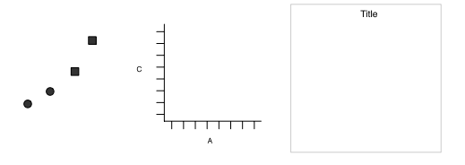
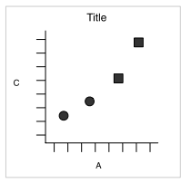

```{r setup, include=FALSE}
options(htmltools.dir.version = FALSE)
knitr::opts_chunk$set(
	echo = FALSE,
	message = FALSE,
	warning = FALSE
)
```

```{r, echo=FALSE}
library(ggplot2)
library(ggsci)
library(ggthemes)
library(gridExtra)
library(grid)
library(gganimate)
library(GGally)
library(ggrepel)

grid_arrange_shared_legend <- function(..., ncol = length(list(...)), nrow = 1, position = c("bottom", "right")) {

  plots <- list(...)
  position <- match.arg(position)
  g <- ggplotGrob(plots[[1]] + theme(legend.position = position))$grobs
  legend <- g[[which(sapply(g, function(x) x$name) == "guide-box")]]
  lheight <- sum(legend$height)
  lwidth <- sum(legend$width)
  gl <- lapply(plots, function(x) x + theme(legend.position="none"))
  gl <- c(gl, ncol = ncol, nrow = nrow)

  combined <- switch(position,
                     "bottom" = arrangeGrob(do.call(arrangeGrob, gl),
                                            legend,
                                            ncol = 1,
                                            heights = unit.c(unit(1, "npc") - lheight, lheight)),
                     "right" = arrangeGrob(do.call(arrangeGrob, gl),
                                           legend,
                                           ncol = 2,
                                           widths = unit.c(unit(1, "npc") - lwidth, lwidth)))
  
  grid.newpage()
  grid.draw(combined)

  # return gtable invisibly
  invisible(combined)

}

cryptoart <- read.csv('data/crypto.csv')

```

class: center, middle

# BUILDING PLOTS

---
class:  center, middle

# Underlying theory

---

# What is a graphic?

ggplot2 uses the idea that you can build every graph from the same components:

  1. a **data** set
  
  2. a **coordinate system**
  
  3. **geoms** - visual marks that represent data
  
- to display values, map variables in the data to visual properties of the geom (**aesthetics**) like **size**, **color**, and **x** and **y** locations



---
# How to build a graph

Complete the template below to build a graph

.pull-left[

]

.pull-right[

<p align="center">


</p>
]
---
# How to build a graph

`ggplot(cryptoart, aes(x = Platform, y = End.Price))`

- This will begin a plot that you can finish by adding layers to.

- You can add one geom per layer


```{r plots-4, fig.align='bottom', fig.height=5, fig.width=15}
p1 <- ggplot(cryptoart, aes(x = Platform, y = End.Price))+theme(axis.text.x = element_text(angle = 45))
p2 <- ggplot(cryptoart, aes(x = Platform, y = End.Price)) + geom_boxplot()+theme(axis.text.x = element_text(angle = 45))
p3 <- ggplot(cryptoart, aes(x = Platform, y = End.Price)) + geom_jitter() + geom_boxplot() +theme(axis.text.x = element_text(angle = 45))
grid.arrange(p1, p2, p3, ncol = 3, nrow = 1)
```

---


# What is a geom?

In ggplot2, we use a geom function to represent data points, and use the geom's aesthetic properties to represent variables.


```{r, fig.align='top', fig.height=4, fig.width=10}
p1 <- ggplot(cryptoart, aes(x = Start.Price, y = End.Price, colour = Platform)) + geom_text(aes(label = Platform))+ scale_color_locuszoom() +labs(x = "Start Price", y = "End Price", title = "Geom Text")
p2 <- ggplot(cryptoart, aes(x = Start.Price, y = End.Price, colour = Platform)) + geom_point()+ scale_color_locuszoom() + labs(x = "Start Price", y = "End Price", title = "Geom Point")
grid.arrange(p2, p1, ncol = 2, nrow = 1)
```

Once our data is formatted and we know what type of variables we are working with, we can select the correct geom for our visualization. 

---
# Available geoms 

```{r, echo=FALSE, fig.align="center"}
library(png)
library(grid)
img <- readPNG("images/geoms.png")
 grid.raster(img)
```


---
# What is a layer?

- it determines the physical representation of the data

- Together, the data, mappings, statistical transformation, and geometric object form a layer

- A plot may have multiple layers
 
```{r, fig.align='bottom', fig.height=5, fig.width=15}
p1 <- ggplot(cryptoart, aes(x = Platform, y = End.Price, colour = Platform)) + geom_jitter(width = 0.1) + scale_fill_locuszoom() + scale_color_locuszoom()+theme(axis.text.x = element_text(angle = 45))
p2 <- ggplot(cryptoart, aes(x = Platform, y = End.Price, colour = Platform)) + geom_violin(aes(fill = Platform), alpha = 0.4) + scale_fill_locuszoom() + scale_color_locuszoom()+theme(axis.text.x = element_text(angle = 45))
p3 <- ggplot(cryptoart, aes(x = Platform, y = End.Price, colour = Platform)) + geom_jitter(width = 0.1) + geom_violin(aes(fill = Platform), alpha = 0.4) + scale_fill_locuszoom() + scale_color_locuszoom()+theme(axis.text.x = element_text(angle = 45))
grid.arrange(p1, p2, p3, ncol = 3, nrow = 1)
```

---
# Alternative method of building layers: Stats

A stat builds a new variable to plot (e.g., count and proportion)
.pull-left[
```{r fig.width=4.5, echo=FALSE, fig.align = "top"}
img <- readPNG("images/stat1.png")
 grid.raster(img)
```
]
.pull-right[
```{r fig.width=4.5, echo=FALSE, fig.align = "top"}
img2 <- readPNG("images/stat2.png")
 grid.raster(img2)
```
]


---

# Faceting

A way to extract subsets of data and place them side-by-side in graphics

```{r, fig.width=10, fig.height=4, echo = TRUE, eval=FALSE}
ggplot(cryptoart, aes(x = Start.Price, y = End.Price, colour = Platform))+ geom_point()

ggplot(cryptoart, aes(x = Start.Price, y = End.Price, colour = Platform)) + geom_point() +facet_grid(.~Platform)
```

```{r, fig.width=10, fig.height=4, fig.align = "center", echo=FALSE}
a <- ggplot(cryptoart, aes(x = Start.Price, y = End.Price, colour = Platform)) + geom_point()+ scale_color_locuszoom()

b <- ggplot(cryptoart, aes(x = Start.Price, y = End.Price, colour = Platform)) + geom_point() +theme(legend.position = "none") +facet_grid(.~Platform)+ scale_color_locuszoom()


grid.arrange(a, b, nrow = 1)
```

---
# Faceting Options

- `facet_grid(. ~ b)`:facet into columns based on b 
- `facet_grid(a ~ .)`:facet into columns based on a 
- `facet_grid(a ~ b)`:facet into both rows and columns
- `facet_wrap( ~ fl)`:wrap facets into a rectangular layout

You can set scales to let axis limits vary across facets:

- `facet_grid(y ~ x, scales = "free")`: x and y axis limits adjust to individual facets
- "free_x" - x axis limits adjust
- "free_y" - y axis limits adjust

You can also set a labeller to adjust facet labels:
- `facet_grid(. ~ fl, labeller = label_both)`
- `facet_grid(. ~ fl, labeller = label_bquote(alpha ^ .(x)))`
- `facet_grid(. ~ fl, labeller = label_parsed)`


---

# Position Adjustments

Position adjustments determine how to arrange geoms that would otherwise occupy the same space
- **Dodge**: Arrange elements side by side 
- **Fill**: Stack elements on top of one another, normalize height
- **Stack**: Stack elements on top of one another

`ggplot(cryptoart, aes(Times.Sold, fill = Growth)) + geom_bar(position = "")`

```{r, fig.width=10, fig.height=4, fig.align = "center"}
s <- ggplot(cryptoart, aes(Times.Sold, fill = Growth)) +ggtitle("") + scale_fill_locuszoom()
s1 <- s + geom_bar(position = "dodge") +ggtitle("Dodge")
s2 <- s + geom_bar(position = "fill") +ggtitle("Fill") + scale_fill_locuszoom()
s3 <- s + geom_bar(position = "stack") +ggtitle("Stack")

grid.arrange(s1, s2, s3, nrow = 1)

```

---
# Position Adjustments: Jitter

- **Jitter**: Add random noise to X & Y position of each element to avoid overplotting
- There is also a jitter geom 

```{r, fig.width=10, fig.height=4, fig.align = "center"}
p2 <- ggplot(cryptoart, aes(Bids, End.Price, color = factor(Bids))) + geom_point() + ggtitle("geom_point()")+ scale_color_locuszoom()
p3 <- ggplot(cryptoart, aes(Bids, End.Price, color = factor(Bids))) + geom_point(position = "jitter") + ggtitle('geom_point(position = "jitter")')+ scale_color_locuszoom()
p4 <- ggplot(cryptoart, aes(Bids, End.Price, color = factor(Bids))) + geom_jitter() + ggtitle("geom_jitter()")+ scale_color_locuszoom()
grid.arrange(p2, p3, p4, nrow = 1)
```


---

## Coordinate Systems

- `coord_cartesian()`: The default cartesian coordinate system
- `coord_fixed()`: Cartesian with fixed aspect ratio between x & y units
- `coord_flip()`: Flipped Cartesian coordinates
- `coord_polar()`: Polar coordinates
- `coord_trans()`: Transformed cartesian coordinates.
- `coord_map()`: Map projections from the mapproj package (mercator (default), azequalarea, lagrange, etc.)

```{r, fig.width=10, fig.height=4, fig.align = "center", eval = FALSE}
r <- ggplot(cryptoart, aes(Times.Sold)) + geom_bar()
r + coord_cartesian(xlim = c(0, 5))
r + coord_fixed(ratio = 1/10)
r + coord_flip()
r + coord_trans(y = "sqrt")
r + coord_polar(theta = "x", direction=1 )
z + coord_map(projection = "ortho")
z + coord_map(projection = "ortho", orientation = c(-90, 0, 0))
```

```{r, fig.width=10, fig.height=5, fig.align = "center"}
r <-  ggplot(cryptoart, aes(Times.Sold)) + geom_bar()
r1 <- r + coord_cartesian(xlim = c(0, 5)) + ggtitle("coord_cartesian")
r2 <- r + coord_fixed(ratio = 1/10) + ggtitle("coord_fixed")
r3 <- r + coord_flip() + ggtitle("coord_flip")
r4 <- r + coord_polar(theta = "x", direction=1 ) + ggtitle("coord_polar")
r5 <- r + coord_trans(y = "sqrt") + ggtitle("coord_trans")
world <- map_data("world")
library(maps)
worldmap <- ggplot(world, aes(x = long, y = lat, group = group)) +
  geom_path() +
  scale_y_continuous(breaks = (-2:2) * 30) +
  scale_x_continuous(breaks = (-4:4) * 45)
r7 <- worldmap + coord_map("ortho") + ggtitle("coord_map")
r8 <- worldmap + coord_map("ortho", orientation = c(-90, 0, 0)) + ggtitle("coord_map")

grid.arrange(r1, r2, r3, r5, r4, r7, r8, nrow = 2)
```


---

## ggplot2 extensions

There are many ggplot2 extensions available. For example,

* gganimate
* GGally

You can find other extensions here: https://exts.ggplot2.tidyverse.org/gallery/

---

## gganimate

.pull-left[
gganimate extends the grammar of graphics as implemented by ggplot2 to include the description of animation.
```{r p1, echo=TRUE,eval=FALSE}
ggplot(cryptoart, aes(x = Platform, y = End.Price)) + geom_boxplot()+theme(axis.text.x = element_text(angle = 45))+
  transition_states(
    Times.Sold,
    transition_length = 2,
    state_length = 1
  ) +
  enter_fade() + 
  exit_shrink() +
  ease_aes('sine-in-out')
```
]
.pull-right[
```{r p1-out, ref.label="p1", echo=FALSE}
```
]

---
## GGally

.pull-left[
GGally extends ggplot2 by adding several functions to reduce the complexity of combining geoms with transformed data. 
```{r p2, echo=TRUE,eval=FALSE}
ggpairs(cryptoart)
```
]
.pull-right[
```{r p2-out, ref.label="p2", echo=FALSE}
```
]

 