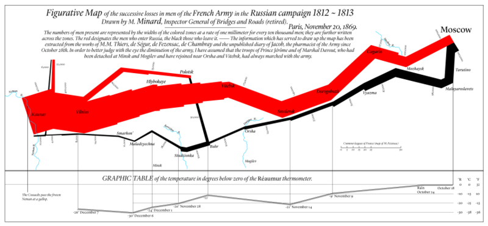
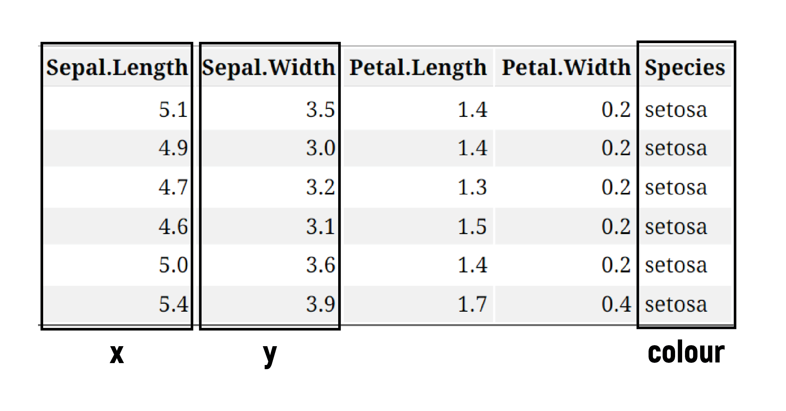
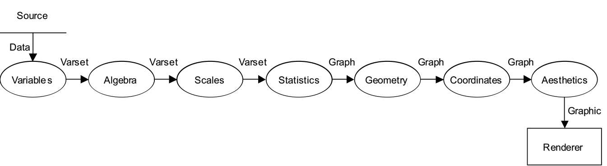
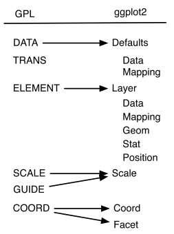
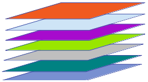

```{r setup, include=FALSE}
options(htmltools.dir.version = FALSE)
knitr::opts_chunk$set(
	echo = FALSE,
	message = FALSE,
	warning = FALSE
)
```

```{r}
library(tidyverse)
library(ggsci)
library(ggthemes)
library(gridExtra)
library(grid)

grid_arrange_shared_legend <- function(..., ncol = length(list(...)), nrow = 1, position = c("bottom", "right")) {

  plots <- list(...)
  position <- match.arg(position)
  g <- ggplotGrob(plots[[1]] + theme(legend.position = position))$grobs
  legend <- g[[which(sapply(g, function(x) x$name) == "guide-box")]]
  lheight <- sum(legend$height)
  lwidth <- sum(legend$width)
  gl <- lapply(plots, function(x) x + theme(legend.position="none"))
  gl <- c(gl, ncol = ncol, nrow = nrow)

  combined <- switch(position,
                     "bottom" = arrangeGrob(do.call(arrangeGrob, gl),
                                            legend,
                                            ncol = 1,
                                            heights = unit.c(unit(1, "npc") - lheight, lheight)),
                     "right" = arrangeGrob(do.call(arrangeGrob, gl),
                                           legend,
                                           ncol = 2,
                                           widths = unit.c(unit(1, "npc") - lwidth, lwidth)))
  
  grid.newpage()
  grid.draw(combined)

  # return gtable invisibly
  invisible(combined)

}

```

class: center, middle

# MOTIVATION

---

# Why visualize?

- The sole purpose of visualization is communication


- Visualization offers an alternative way of communicating numbers



---

# Tables and lists vs. Charts and graphs


```{r}
data(iris)
knitr::kable(head(iris), format = 'html')
```

---

# Tables and lists vs. Charts and graphs




---

# Tables and lists vs. Charts and graphs


```{r, fig.height=4, fig.width=7, fig.align = "center"}
data(iris)
ggplot(iris) + geom_point(aes(x= Sepal.Length, y=Sepal.Width, colour = Species), size = 2.5)+ scale_color_locuszoom()
```

Visualizations can aid communication and make the data easier to perceive


---
class: center, middle 

# Survey of types of graphs

---

# Beginner


.pull-left[
**One Variable**
- Discrete
  - Bar Chart
  - Pie Chart
  
- Continuous
  - Stem and Leaf Plots
  - Histograms
  
]

.pull-right[
**Two variables**
- Continuous X, Continuous Y
  - Scatterplots
  
- Maps
]

<br/>


```{r beg, fig.height=4, fig.width=20, fig.pos="center"}
data(mtcars)


p1 <- ggplot(mtcars, aes(factor(cyl), fill = factor(cyl))) + geom_bar() + labs(x="Cyl", title = "Bar Chart")+scale_fill_grey(start=0.2, end= 0.8, name = "cyl")+theme(legend.position = "none")

p2 <- ggplot(mtcars, aes(factor(1), fill = factor(cyl))) + geom_bar(width=1) + coord_polar(theta="y") + labs(x="", title = "Pie Chart")+scale_fill_grey(start=0.2, end= 0.8, name = "cyl")+theme(legend.position = "none")

p3 <- ggplot(iris, aes(Sepal.Length)) + geom_histogram(bins=20)+ labs(x="", title = "Histogram")

#p3 <- png("images/stem-and-leaf.png")
#p3

p4 <- ggplot(iris, aes(Sepal.Length, Sepal.Width)) + geom_point()+ labs(x="", y="", title = "Scatterplot")

data <- data.frame(murder=USArrests$Murder, state=tolower(rownames(USArrests)))
map <- map_data("state")
map2 <- map %>% filter(region == "iowa")
p5 <- data %>% filter(state == "iowa") %>% ggplot() + geom_map(aes(map_id=state), map=map2, fill = "grey33") + expand_limits(x = map2$long, y = map2$lat)+ labs(title = "Map")
grid.arrange(p1, p2, p3, p4, p5, ncol = 5, nrow = 1)

```


---

# Intermediate

- Parallel Coordinate Plots
- Mosaic Plots
- Radar Charts
- Heat Maps

<br/>
<br/>
<br/>
<br/>
```{r}
# library(devtools)
# devtools::install_github("mangothecat/fftw3")
# install_github('omegahat/Rcartogram')
# ## Wait for installation, then:
# install_github('chrisbrunsdon/getcartr', subdir='getcartr')
# 
# library(Rcartogram)
# library(getcartr)
# library(ggplot2)
# world <- readShapePoly('TM_WORLD_BORDERS-0.3.shp')
# ## We are using the world's population data from World Bank
# world.pop <- read.csv(file = 'sp.pop.totl_Indicator_en_csv_v2.csv', stringsAsFactors = FALSE)
# ## Create a smaller dataset by retaining the world's population in 2013 and the ISO3
# ## country code, which will be used for matching and merging with the input shapefile
# smaller.data <- data.frame(Country.Code = world.pop$Country.Code, Population = world.pop$X2013)
# smaller.data <- na.omit(smaller.data)
# 
# ## Join the two datasets using their common field
# matched.indices <- match(world@data[, "ISO3"], smaller.data[, "Country.Code"])
# world@data <- data.frame(world@data, smaller.data[matched.indices, ])
# ## Compute the cartogram transformation of each country using its population
# ## with the degree of Gaussian blur = 0.5 (otherwise, it may not work)
# world.carto <- quick.carto(world, world@data$Population, blur = 0.5)
# 
# ## Convert the object into data frame
# world.f <- fortify(world.carto, region = "Country.Code")
# ## Merge the cartogram transformation with the world map shapefile
# world.f <- merge(world.f, world@data, by.x = "id", by.y = "Country.Code")
# ## Make a plot of the transformed polygons, where each country is
# ## further shaded by their population size (lighter means bigger)
# my_map <- ggplot(world.f, aes(long, lat, group = group, fill = world.f$Population)) + geom_polygon()
# ## Display the plot and give it a title
# (my_map <- my_map + ggtitle("Cartogram of the World Population (2013)"))

```

```{r int, fig.height=4, fig.width=20, fig.pos="center"}

iris2 <- iris %>% mutate(obs = 1:150) %>% gather(variable, value, -c(obs, Species)) 

#i1 <- ggplot()+ labs(x="", y="", title="Cartogram")

library(GGally)

i2 <- ggparcoord(data = iris, columns = 1:4, groupColumn = 5) +scale_colour_grey(start=0.2, end= 0.7) + theme(legend.position = "none")+ labs(x="", y="", title="Parallel Coordinates")

data(diamonds)
library(ggmosaic)

i3 <- ggplot(diamonds) + geom_mosaic(aes(x=product(color), fill = cut))+scale_fill_grey(start=0.2, end= 0.7) + theme(legend.position = "none") + labs(x="", y="", title="Mosaic Plot")

library(ggradar)

suppressPackageStartupMessages(library(dplyr))
library(scales)

mtcars %>%
     add_rownames( var = "group" ) %>%
     mutate_each(funs(rescale), -group) %>%
     tail(4) %>% select(1:10) -> mtcars_radar

 i4 <-ggradar(mtcars_radar, group.line.width = .7,
   group.point.size = 2, axis.label.size = 3.5, grid.label.size = 2.5, background.circle.transparency = 0.1, plot.legend =FALSE)+scale_colour_grey(start=0.4, end= 0.9)+ theme(legend.position = "none") + labs(x="", y="", title="Radar Charts")
# i4 <- ggplot()+ labs(x="", y="", title="Radar Charts")

df.team_data <- expand.grid(teams = c("Team A", "Team B", "Team C", "Team D") ,metrics = c("Metric 1", "Metric 2", "Metric 3", "Metric 4", "Metric 5"))

# add variable: performance
set.seed(41)
df.team_data$performance <- rnorm(nrow(df.team_data))

i5 <-ggplot(data = df.team_data, aes(x = metrics, y = teams)) +
  geom_tile(aes(fill = performance)) + scale_fill_distiller(palette = "Greys")+ theme(legend.position = "none") + labs(x="", y="", title="Heat Map")


grid.arrange(i2, i3, i4, i5, ncol = 4, nrow = 1)

```


---

# Advanced

- Density Plots
- Violin Plots
- Social Network Plots

<br/>
<br/>
<br/>
<br/>

```{r adv, fig.height=4, fig.width=18, fig.pos="center"}

a1 <- ggplot(diamonds, aes(depth)) +
    geom_density(aes(fill = cut), alpha = .8) +
    xlim(55, 70) + labs(x="", y="", title="Density Plot")+scale_colour_grey(start=0.6, end= 0.9)+scale_fill_grey(start=0.6, end= 0.9) + theme(legend.position = "none")

a2 <- ggplot(diamonds, aes(cut, price)) + geom_violin(aes(fill = cut), alpha = .8) + labs(x="", y="", title="Violin Plot")+scale_fill_grey(start=0.6, end= 0.9) + theme(legend.position = "none")


library(geomnet)
data(blood)

a3 <- ggplot(data = blood$edges, aes(from_id = from, to_id = to)) +
  geom_net(vertices=blood$vertices, aes(colour=..type..)) + 
  theme_net() +scale_colour_grey(start=0.4, end= 0.9)+ theme(legend.position = "none") + labs(x="", y="", title="Network Plot")


grid.arrange(a1, a2, a3, ncol = 3, nrow = 1)

```

  
---
class: center, middle 

# Grammar of Graphics

---

# Grammar of Graphics


What is the grammar of graphics?

- Developed by Leland Wilkinson, is a set of grammatical rules for creating perceivable graphs

- Rather than thinking about a limited set of graphs, think about graphical forms

- Charts are instances of much more general objects
  
- An abstraction which makes thinking, reasoning, and communicating graphics easier


???


We often talk about types of graphs – bar plots, pie charts, scatterplots – as though they are unrelated, but most graphs share many aspects of their structure. 

We can think of graphs as visual representations of (possibly transformed) data, along with labels (like axes and legends) that make the meaning clear.

Much like the grammar of a language allows you to combine words into meaningful sentences, a grammar of graphics provides a structure to combine graphical elements into figures that display data in a meaningful way. 

The grammar of graphics was developed in order to produce a flexible system that can create a rich variety of charts as simply as possible, without duplication of methods.

A grammar provides a strong foundation for understanding a diverse range of graphics. A grammar may also help guide us on what a well-formed or correct graphic looks like, but there will still be many grammatically correct but nonsensical graphics
---

# Grammar of Graphics

Different types of graphs may appear completely distinct, but in actuality share many common elements.

By making different visual choices, you can use graphs to highlight different aspects of the same data. 

For example, here are three ways of displaying the same data:


```{r plots-3, fig.align='bottom', fig.height=5, fig.width=15}
library(ggsci)
data(diamonds)
p1 <- ggplot(diamonds, aes(cut, fill=cut)) + geom_bar() + labs(title = "Bar Chart", subtitle = "Cartesian coordinates")+ scale_fill_locuszoom()
p2 <- ggplot(diamonds, aes(factor(1), fill=cut)) + geom_bar(width=1) + labs(x="", title = "Fill-Bar", subtitle = "Cartesian coordinates") + scale_fill_locuszoom()
p3 <- ggplot(diamonds, aes(factor(1), fill=cut)) + geom_bar(width=1) + coord_polar(theta= "y") + labs(x="", title = "Fill-Bar", subtitle = "Polar coordinates")+ scale_fill_locuszoom()

grid.arrange(p1, p2, p3, ncol = 3, nrow = 1)
```


???
add in description of how they are different


Different types of graphs may, at first glance, appear completely distinct. But in fact, graphs share many common elements, such as coordinate systems and using geometric shapes to represent data. 

By making different visual choices (Cartesian or polar coordinates, points or lines or bars to represent data), you can use graphs to highlight different aspects of the same data. For example, here are three ways of displaying the same data:

---

# Grammar of Graphics

Statistical graphic specifications are expressed in six statements:

1) **DATA**: a set of data operations that create variables from datasets  

2) **TRANS**: variable transformations  

3) **SCALE**: scale transformations  

4) **COORD**: a coordinate system  

5) **ELEMENT**: graphs (points) and their aesthetic attributes (color)  

6) **GUIDE**: one or more guides (axes, legends, etc.)  


???
The internal processes that constitute the syntax of the grammar of graphics
<br/>
<br/>


a data flow diagram that shoes what the stages are, how they must be ordered, and waht data are required along the way

provides us the ingredients and the dependencies among them, but it does not tell us how to assemble the ingredients

The Recipe:

1. Create variables – extract data into variables  
2. apply algebra – 
3. apply scales – ex. categorical
4. compute statistics
5. construct geometry
6. apply coordinates - ex. for polar: send (x,y) to (r, theta)
- by postponing the coordinnates operation as late in the pipeline as possible, we have made the system more flexible
7. compute aesthetics
- aesthetic functions translate a graph into a graphic, which is a set of drawing instructions for a renderer
ex. position, color, label


---

# Limitations to the Grammar

- tells us what words make up our graphical “sentences,” but offers no advice on how to write well

- is not about good taste, practice, or graphic design

- while very useful, the grammar is not all encompassing

- does not include interactive graphics

- does not include a few interesting and useful charts


---
class: center, middle 

# ggplot2
## A layered grammar of graphics

---

## A layered grammar vs The Grammar of Graphics

ggplot2 is based on The Grammar of Graphics




In both grammars, the components are independent, meaning that we can generally change a single component in isolation

---

# What is a graphic?

ggplot2 uses the idea that you can build every graph with graphical components from three sources

  1. the **data** , represented by **geoms** 
  
  2. the **scales** and **coordinate system**
  
  3. the **plot annotations**
  
- to display values, map variables in the data to visual properties of the geom (**aesthetics**) like **size**, **color**, and **x** and **y** locations


---
# ggplot2: A layered grammar

The layered grammar defines the components of a plot as:

1. a default dataset and set of mappings from variables to aesthetics 

2. one or more layers, each layer having one geometric object, one statistical transformation, one position adjustment, and optionally, one dataset and set of aesthetic mappings  

3. one scale for each aesthetic mapping used  

4. a coordinate system 

5. the facet specification 
.pull-right[


]

???

---

# What is a Layer?


- it determines the physical representation of the data
  
- a plot may have multiple layers
  - usually all the layers on a plot have something in common, i.e. different views of the same data
    
- a layer is composed of four parts:
    1. data and aesthetic mapping
    2.  a statistical transformation (stat)
    3. a geometric object (geom)
    4. a position adjustment


???


---

# ggplot2: A layered grammar

```{r plots-4, fig.align='top', fig.height=5, fig.width=15}
p1 <- ggplot(diamonds, aes(cut, fill=cut)) + geom_bar() + labs(title = "Bar Chart", subtitle = "Cartesian coordinates")+ scale_fill_locuszoom()
p2 <- ggplot(diamonds, aes(factor(1), fill=cut)) + geom_bar(width=1) + labs(x="", title = "Fill-Bar", subtitle = "Cartesian coordinates") + scale_fill_locuszoom()
p3 <- ggplot(diamonds, aes(factor(1), fill=cut)) + geom_bar(width=1) + coord_polar(theta= "y") + labs(x="", title = "Fill-Bar", subtitle = "Polar coordinates")+ scale_fill_locuszoom()
grid.arrange(p1, p2, p3, ncol = 3, nrow = 1)
```


<style>
.column-left{
  float: left;
  width: 32%;
  text-align: left;
}
.column-center{
  display: inline-block;
  width: 34%;
  text-align: left;
}
.column-right{
  float: right;
  width: 32%;
  text-align: left;
}
</style>

<div class="column-left">

data: diamonds  </br>
layer:  </br>
  mapping: x = cut, y = count, fill = cut  </br>  
  geom: bar    </br>
coordinates: Cartesian

</div>
<div class="column-center">

data: diamonds  </br>
layer:  </br>
  - mapping: x = 1, y = count, fill = cut  </br>
  - geom: fill-bar  </br>
coordinates: Cartesian  </br>

</div>
<div class="column-right">

data: diamonds  </br>
layer:  </br>
  - mapping: x = 1, y = count, fill = cut  </br>
  - geom: fill-bar  </br>
coordinates: Polar  </br>
</div>


---

class: center, middle 

# Make your first figure

---


```{r, eval=FALSE, fig.align='center', include=FALSE}
library(ggplot2)
data(iris)
p <- ggplot(data = iris, mapping = aes(x = Petal.Length, y = Petal.Width)) 
p
p + geom_point()
```

```{r, eval=FALSE, fig.align='center', fig.height=4, fig.width=8, include=FALSE}

p1 <- ggplot(data = iris, mapping = aes(x = Petal.Length, y = Petal.Width)) 

p2 <- p1 + geom_point()
p3 <- p1 + geom_point(aes(color = Species)) + theme(legend.position = "none")

grid.arrange(p1, p2, ncol = 2, nrow = 1)

```

# We begin with the data

```{r, fig.width=10, fig.height=6, echo = TRUE}
ggplot(data = diamonds)
```

---

# Then we specify the aesthetic mappings

```{r, eval=FALSE, fig.height=6, fig.width=10, echo = TRUE}
ggplot(data = diamonds, aes(x = carat, y = price))

```

```{r, echo=FALSE, fig.height=6, fig.width=10}
ggplot(data = diamonds, aes(x = carat, y = price))+ scale_fill_locuszoom()
```
???
or what relationships we want to see
---

# Then we choose a geom

```{r, eval=FALSE, fig.width=10, fig.height=5, echo = TRUE}
ggplot(data = diamonds, aes(x = carat, y = price)) +
    geom_point()
```

```{r, echo=FALSE, fig.width=10, fig.height=5}
ggplot(data = diamonds, aes(x = carat, y = price)) +
    geom_point()+ scale_color_locuszoom()
```

---

# And add an aesthetic

```{r, eval=FALSE, fig.width=10, fig.height=5, echo = TRUE}
ggplot(data = diamonds, aes(x = carat, y = price)) +
    geom_point(aes(colour = cut))
```

```{r, echo=FALSE, fig.width=10, fig.height=5}
ggplot(data = diamonds, aes(x = carat, y = price)) +
    geom_point(aes(colour = cut)) + scale_color_locuszoom()
```

---
# And add another layer...

```{r, eval = FALSE, fig.width=10, fig.height=5, echo = TRUE}
ggplot(data = diamonds, aes(x = carat, y = price)) +
    geom_point(aes(colour = cut)) +
   geom_smooth()
```

```{r, echo = FALSE, fig.width=10, fig.height=5}
ggplot(data = diamonds, aes(x = carat, y = price)) +
    geom_point(aes(colour = cut)) +
    geom_smooth() + scale_color_locuszoom()
```

---

# Mapping aesthetics vs setting aesthetics

```{r, fig.width=10, fig.height=5, eval = FALSE, echo = TRUE}
ggplot(data = diamonds, aes(x = carat, y = price) +
    geom_point(aes(colour = cut), size = 2, alpha = .5) +
    geom_smooth((aes(fill = cut)) 
```

```{r, fig.width=10, fig.height=5, echo = FALSE}
ggplot(data = diamonds, aes(x = carat, y = price)) +
    geom_point(aes(colour = cut), size = 2, alpha = .5) + scale_color_locuszoom()+ scale_fill_locuszoom()+
    geom_smooth(aes(fill = cut))
```

---

# Coordinate transformations can be specified

```{r, fig.width=10, fig.height=5, eval = FALSE, echo = TRUE}
ggplot(data = diamonds, aes(x = carat, y = price)) +
    geom_point(aes(colour = cut), size = 2, alpha = .5) +
    geom_smooth(aes(fill = cut)) +
    scale_y_log10()
```

```{r, fig.width=10, fig.height=5, echo = FALSE}
ggplot(data = diamonds, aes(x = carat, y = price)) +
    geom_point(aes(colour = cut), size = 2, alpha = .5) +
    geom_smooth(aes(fill = cut)) + scale_color_locuszoom()+ scale_fill_locuszoom()+ scale_y_log10()
```


---

# As can facet variables

```{r, fig.width=10, fig.height=5, eval = FALSE, echo = TRUE}
ggplot(data = diamonds, aes(x = carat, y = price)) +
    geom_point(aes(colour = cut), size = 2, alpha = .5) +
    geom_smooth() +
    scale_y_log10() +
    facet_wrap(~cut)
```

```{r, fig.width=10, fig.height=5, echo = FALSE}
ggplot(data = diamonds, aes(x = carat, y = price)) +
    geom_point(aes(colour = cut), size = 2, alpha = .5) +
    geom_smooth(aes(fill = cut)) + scale_color_locuszoom()+ scale_fill_locuszoom()+
    scale_y_log10()+
    facet_wrap(~cut)
```


---

# Course Outline

BASICS
1. Why is data visualization important?
2. Data Types, Formats, and Structures
3. Formatting your data: A tidy data discussion

BUILDING PLOTS
1. Geoms, Stats, Coordinates, and Faceting

PERCEPTION
1. Basics of cognitive visual perception
2. What makes a good graphic?
3. Aesthetics and scales in ‘ggplot2‘

POLISHING PLOTS
1. Setting themes
2. Modifying elements of a plot  
3. Making plots interactive!
4. Saving your work


