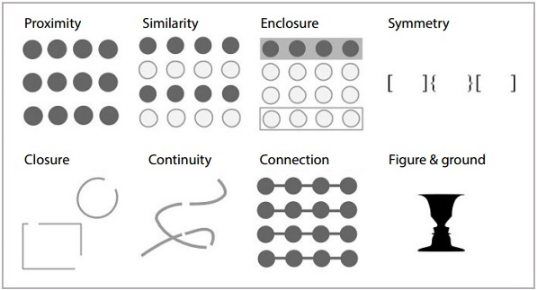
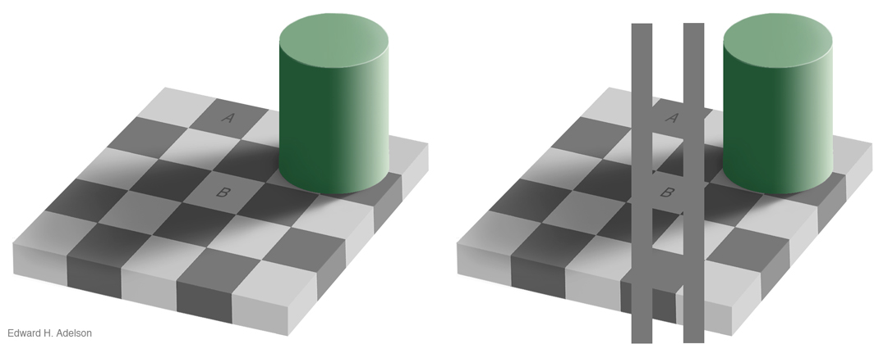
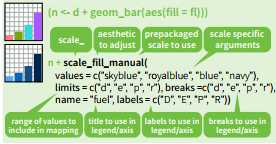
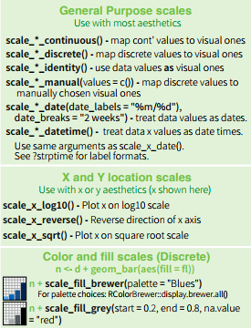
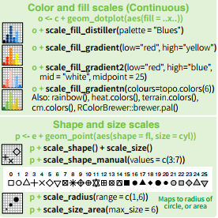

```{r setup, include=FALSE}
options(htmltools.dir.version = FALSE)
knitr::opts_chunk$set(
	echo = FALSE,
	message = FALSE,
	warning = FALSE,
	cache = TRUE
)
```

```{r}
library(ggplot2)
library(ggsci)
library(ggthemes)
library(gridExtra)
library(grid)

grid_arrange_shared_legend <- function(..., ncol = length(list(...)), nrow = 1, position = c("bottom", "right")) {

  plots <- list(...)
  position <- match.arg(position)
  g <- ggplotGrob(plots[[1]] + theme(legend.position = position))$grobs
  legend <- g[[which(sapply(g, function(x) x$name) == "guide-box")]]
  lheight <- sum(legend$height)
  lwidth <- sum(legend$width)
  gl <- lapply(plots, function(x) x + theme(legend.position="none"))
  gl <- c(gl, ncol = ncol, nrow = nrow)

  combined <- switch(position,
                     "bottom" = arrangeGrob(do.call(arrangeGrob, gl),
                                            legend,
                                            ncol = 1,
                                            heights = unit.c(unit(1, "npc") - lheight, lheight)),
                     "right" = arrangeGrob(do.call(arrangeGrob, gl),
                                           legend,
                                           ncol = 2,
                                           widths = unit.c(unit(1, "npc") - lwidth, lwidth)))
  
  grid.newpage()
  grid.draw(combined)

  # return gtable invisibly
  invisible(combined)

}

```

class: center, middle

# PERCEPTION

---

# Why are some plots easier to read than others?

What makes bad figures bad?

- issues can be (1) aesthetic, (2) substantive, and/or (3) perceptual 


---

# Why are some plots easier to read than others?

What makes bad figures bad?

- issues can be (1) **aesthetic**, (2) substantive, and/or (3) perceptual 
<br/><br/>

- Edward R. Tufte is a better known critic of this style of visualization

- Graphical excellence is the well-designed presentation of interesting data and consists of:

  - complex ideas communicated with clarity, precision, and efficiency

  - maximizes the “data-to-ink” ratio.

  - nearly always multivariate 

  - requires telling the truth about the data. 

- defines "chartjunk" as superfluous details

???

While chartjunk is not entirely devoid of merit, bear in mind that ease of recall is only one virtue amongst many for graphics.

---

# Why are some plots easier to read than others?

What makes bad figures bad?

- issues can be (1) aesthetic, (2) **substantive**, and/or (3) perceptual 
<br/><br/>

- bad data
---

# Why are some plots easier to read than others?

What makes bad figures bad?

- issues can be (1) aesthetic, (2) substantive, and/or (3) **perceptual **
<br/><br/>

- Looking at pictures of data means looking at lines, shapes, and colors

- Our visual system works in a way that makes some things easier for us to see than others

- “Preattentive” features

- Gestalt Principles

- color and contrast

???

---
# Good Graphics

Graphics consist of:

- **Structure**: boxplot, scatterplot, etc.

- **Aesthetics**: features such as color, shape, and size that map other characteristics to structural features

Both the structure and aesthetics should help viewers interpret the information.

<br> <br>
<p align="left">


</p>
---
class: center, middle 

# Gestalt Principles
### What sorts of relationships are inferred, and under what circumstances? 
---

# Which has more structure?

```{r rand, fig.height=4, fig.width=12, fig.pos="center"}

library(tidyverse)
library(spatstat)

#  matern model
pp <- rMaternI(300, .02, stationary=FALSE)
dat <- data_frame(x = pp$x, y = pp$y)
a1 <- ggplot(dat) + geom_point(aes(x = x, y =y )) + theme_void() + labs(x="", y="", title="Matern Model")


# uniform Poisson process with intensity 150 in the unit square
pp2 <- rpoispp(200)
dat2 <- data_frame(x = pp2$x, y = pp2$y)
a2 <- ggplot(dat2) + geom_point(aes(x = x, y =y )) + theme_void() + labs(x="", y="", title="Poisson Process")

grid.arrange(a2, a1, ncol = 2, nrow = 1)

```
???

We look for structure all the time. We are so good at it that we will find it in random data, given time. (This is one of the reasons that data visualization can hardly be a replacement for statistical modeling.) The strong inferences we make about relationships between visual elements from relatively sparse visual information are called “gestalt rules”. They are not pure perceptual effects, like the checkerboard illusions. Rather, they describe our tendency to infer relationships between the objects we are looking at in a way that goes beyond what is strictly visible.

---
# Gestalt principles




???

---

# Gestalt principles

What sorts of relationships are inferred, and under what circumstances? 

- **Proximity**: Things that are spatially near to one another are related.

- **Similarity**: Things that look alike are related.

- **Enlosure**: A group of related elements are surrounded with a visual element

- **Symmetry**: If an object is asymmetrical, the viewer will waste time trying to find the problem instead of concentrating on the instruction.

- **Closure**: Incomplete shapes are perceived as complete.

- **Continuity**: Partially hidden objects are completed into familiar shapes.

- **Connection**: Things that are visually tied to one another are related.

- **Figure/Ground**: Visual elements are either in the foreground or the background.

---
class: center, middle 

# Pre-Attentive Features

---

# Pre-Attentive Features

```{r, fig.align="center"}
library(RColorBrewer)
library(tidyverse)

data <- data.frame(expand.grid(x = 1:6, y = 1:6), color = factor(sample(c(1, 2), 36, replace = TRUE)))
data$x <- data$x + rnorm(36, 0, .25)
data$y <- data$y + rnorm(36, 0, .25)
data$shape <- factor(c(rep(2, 15), 1, rep(2,20)))

ggplot(data, aes(x, y)) + geom_point(aes(shape = shape), size = 5, colour = "#1B9E77") + theme_void() + theme(legend.position = "none")
```

---

# Pre-Attentive Features

```{r, fig.align="center"}
data$shape <- factor(c(rep(2, 25), 1, rep(2, 10)))


ggplot(data, aes(x, y)) + geom_point(aes(colour = shape), size = 5, shape = I(19)) + theme_void() + theme(legend.position = "none") + scale_colour_brewer(palette="Dark2")
```

---
# Pre-Attentive Features

Pre-Attentive Features are things that "jump out" in less than 250 ms

- Color, form, movement, spatial localization

There is a hierarchy of features

- Color is stronger than shape

- Combinations of pre-attentive features are usually not pre-attentive due to **interference**

---

## Pre-attentive Features

```{r, fig.align="center"}
data$shape <- data$color

ggplot(data, aes(x, y)) + geom_point(aes(colour = color, shape = shape), size = 5) + theme_void() + theme(legend.position = "none") + scale_colour_brewer(palette="Dark2")
```

---

## Pre-attentive Features

```{r, fig.align="center"}

data$shape[1] <- if(data$shape[1]==2) 1 else 2

ggplot(data, aes(x, y)) + geom_point(aes(colour = shape), shape = 19, size = 5) + theme_void() + theme(legend.position = "none") + scale_colour_brewer(palette="Dark2")


```

---

## Color

- **Hue**: shade of color (red, orange, yellow...)

- **Intensity**: amount of color

- Both color and hue are pre-attentive. Bigger contrast corresponds to faster detection.

- Use color to your advantage

- When choosing color schemes, we will want mappings from data to color that are not just numerically but also ***perceptually*** uniform

- Distinguish bewteen sequential scales and categorical scales

---

## Color

Color is context-sensitive: A and B are the same intensity and hue, but appear to be different.



---

## Ordering Variables

Which is bigger?

- Position: higher is bigger (y), items to the right are bigger (x)
- Size, Area
- Color: not always ordered. More contrast = bigger.
- Shape: Unordered. 

```{r, echo=FALSE, fig.width=20}
library(RColorBrewer)
library(gridExtra)

data <- data.frame(x = c(1, 2, 3, 4, 5), 
                   y = c(1, 4, 9, 10, 12), 
                   size = c(1, 4, 2, 1, 5))

p1 <- qplot(x, y, data = data, size = size, geom = "point") + 
    scale_size_continuous(range = c(2.5, 5), guide = "none") + 
    theme_bw()  + 
    theme(axis.text = element_blank())

data <- data.frame(x = factor(c(1, 2, 3, 4, 5)), 
                   y = c(4, 3, 1, 5, 2))

p2 <- ggplot(data = data, aes(x = x, weight = y)) + 
    geom_bar() + 
    theme_bw() + 
    theme(axis.text = element_blank())

data <- data.frame(expand.grid(x = 1:6, y = 1:2), 
                   color = c(brewer.pal(7, "Blues")[2:7], 
                             brewer.pal(6, "Set1")))

p3 <- ggplot(data = data, aes(x = x, y = factor(y), color = color)) + 
    geom_point(size = 5) + 
    scale_color_identity() + 
    ylab("") + 
    xlab("") + 
    theme_bw() + 
    theme(axis.text = element_blank())

grid.arrange(p1, p2, p3, nrow = 1)
```

---
class: center, middle 

# Aesthetics in `ggplot2`
## scales

---

## Aesthetics in `ggplot2`

**Aesthetics**: features such as color, shape, and size that map other characteristics to structural features

**Scales** map data values to the visual values of an aesthetic  

 - to change a mapping, add a new scale


---
## Scales

.pull-left[

]

.pull-right[

]

---
## Gradients

Qualitative schemes: no more than 7 colors


```{r, echo=FALSE, fig.width=7, fig.height=1.2}
data <- data.frame(x = 1:7, 
                   blues = brewer.pal(7, "Blues"), 
                   set1 = brewer.pal(7, "Set1"), 
                   diverge = brewer.pal(7,"RdBu"))

qplot(xmin = x-.5, xmax = x+.5, ymin = 0, ymax = 1, data = data, geom = "rect", color = I("black"), fill = set1) + 
    scale_fill_identity() + 
    ylab("") + 
    xlab("") + 
    theme(axis.text = element_blank(), 
          axis.ticks = element_blank(), 
          rect = element_blank()) + 
    coord_fixed(ratio = 1) + 
    theme_void()
```

<small>
Can use `colorRampPalette()` from the RColorBrewer package to produce larger palettes by interpolating existing ones
</small>

```{r, echo=FALSE, fig.width=10, fig.height=1.2}

getPalette = colorRampPalette(brewer.pal(9, "Set1"))

data2 <- data.frame(x = 1:20, 
                   expanded = getPalette(20))

qplot(xmin = x-.5, xmax = x+.5, ymin = 0, ymax = 1, data = data2, geom = "rect", color = I("black"), fill = expanded) + 
    scale_fill_identity() + 
    ylab("") + 
    xlab("") + 
    theme(axis.text = element_blank(), 
          axis.ticks = element_blank(), 
          rect = element_blank()) + 
    coord_fixed(ratio = 1) + 
    theme_void()
```

Quantitative schemes: use color gradient with only one hue for positive values

```{r, echo=FALSE, fig.width=7, fig.height=1.2}
qplot(xmin = x-.5, xmax = x+.5, ymin = 0, ymax = 1, data = data, geom = "rect", color = I("black"), fill = blues) + 
    scale_fill_identity() + 
    ylab("") + 
    xlab("") + 
    theme(axis.text = element_blank(), 
          axis.ticks = element_blank(), 
          rect = element_blank()) + 
    coord_fixed(ratio = 1) + 
    theme_void()
```

---

## More Gradients

Quantitative schemes: use color gradient with two hues for positive and negative values. Gradient should go through a light, neutral color (white)

```{r, echo=FALSE, fig.width=7, fig.height=1.5}
qplot(xmin = x-.5, xmax = x+.5, ymin = 0, ymax = 1, data = data, geom = "rect", color = I("black"), fill = diverge) + 
    scale_fill_identity() + 
    ylab("") + 
    xlab("") + 
    theme(axis.text = element_blank(), 
          axis.ticks = element_blank(), 
          rect = element_blank()) + 
    coord_fixed(ratio = 1) + 
    theme_void()
```

Small objects or thin lines need more contrast than larger areas

---
## Factors vs. Continuous variables

- Factor variable:
    - `scale_colour_discrete`
    - `scale_colour_brewer(palette = ...)`
- Continuous variable:
    - `scale_colour_gradient` (define low, high values)
    - `scale_colour_gradient2` (define low, mid, and high values)
    - Equivalents for fill: `scale_fill_...`

```{r, fig.align='top', fig.height=4, fig.width=10}
p1 <- ggplot(data = mpg, aes(x = cty, y = hwy, colour = class)) + geom_point() + scale_color_locuszoom() +labs(x = "city mpg", y = "highway mpg", title = "Factor variable")
p2 <- ggplot(data = mpg, aes(x = cty, y = hwy, colour = hwy)) + geom_point() + labs(x = "city mpg", y = "highway mpg", title = "Continuous variable")
grid.arrange(p1, p2, ncol = 2, nrow = 1)
```

---
## Color in ggplot2

There are packages available for use that have color scheme options.

Some Examples:

  - Rcolorbrewer
  - ggsci
  - viridis
  - wes anderson

<br> <br>
<p align="right">


</p>

---
## Color in ggplot2

- There are packages available for use that have color schemes options.


```{r, echo=FALSE, fig.height=7, fig.width=10}
library(ggsci)
library(viridis)
library(wesanderson)
library(RColorBrewer)

p1 = ggplot(data = mpg, aes(x = class, fill = class)) + geom_bar() +
  theme_bw() +theme(legend.position = "none")
p11<- p1 +labs(title= "ggplot2 default")
p2 = p1 + scale_fill_npg() + labs(title = "NPG")
p3 = p1 + scale_fill_startrek() + labs(title = "Star Trek")
p4 = p1 + scale_fill_ucscgb() + labs(title = "UCSCGB")
p5 = p1 + scale_fill_viridis(discrete = TRUE) + labs(title = "Viridis")
p6 = p1 + scale_fill_viridis(option="magma", discrete = TRUE) + labs(title = "Magma")
#p7 = p1 + scale_color_manual(values = wes_palette(4, "Rushmore")) + labs(title = "Rushmore")
#p8 = p1 + scale_color_manual(values = wes_palette(5, "Zissou")) + labs(title = "Zissou")
p9 = p1 + scale_fill_brewer(palette="Set2") + labs(title = "Set2")
p0 = p1 + scale_fill_brewer(palette="Dark2") + labs(title = "Dark2")

grid.arrange(p11, p2, p3, p4, p5, p6, #p7, p8, 
             p9, p0, nrow = 2)

```
  
  

---

## Your Turn 

- In the diamonds data, clarity and cut are ordinal, while price and carat are continuous
- Find a graphic that gives an overview of these four variables while respecting their types

<br> <br> <br> <br>

<p align="center">


</p>
---

## Answers

```{r, echo=TRUE, fig.height=6}
ggplot(diamonds, aes(x=carat, y=price, colour=clarity))+geom_point()+facet_wrap(~factor(cut))
```


