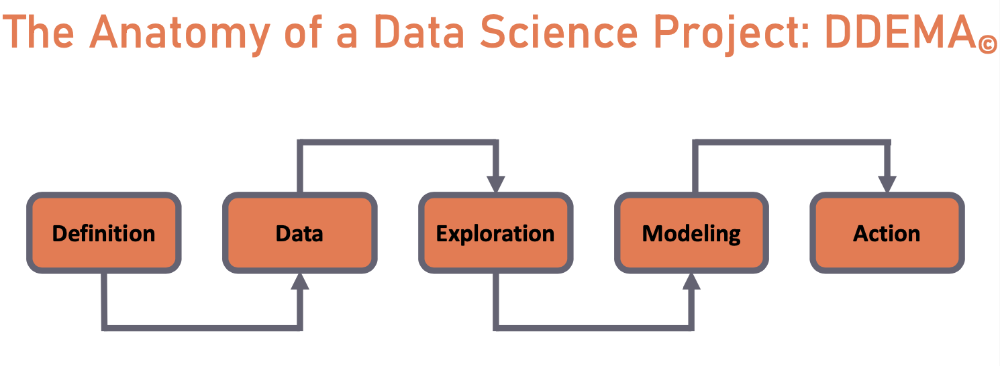

```{r setup, include=FALSE}
knitr::opts_chunk$set(echo = TRUE, warning = FALSE, message = FALSE, fig.align = "center", fig.height = 5)

```

## Module 3 Outline - < to be Removed from slides >

- Part 1: 
    - Intro to DDEMA: understand each of the steps of the data science process and learn the ML workflow. 
    - D for definition: We want to find characteristics of people who own cryptocurrency
    - Data and Exploration: 
          - Explore and find issues in the adult dataset - missing values, outliers values
          - Answering data questions, t tests, Viz
- Part 2: 
    - M for Modeling - Unsupervised Machine Learning techniques: Given an unlabelled dataset, we will learn how to find patterns with minimal effort 
    - Using k-means
    - Naming clusters
    - Evaluate these patterns that were found, and visualize them effectively
    - Other clustering techniques: hclust, pam
- Part 3:
    - M for Modeling - Supervised Learning techniques: Using a labelled dataset to create a model, and predict future trends or categorize unseen data
    - Using glm, svm, CART, xgboost, randomforests
    - Evaluation of the models - class metrics and differences
    - Feature importance
    - Feature engineering or data prep
    - A for Action - how might this be useful for us - targeting campaigns, cross selling products
    - Further Optimizations: Hyperparameter tuning and Cross validation

---

## Outline:

- The DDEMA Process
- Definition - D
  - Problem statement and objective
- Data - D
  - Integrity checks and cleaning
- Exploration - E
  - Univariate analysis 
  - Multivariate analysis
  - Answering questions via data wrangling, and initial hypotheses
  - Visualizations 
- Testing statistical significance

---

## The DDEMA Process

<p align="center">



</p>

-	Definition - define the problem well to create mathematical objective
-	Data - collection process, completeness,  
-	Exploration - data integrity, univariate and multivariate analysis
-	Modeling - map the business problem to an appropriate statistical technique
-	Action - bring model and results into action 

---

## Definition 

The marketing team of a financial services company has approached us for helping them understand their customers. They would like us to find the characteristics of ethereum holders that differentiate them from non holders. 

They were able to collect responses from some loyal customers, and would like to be able to predict whether a customer owns ethereum so that they can offer reward points in crypto or fiat accordingly.

In this module, our objectives are to -  

- Find distinguishing characteristics of ethereum owners: We will find this using statistical analysis and unsupervised machine learning techniques. 
- Predict whether a new individual is an ethereum owner or not: We will find this using a number of supervised learning techniques.

---

## Data

Our dataset is a survey response dataset containing certain demographic details of adults and whether or not they own ethereum.

Let's 

- load **tidyverse** library for data analysis. It can be installed, if not already done so, using `install.packages("tidyverse")`
- read in data and look at the dimensions of the data

```{r echo=TRUE}
library(tidyverse)
data_raw <- read_csv("data/data_raw.csv")

dim(data_raw)
```

There are `r nrow(data_raw)` observations, or adults, and `r ncol(data_raw)` characteristics collected for each adult

---

Looking at the first few rows

```{r}
head(data_raw)
```

Notice that the columns containing text is shown as `<chr>` (character). We will convert them to factor variable.

---

### Assigning data types

The columns which have categorical data are not represented well by the 'character' data type. In R we use the 'factor' data type to represent these columns correctly.  

```{r}
data <- data_raw %>%
    mutate(across(where(is.character), as_factor))
```

Reminder on data types in R: character used for nominal data, numeric or double for integer data, factor for ordinal data.

---

```{r, echo=FALSE, fig.show='hold'}
summary(data)
```

Notice max values of '99999' in *capital_gain* and  '99' in *hours_per_week* 

---

### Data Integrity

When we look at the summary statistics for *capital_gain* and *hours_per_week*, we notice max values look suspicious. We can see this clearly using a boxplot.

```{r}
ggplot(data, aes(y = capital_gain)) +
  geom_boxplot()
```

---

### Missing Values

On cross checking this with the appropriate data collection team they tell us that 9999 in capital_gain and 99 in hours_per_week were encoded to denote missing values.

Let's correct this discrepancy in the data.

```{r}
data <- data %>%
    mutate(capital_gain = ifelse(capital_gain == 99999, NA, capital_gain)) %>%
    mutate(hours_per_week = ifelse(hours_per_week == 99, NA, hours_per_week)) 
```
---

## Summary using skimr

`skimr` is a useful package to view summary statistics, distributions and missing values

```{r, eval=FALSE, fig.keep='none'}
library(skimr)
data %>%
    skim()
```
---

```{r, echo = FALSE, out.height=1}
data %>%
    skimr::skim()
```

---

## Exploration

After the initial summary statistics and integrity checks on the columns, we can look at individual characteristics and see how they vary between the ethereum owner vs non owner groups.

### Univariate analysis

What is the proportion of owners vs non owners?

```{r}
data %>%
    group_by(owns_ethereum) %>%
    summarise(n = n(), nperc = n/nrow(data)*100)
```
---

```{r}
ggplot(data, aes(x = owns_ethereum)) +
  geom_bar()
```

---

Distribution of Age

```{r}
ggplot(data, aes(x = age)) +
  geom_histogram()

```

---

What is the percentage of Males vs Females in the data?

```{r}
data %>%
 group_by(sex) %>%
 summarise(n = n(), nperc = n/nrow(data)*100)
```

---

## Exploration - Multivariate Analysis

Correlations

```{r}
cor(data %>% select(where(is.numeric), donated, owns_ethereum) ,
    use = "complete.obs")

```

From the numeric variables - Age, Education and Donations are correlated to *owns_ethereum*

---

We can add in the owns_ethereum variable to understand distributional differences. 

```{r}
ggplot(data, aes(x = age, fill = owns_ethereum)) +
  geom_histogram(alpha = 0.5)

```

Ethereum owners seem to be younger. Try using `geom_density()` to make a neater plot!

---

What is the percentage of men who are ethereum owners?

```{r}
data %>%
  filter(sex == "Male") %>%
  group_by(owns_ethereum) %>%
  summarise(n = n(), nperc = n/nrow(.)*100)
```
What about women?

```{r}
data %>%
  filter(sex == "Female") %>%
  group_by(owns_ethereum) %>%
  summarise(n = n(), nperc = n/nrow(.)*100)
```

---

Answering this visually

```{r}
ggplot(data = data) +
  aes(x = sex, fill = owns_ethereum) +
  geom_bar()
```

is the plot useful to answer the question?

---

## Visualizing Proportions

When visualizing categorical variables, it is useful to look at proportions. Especially if there are more observations in one level compared to the other levels, like this case where there are more Males.

```{r}
ggplot(data = data) +
  aes(x = sex, fill = owns_ethereum) +
  geom_bar(position = "fill")
```

---

## Your Turn

Find what percentage of ethereum owners are also donors?

---

## Answer

```{r}
data %>%
    filter(owns_ethereum == "TRUE") %>%
    group_by(donated) %>%
    summarise(n = n(), nperc = n/nrow(.)*100)

```
---

```{r}
ggplot(data = data) +
  aes(x = donated, fill = owns_ethereum) +
  geom_bar(position = "fill")
```


---

## Mean

We can also find the average of each characteristic for ethereum owners vs non owners. Since the mean only works for numeric data types, we first `select` all the numeric columns in the data, and then use the familiar `group` and `summarise` command.

```{r, fig.height=8}
data %>%
    select(owns_ethereum, where(is.numeric)) %>%
    group_by(owns_ethereum) %>%
    summarise_all(funs(mean(., na.rm = TRUE))) %>%
    data.frame()

```

---

## Your Turn - Mode

- Find the mode or the most frequently occurring characteristics of the ethereum holders and the non holders. 

  You can use the helper function 'get_mode()' given below 

```{r}

get_mode <- function(v) {
    all_levels <- unique(v)
    all_levels[which.max(tabulate(match(v, all_levels)))]
}

```

- How do the majority characteristics vary between the two groups?

---

## Answer

```{r, fig.height=8}
data %>%
    group_by(owns_ethereum) %>%
    summarise_all(funs(get_mode(.))) %>%
    data.frame()

```

We see that there are more donors, and more higher educated, lower age adults in the owns_ethereum = TRUE group

---

## Statistical significance testing

Let's test our hypothesis by applying a t test to see difference between ages of ethereum owners and non owners

```{r}
t.test(age ~ owns_ethereum, data = data)
```

---

## Chi-square test of independence

Let us test the relationship between sex and ownership

```{r}
chisq.test(table(data$owns_ethereum, data$sex))

```

as the p < 0.05, we reject the null hypothesis. There is a significant relationship between the variables and knowing the value of one variable helps to predict the value of the other variable.

---

## Your Turn

Is there a statistically significant difference between education levels of ethereum owners and non owners?

Use an appropriate visualization to showcase this difference.

---

## Answer

```{r}
t.test(education_num ~ owns_ethereum, data = data)
```

We see that there is a significant difference (p<0.05) between the age, and education of ethereum owners vs non owners

---

```{r}
ggplot(data, aes(x = owns_ethereum, y = education_num)) +
  geom_boxplot()

```

---

## Multivariate Visualizations - Pair plots

One way to look at the interactions between multiple variables at the same time, is to use pair plots. When we specify a color variable, the correlation for each level is shown.

We load the GGally package, installed using `install.packages("GGally")`, to create pair plots of all the numeric variables

```{r, eval=FALSE, fig.show='hold'}
library(GGally)
# numerical vars
data %>%
    select(owns_ethereum, age, education_num, capital_gain, capital_loss, hours_per_week) %>%
    ggpairs(columns = 2:6, aes(color = owns_ethereum, alpha = 0.5))
```

---

```{r, echo=FALSE, fig.show='asis'}
library(GGally)
data %>%
    select(owns_ethereum, age, education_num, capital_gain, capital_loss, hours_per_week) %>%
    ggpairs(columns = 2:6, aes(color = owns_ethereum, alpha = 0.5))
```

---

Finally we can take a look at all the categorical variables using faceting. The proportions are visualized to understand which variables contribute more to each group

```{r cat, eval=FALSE, fig.show='hold'}
data %>%
    select(
        workclass, marital_status, occupation,
        relationship, race, sex, donated, owns_ethereum
    ) %>%
    pivot_longer(workclass:donated) %>%
    ggplot(aes(y = value, fill = owns_ethereum)) +
    geom_bar(position = "fill", na.rm = FALSE) +
    facet_wrap(vars(name), scales = "free") +
    labs(x = NULL, y = NULL, fill = NULL)

```

---

```{r eval= TRUE, echo=FALSE, fig.height=6}
data %>%
    select(
        workclass, marital_status, occupation,
        relationship, race, sex, donated, owns_ethereum
    ) %>%
    pivot_longer(workclass:sex) %>%
    ggplot(aes(y = value, fill = owns_ethereum)) +
    geom_bar(position = "fill", na.rm = FALSE) +
    facet_wrap(vars(name), scales = "free") +
    labs(x = NULL, y = NULL, fill = NULL)

```

